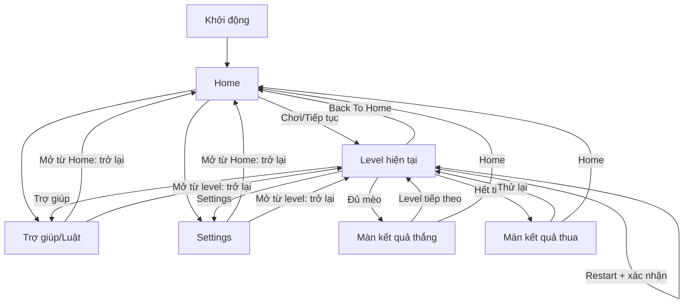

# 03 — Luồng màn hình và UX

## 1. Điều hướng tuyến tính

Không có màn bản đồ/chương/chọn level (UX-02 bỏ). Home `Chơi` mở level hiện tại đã lưu; nếu vừa thắng, mở level kế; nếu đang thua, mở lại màn thua. Khi hoàn thành mọi level hiện có, Home báo “Bạn đã hoàn thành các level hiện có” và không dẫn vào bàn trống.

| ID | Màn | Nội dung và hành động |
| --- | --- | --- |
| UX-01 | Home | Chơi/Tiếp tục, tên/số level hiện tại, Trợ giúp, Settings; trạng thái hết nội dung |
| UX-03 | Puzzle | Tên level, tim, **vùng luật bốn icon + chữ luôn nhìn thấy**, bàn, **hàng N vị trí tiến độ có màu/nhãn/họa tiết vùng**, Undo, Restart có xác nhận, Back To Home, một Hint/lượt, Trợ giúp, Settings |
| UX-04 | Tutorial | Chỉ có ở Level 1; chỉ dẫn ngắn trên bàn cho X, clear, kéo X, chạm đôi, bốn luật, X đỏ khóa và Hint; tiến theo hành động |
| UX-05 | Kết quả thắng | Câu khích lệ, điểm, sticker chúc mừng/hoạt ảnh mèo, nút “Level tiếp theo” và Home |
| UX-06 | Kết quả thua riêng | Thông điệp hết 3 tim, điểm lượt, “Thử lại” và Home; không dùng giao diện thắng đổi chữ |
| UX-07 | Trợ giúp/Luật | Ví dụ hàng/cột/vùng/chạm chéo; chạm/kéo X, chạm đôi mèo, X đỏ khóa, hint; trở lại màn trước |
| UX-08 | Settings | Âm, rung, giảm chuyển động, hỗ trợ phân biệt vùng; trở lại đúng màn gọi |

Vùng luật cơ bản trên puzzle là bốn icon kèm nhãn ngắn **không gấp và luôn nhìn thấy**; người chơi mở Trợ giúp để xem ví dụ. Settings là màn riêng, không làm mất session. Nếu từ Home mở Trợ giúp/Settings, nút trở lại về Home; nếu từ puzzle, trở lại puzzle. Result không nhận thao tác bàn.

## 2. Bố cục puzzle

Header ở safe area: Back To Home, “Level n”, tim, Restart và Settings; không hiện điểm trong lúc chơi. Ngay dưới là vùng luật bốn icon + chữ luôn nhìn thấy, bàn vuông là vùng ưu tiên diện tích, tiếp đến hàng N vị trí theo thứ tự vùng A..(N), rồi Undo/Hint/Trợ giúp. Hàng tiến độ không phải công cụ cần chọn: vị trí chưa tìm có viền/họa tiết nhạt, vị trí đã tìm sáng theo màu vùng; given hiển thị là đã tìm. Mỗi vị trí có nhãn vùng và trạng thái đọc được. Hình mèo trên ô `cat` và hoạt ảnh lấy từ mèo đang chọn, không từ nhãn vùng; nền/viền/nhãn/họa tiết vẫn cho biết vùng. Với N>6, hàng này cuộn ngang, không ép 12 icon vào chiều rộng màn.

Trên bàn N=6, vùng chạm mỗi ô/nút ít nhất 44×44 điểm logic tại thiết bị mục tiêu. Bàn, vùng luật cố định, hàng tiến độ và nút hành động phải cùng qua safe-area/chữ lớn mà không che nhau. Bàn **không có thao tác phóng hoặc trượt** ở mọi N. Trần dữ liệu vẫn N=12; chỉ phát hành một cỡ bàn nếu ô, chữ và nhãn vùng còn đọc/chạm chính xác trên thiết bị mục tiêu ở kích thước thật. N>6 bị giữ sau cổng usability riêng; nếu N=12 không đạt, giảm cỡ bàn phát hành hoặc đổi bố cục trước khi mở nội dung, không âm thầm thêm zoom/pan.

## 3. Nhận diện thao tác và phản hồi

| ID | Yêu cầu |
| --- | --- |
| UX-09 | Một chạm trên empty hiện X tức thì; trên X hiện empty tức thì. Sau khi nhấc, đây là preview tối đa 280 ms rồi mới lưu. X đỏ/cat không đổi. |
| UX-10 | Hai chạm nhanh **cùng ô** gọi một `TryCat`; bỏ preview X của chạm đầu trước khi chấm đúng/sai. Không có X lưu trung gian. |
| UX-11 | Chạm hai ô khác nhau là hai chạm đơn. Nét kéo quá 12 điểm logic lấy chế độ đánh/xóa từ ô đầu, đi qua mỗi ô một lần và lưu một batch khi nhấc ngón. |
| UX-12 | Mèo đúng: chỉ báo vùng tương ứng sáng lên trong hàng tiến độ, hoạt ảnh của mèo đang chọn và “Nice!”/“Great!” không che ô lâu quá 0,7 giây. |
| UX-13 | Sai: X đỏ có hình dấu/cảnh báo ngoài màu, tim đổi cùng lúc, lý do cục bộ có chứng cứ hoặc câu trung tính. |
| UX-14 | Hint tô focus/source/target và chứng cứ, có nút đóng; sau evidence đầu tiên, nút chuyển sang “Đã dùng”. `NoHint` giữ nút dùng được. Trợ giúp và Settings quay lại đúng puzzle. |
| UX-15 | Back To Home lưu ngay, không hỏi; Home Play tiếp tục đúng board. |
| UX-24 | Undo chỉ bật khi action X gần nhất còn trong khe. Một lần nhấn hoàn nguyên một ô hoặc toàn bộ stroke; `TryCat`, điều hướng, kết thúc lượt và app đóng làm nút tắt. |
| UX-25 | Restart luôn yêu cầu xác nhận “Bắt đầu lại Level n?”; xác nhận reset toàn bộ lượt cùng level, hủy giữ nguyên board. |
| UX-22 | Chỉ nhận `index=0` bắt đầu trong bàn làm ngón chính; ngón phụ/chạm lòng bàn tay phát sinh sau đó không được thêm nét, đặt mèo hay chiếm quyền. Tiếp xúc lòng bàn tay đầu tiên trong bàn vẫn cần thử trên thiết bị vì input thường không gắn nhãn palm. |
| UX-23 | Nét kéo đi nhanh qua nhiều ô phải phủ đủ ô trung gian; ô X đỏ/cat/given là chướng ngại bất biến nhưng không dừng nét. |

Cửa sổ 280 ms đo từ lần nhấc thứ nhất đến lần chạm xuống thứ hai; ngưỡng kéo 12 điểm logic là tham số playtest. Godot nhận vị trí theo viewport; phải quy đổi theo UI scale trước khi đo ngưỡng. X preview xuất hiện trong khung hình đầu tiên (mục tiêu dưới 50 ms). Nếu chạm thứ hai cùng ô chuyển thành kéo, commit chạm đầu rồi xử lý nét thứ hai riêng từ trạng thái đã commit; không đặt mèo. Nếu ngón chính nhấc ngoài bàn sau khi kéo, commit các ô đã đi qua. Nếu app nền/chuyển màn sau chạm đơn đã nhấc nhưng còn chờ, commit chạm đơn rồi lưu; nếu nét đang kéo/chạm chưa nhấc, hủy preview. `TryCat` phản hồi dưới 100 ms sau chạm thứ hai nếu save thành công. Khi người dùng chạm lên X đỏ, không đổi và không mất thêm tim. Cat/given bất biến.

## 4. Tutorial

Tutorial chỉ gắn Level 1, script theo ID level và điều kiện bàn; không cần chương. Mốc đã thấy lưu vào progress. Làm nước đúng khác thứ tự phải bỏ qua mốc đã thỏa. Từ Level 2 không còn miễn phạt tutorial. Mở lại hướng dẫn từ Trợ giúp dùng bản thực hành riêng, không thay đổi campaign.

| Mốc | Bài học | Hành động để qua |
| --- | --- | --- |
| T1 | Một chạm đặt X | Đánh X vào ô được gợi ý loại trừ |
| T2 | Một chạm nữa xóa X | Xóa X đó sau khi chỉ dẫn T2 xuất hiện |
| T3 | Kéo để đánh/xóa nhiều X | Kéo qua ít nhất hai ô hợp lệ; chế độ do ô đầu quyết định |
| T4 | Hai chạm xác nhận mèo | Đặt đúng mèo tại ô S2 được tô sáng |
| T5 | Bốn luật và X đỏ | Xem minh họa hàng/cột/vùng/không chạm và một minh họa X đỏ an toàn |
| T6 | Hint | Mở Hint miễn phí của lượt và đóng phần giải thích |

Trong Level 1, thử mèo sai **trên ô đang tô sáng** chỉ được nhắc và không mất tim; thao tác khác theo luật thường. Script phải được QA kiểm trên level thật. Khi app đóng giữa mốc, khôi phục board, `hintCount` và `tutorialSeenIds`, rồi suy lại mốc chưa đạt; không phát sinh thao tác ảo hoặc cấp lại Hint.

## 5. Tiếp cận, màu và chuyển động

| ID | Yêu cầu |
| --- | --- |
| UX-16 | Vùng và hàng tiến độ cùng nhãn A..(N), viền/họa tiết riêng; hình mèo được chọn không phải mã vùng. X đỏ có dấu cảnh báo, không chỉ khác màu. |
| UX-17 | Trình đọc màn hình đọc hàng/cột/vùng/trạng thái và cho hai action ngữ nghĩa “Đánh/Xóa X” và “Thử đặt mèo”. |
| UX-18 | Ô/nút đạt vùng chạm tối thiểu 44×44 điểm ở N≤6 trên thiết bị mục tiêu; N lớn chỉ phát hành sau đo chính xác chạm và khả năng đọc ở kích thước thật. |
| UX-19 | Giảm chuyển động thay nhảy/lắc/flash bằng fade ngắn hoặc chữ tĩnh; không tự phát video gây chói. |
| UX-20 | Âm và rung độc lập; tắt cả hai vẫn đọc được đúng/sai, tim, điểm và level. |
| UX-21 | Mọi chuỗi là khóa localization; layout thử với chữ dài hơn 30%, cỡ chữ lớn và safe area. |

## 6. Phục hồi và kết quả

Thắng phải ghi progress/level kế trước khi hiện màn thắng. Thua lưu `Failed` và hiện **màn kết quả thua** khi Play lại. Retry/Restart tạo lượt mới; Back To Home/app nền giữ session và hạn mức Hint nhưng xóa khe Undo runtime. Nếu session hỏng, báo lỗi và bắt đầu lại cùng level, không tiến level; progress hỏng thì dùng bản sao hợp lệ trước và không ghi đè dữ liệu hỏng bằng progress trống. App nền commit chạm đơn đã nhấc, hủy cử chỉ chưa nhấc, dừng đồng hồ và giữ màn hiện tại. Sticker hoạt ảnh 2D là phần thưởng hình ảnh; nút tiếp tục/thử lại luôn dùng được ngay cả khi animation chưa kết thúc.

**UX mở rộng sau MVP (REV-GD-04/REV-META-01):** Home có lối vào “Vườn mèo” là danh sách chỉ gồm mèo đã mua; có nút riêng để chọn lại mèo mặc định, không có sân vườn tương tác. Danh mục mua cho xem giá và số dư trước khi xác nhận. Khi hết tim, màn chờ quyết định hiển thị giá cứu lượt, nút trả vàng nếu đủ, nút xem quảng cáo thưởng **chỉ khi không đủ vàng và quảng cáo sẵn có**, cùng nút Thử lại miễn phí. Hủy/quảng cáo lỗi giữ nguyên màn và board; đóng app rồi mở lại cũng trở về màn chờ. Chỉ hiển thị “Đã cứu lượt” sau khi ghi tim, board và giao dịch thành công. Luồng này không thuộc UX-06 của bản đầu cho đến khi bật gói meta.
