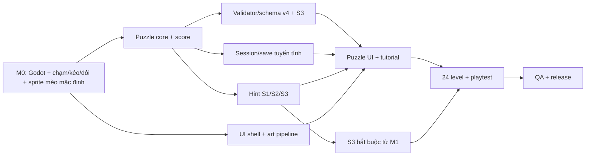

# 08 — Kế hoạch triển khai cho agent

Trước khi nhận gói, đọc [README](README.md), [luật chuẩn](02-luat-choi-va-trang-thai.md) và tài liệu gói. Mỗi bàn giao nêu mã GDD/QA, lệnh/kết quả kiểm tra, rủi ro còn lại. Dùng [fixture](data/levels.sample.json) làm đầu vào ban đầu; T01/E01/E02/S301/N12 không tính vào 24 level phát hành. Thay luật/schema/tiến trình/điểm phải cập nhật GDD, fixture, validator/test và QA cùng thay đổi.

## 1. Thứ tự phụ thuộc

Core không đo thời gian chạm hay phát animation. Gesture layer hiển thị X preview tức thì rồi tạo `MarkX`/`ClearX`/`MarkStroke`/`TryCat`/`UndoX`/`RestartLevel`; session service chỉ lưu action đã xác nhận, không lưu khe Undo; UI trình bày events. Content tool, save và Hint chỉ làm song song sau khi schema v4, hành vi X đỏ/scorecard và S3 được khóa. Không dùng S4/S5 ở level phát hành.

## 2. Gói việc

| Gói | Đầu ra | Mã chính | QA chính |
| --- | --- | --- | --- |
| A — Bootstrap/tech spike | Godot version khóa, build Android/iOS thử, prototype X tức thì/chạm đôi 280 ms/kéo ngưỡng 12 điểm và một bộ sprite mèo mặc định dùng trên 6 vùng; đo atlas, VRAM và mèo nhảy/sticker | D-06, TECH-13/14/19..21 | QA-12/26/30/43..45/50 |
| B — Core | Board, solver độc lập, 4 trạng thái, X đỏ khóa, scorecard, batch nét kéo, Undo X một bước, Restart, event, unit tests | GR-01..20/29..33, TECH-01..03/17 | QA-02..04/08..17/43/44/54/55 |
| C — Content tool | Schema v4 N≤12, S2/S3 trace, lọc trùng, cổng order1..24/N≤6 và logic band 1–18/19–24 | LV-01..08, TECH-07/16 | QA-01..07/32/35/37/40/57 |
| D — Save/progress | Một session, progress current level, backup/atomic, crash recovery, append level | GR-25..28, TECH-06/08..12/15 | QA-14/15/23..25/31 |
| E — Hint | Một Hint/lượt, S1 witness/S2 và chuỗi S3→S2 runtime, bỏ qua X đỏ | GR-21..24, TECH-04 | QA-18..20/41/56 |
| F — UI/tutorial | Home, Puzzle, hai Result, Help, Settings, vùng luật cố định, Undo/Restart, tutorial chỉ Level 1, accessibility | UX-01/03..25, TECH-05 | QA-08..12/21/22/27..29/33/36/43..45/54..56 |
| G — Art/sprite/audio | Model mèo gốc + rig/clip, một bộ sprite mèo mặc định dùng trên 6 vùng, sticker, SFX, manifest quyền | ART-01..13, TECH-18..21 | QA-27/28/30/34/36/50 |
| H — Level design | 24 level gốc order1..24, order1 tutorial duy nhất, order1–18 S2 và 19–24 cần S3, mốc 10/20, biên bản duyệt/playtest | LV-01..08 | QA-01..07/33/49/57 |
| I — QA/release | Báo cáo QA, build ứng viên offline, số đo thiết bị, playtest | GDD 07 | QA-01..57 theo phạm vi MVP, trừ cổng tương lai |
| J — S3 MVP và nghiên cứu S4/S5 | Hoàn tất fixture dương/âm, proof trace, Hint và cổng S3 trước content; giữ S4/S5 ở nhánh nghiên cứu sau MVP | GDD 10, LV-03/08 | QA-37/40/41/57; QA-38/39/42 cho nghiên cứu |
| K — Meta/sinh level sau MVP | Thiết kế/triển khai wallet, cứu lượt bằng vàng/quảng cáo thưởng, danh sách mèo đã mua/chọn và generator offline cho level mới/mốc sau 24; không thêm vào build đầu | GDD 11, LV-07, TECH-20/21 | QA-46..48/52/53 |

## 3. Mốc và cổng

| Mốc | Đầu ra thấy được | Điều kiện qua |
| --- | --- | --- |
| M0 — Proof of concept | T01 chơi được: X tức thì, kéo X, chạm đôi mèo, X đỏ khóa, score; sprite mèo mặc định nhảy/sticker trên các vùng | Khóa Godot minor version, máy macOS/Xcode, Android/iPhone mục tiêu, số đo TECH-19/21 và QA-50, đo ngưỡng kéo/chạm đôi và bộ atlas |
| M1 — Vertical slice | 4 level phát hành gốc đầu, tutorial chỉ Level 1, 5 màn + Result thua, save, một Hint/lượt, Undo/Restart, 6 màu tạm; schema v4 + fixture/chứng minh S3 | Người mới hiểu cử chỉ; QA core/save/Hint/UI và validator S3 cơ bản qua; fixture không tính vào 4 |
| M2 — Content complete | 24 level order1..24 gồm mốc 10/20 và sáu level cuối cần S3, art/sprite/audio gốc | `--release` qua QA-57, từng level có lượt giải không xem nghiệm với ≥1 tim, tutorial bám Level 1 thật; 10 người playtest và sửa điểm kẹt |
| M3 — Release candidate | Build offline Android/iOS và báo cáo QA | Cổng tài liệu 07 đạt trên thiết bị đã chốt |

Không gán lịch tuần trước khi có số đo M0/M1. Sprite 2D từ model gốc là pipeline đã chọn cho bản đầu; M0 tập trung đo bộ atlas thật và chất lượng chạm/kéo. Phaser chỉ là lựa chọn cho một prototype web 2D riêng; không tạo hai codebase sản xuất song song. Gói J bắt đầu từ M1 và phải hoàn tất S3 trước cổng M2; [câu lệnh giao agent](10-nghien-cuu-quy-tac-suy-luan.md#9-câu-lệnh-giao-cho-agent-nghiên-cứu-tiếp) chỉ còn dùng cho S4/S5 sau khi S3 MVP ổn định. Gói K theo [kế hoạch meta và sinh level](11-ke-hoach-meta-va-sinh-level.md) sau MVP, không tạo interface trong build MVP.

## 4. Definition of Done

1. Ghi mã GR/UX/LV/TECH/ART và QA đã đáp ứng, kết quả kiểm thực tế, giới hạn còn lại.
2. Core/gesture/UI/save dùng cùng action contract; chạm đôi có thể có X preview nhưng không lưu X trung gian hoặc hai lỗi; nét kéo lưu một batch.
3. Mọi sửa schema/luật/điểm/order cập nhật tài liệu, fixture, validator/test và migration nếu đã có save phát hành.
4. Asset/model/level có nguồn gốc rõ; ID/puzzle đã phát hành ổn định.
5. Nội dung chưa có chứng minh S2/S3 đúng logic band, chưa qua playtest hoặc chưa đủ màu/vùng chạm N=12 ở kích thước thật không được đóng gói release.

## 5. Quyết định còn mở

| ID | Khi chốt | Nội dung |
| --- | --- | --- |
| O-01 | Trước art cuối | Tên phát hành, logo, bộ nhận diện gốc |
| O-02 | M0 | Godot minor version, renderer mobile, thiết bị mục tiêu, atlas mèo mặc định và bộ màu/nhãn/họa tiết vùng, cửa sổ chạm đôi/ngưỡng kéo qua playtest |
| O-03 | M1 | Tốc độ feedback và nhịp 24 level theo người chơi; công thức scorecard 100/25 giữ trong MVP |
| O-04 | Sau bản đầu | Có phát hành N=7–12 hoặc S4/S5 hay không; cần màu, UX kích thước thật, validator và QA mới |
| O-05 | Sau bản đầu | Công thức vàng, giá cứu lượt/giá từng mèo và khả năng cung cấp quảng cáo thưởng được thử trước khi cập nhật schema/save và mở wallet |
| O-06 | Trước M2; sau bản đầu | Mốc 10/20 làm thủ công trước release; motif generator cho 30/40 về sau được duyệt qua level hợp lệ và playtest |
| O-07 | M0; sau bản đầu | Chốt ngân sách atlas mèo và ngưỡng nạp cache trên máy thấp; chỉ mở chọn mèo sau khi QA-52 đạt. Runtime bake 3D nếu cần nhiều biến thể phải qua QA-51 riêng |
