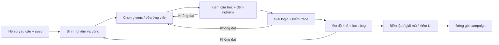

# 11 — CanDoKu: sinh level và đánh giá độ khó

**Phiên bản tài liệu 1.0 · 2026-09-28.** Đặc tả để sau này xây công cụ sinh level hoặc giao AI/người biên tập tạo ứng viên. Đi cùng [bộ nguyên tắc suy luận](10-nghien-cuu-quy-tac-suy-luan.md). Không phải báo cáo đã có generator hoặc bộ chấm độ khó hoàn chỉnh.

**Cập nhật triển khai 2026-09-29:** đã bổ sung generator offline giới hạn N=4–6, closure S2/S3, chứng cứ phụ thuộc, rating-0 và ba policy, lọc trùng, báo cáo và phiếu pilot. Xem [hướng dẫn công cụ](../docs/level-generation.md). Các mục mô tả “tương lai/chưa triển khai” bên dưới là đặc tả gốc; mục 17 là khảo sát tại 2026-09-28. Bản công cụ đầu chưa có mutation, checkpoint, tối ưu trace toàn cục, generator runtime hay hiệu chỉnh bằng người chơi. Profile CLI v1 là tập con riêng được mô tả trong hướng dẫn, không nhận nguyên mẫu request mở rộng ở mục 3.

Phạm vi được bổ sung là **tài liệu nền**. Mục tiêu hiện hành là campaign playtest 30 level, N=4–6; order 1–18 dùng S1/S2, từng order 19–24 cần S3, còn profile 25–30 phải được duyệt riêng nhưng chỉ dùng S1–S3. Không mở Endless, sinh runtime, kinh tế hoặc tự mở R2–R4. Công cụ sinh offline hiện mới hỗ trợ pilot trong dải order 2–24; phải mở rộng có kiểm thử khi được giao làm sáu màn cuối.

## 1. Mục tiêu và tiêu chí một level tốt

Một level được chấp nhận phải đạt độc lập bốn lớp:

1. **Đúng:** vùng liên thông, đúng bốn luật, given hợp lệ, nghiệm duy nhất được kiểm độc lập.
2. **Giải thích được:** giải trọn bằng bộ kỹ thuật cho phép, trace từng bước có chứng cứ; không nhìn đáp án hoặc đoán.
3. **Vừa sức:** phù hợp dải kỹ năng/độ khó yêu cầu, không chỉ tăng kích thước hay giảm given.
4. **Đáng chơi:** không trùng, vùng dễ đọc, có nhịp phát hiện, Hint hiểu được và đã có người giải không nhìn nghiệm.

Tạo được một nghiệm không chứng minh duy nhất. Một trace có S3 không chứng minh S3 bắt buộc. Bộ giải máy chạy nhanh không chứng minh người chơi thấy dễ. Level độc nhất nhưng chỉ giải được bằng kỹ thuật chưa hỗ trợ không được xuất vào campaign đầu.

## 2. Thành phần và đầu vào/đầu ra



| Thành phần | Trách nhiệm |
| --- | --- |
| Request/profile | Mục tiêu số lượng, N, logic band, độ khó, seed, budget, tập đã có |
| Solution generator | Tạo một hoán vị kẹo hợp hàng/cột/không-chạm |
| Region generator | Chia N vùng liên thông, mỗi vùng chứa một ô nghiệm |
| Given editor | Chọn/bỏ given để điều chỉnh uniqueness và đường giải |
| Exact checker | Đếm tới hai nghiệm độc lập, trả UNIQUE/MULTIPLE/INVALID/UNKNOWN |
| Human-style solver | Chỉ dùng ruleset cho phép, xuất trace và dữ kiện các bước |
| Proof checker | Kiểm lại từng bước, không tin generator hoặc solution |
| Difficulty analyzer | Logic tier, tải suy luận, dependency, khả năng tìm bước, tải thị giác |
| Diversity filter | Trùng hình/puzzle và lặp mẫu suy luận |
| Content packager | JSON v4 hợp lệ, báo cáo sidecar, cổng campaign và version |

Exact checker và proof checker phải độc lập với cách generator “biết” đáp án. Có thể dùng chung kiểu dữ liệu/parser nhưng không dùng trace hoặc solution khai báo để bỏ qua kiểm.

## 3. Hồ sơ yêu cầu sinh level

Đây là định dạng **đầu vào công cụ tương lai**, không thêm các trường này vào schema level v4. Ví dụ cho ứng viên dành cho order 19–24:

```json
{
  "requestVersion": 1,
  "profileId": "candoku-campaign-s3-v1",
  "count": 6,
  "sizes": [5, 6],
  "targetOrders": [19, 20, 21, 22, 23, 24],
  "allowedTraceRules": ["S2", "S3"],
  "requireS3": true,
  "difficultyLabels": ["medium"],
  "minPlayableCandies": 2,
  "maxGivens": 2,
  "seed": "candoku-content-0001",
  "ruleCatalogVersion": "candoku-reasoning-1",
  "ratingVersion": "candoku-rating-0",
  "diversityPolicy": "campaign-v1",
  "maxAttempts": 5000,
  "maxMutationsPerAttempt": 20,
  "maxWallSeconds": 600,
  "exactMaxNodesPerAttempt": 2000000,
  "exactMaxSecondsPerAttempt": 5
}
```

count là **số ứng viên đạt**, không là số lần thử. sizes và số given là lựa chọn profile; maxGivens=2 ở ví dụ không trở thành luật cho mọi màn. 5000 lần/600 giây là ngân sách offline khởi điểm đề xuất, chưa benchmark; hết ngân sách phải trả số đạt thực và lý do thiếu.

Request parser cần bác count≤0, minPlayableCandies>N, order không phù hợp ruleset, requireS3 nhưng thiếu S3, hoặc profile release đòi hard/N>6. Cho phép profile nghiên cứu riêng nhưng phải đánh dấu không đủ điều kiện release.

Seed + tên/phiên bản PRNG + phiên bản generator + profile + thứ tự xử lý xác định khả năng tái lập. Không dùng hash ngẫu nhiên của ngôn ngữ, thời gian hệ thống hoặc thứ tự duyệt set làm bộ phá hòa. Nếu chạy song song tương lai, dẫn xuất seed theo attemptIndex và sắp kết quả trước khi chọn; không để tốc độ worker quyết định nội dung. Tài liệu không yêu cầu tạo agent song song.

Mỗi attemptIndex tái lập cùng **ứng viên trước kiểm**, nhưng giới hạn wall-clock có thể làm máy chậm dừng sớm hoặc trả UNKNOWN khác máy nhanh. Vì vậy chỉ cam kết cùng tập accepted khi cùng danh sách attempt đã được kiểm xong, cùng budget nút và không có timeout. Báo riêng attempt chưa hoàn tất, cho phép tiếp tục từ checkpoint; không hứa seed đơn lẻ bảo đảm cùng số lượng accepted trong cùng số giây.

## 4. Sinh một nghiệm nền

Dùng backtracking xây hoán vị cột s[0..N−1]:

```text
ở hàng r:
    lấy các cột chưa dùng theo thứ tự PRNG xác định
    nếu r>0: bỏ cột c có |c-s[r-1]|<=1
    chọn c; đi hàng kế; nếu ngõ cụt thì quay lui
khi đủ N hàng: có một nghiệm nền
```

Chưa có vùng ở bước này; tạo vùng sau sao cho mỗi ô nghiệm sở hữu một vùng. Không tráo tùy ý hàng/cột của một puzzle đã hoàn tất: phép đó có thể phá không-chạm và liên thông. Xoay/lật toàn bàn là phép tương đương hợp lệ, không được tính là nội dung mới.

Đầu ra bước này không được gọi là level: có thể có rất nhiều cách phân vùng và rất nhiều nghiệm khác của từng cách phân vùng.

## 5. Tạo N vùng liên thông quanh nghiệm

1. Mỗi ô (r,s[r]) là hạt giống một vùng riêng.
2. Frontier của vùng là ô chưa gán chung cạnh với ít nhất một ô đã thuộc vùng.
3. Chọn một cặp vùng–ô frontier theo PRNG và tiêu chí hình dạng, gán ô đó.
4. Lặp tới mọi ô được gán; không gán hạt giống của vùng khác.
5. Chuẩn hóa nhãn A.. theo thứ tự xuất hiện khi quét hàng; cập nhật mọi tham chiếu nhãn trong báo cáo.

Mỗi lần thêm qua cạnh giữ liên thông; mỗi vùng giữ đúng một ô nghiệm nền. Kiểm lại bằng BFS độc lập, không mặc định generator không có lỗi. Chọn frontier ngẫu nhiên thuần dễ tạo vùng ngoằn ngoèo hoặc vùng quá lớn; có thể phạt chu vi, nhánh hẹp và mất cân bằng diện tích trong hàm chọn, nhưng không đổi luật để làm đẹp.

**Sửa vùng:** chỉ chuyển ô biên không phải ô nghiệm sang vùng kề; vùng nhận phải chạm cạnh, vùng cho vẫn không rỗng/liên thông. Chạy lại BFS, uniqueness và trace sau mutation. Không tái dùng kết quả đánh giá của topology trước mutation.

Có thể dùng motif đối xứng hoặc luống nhỏ làm điểm vào, nhưng không bắt buộc đối xứng. Vùng một ô hữu ích cho tutorial/S2 dễ; nhiều vùng một ô có thể làm level gần như tự giải. Đây là đặc tính độ khó, không tự là dữ liệu lỗi.

## 6. Chọn givens và điều chỉnh ứng viên

Bắt đầu ít given để xem hình vùng tự tạo suy luận gì; cũng có thể bắt đầu nhiều rồi bỏ từng viên. Mọi given phải thuộc nghiệm nền, không trùng hàng; còn ít nhất hai viên người chơi tự tìm.

Với nhiều nghiệm, có thể thêm một given phân biệt nghiệm nền với nghiệm thay thế. Với level không đạt ruleset, thử sửa vùng hoặc thêm given. Với level quá dễ, thử bỏ given hoặc sửa vùng. Mỗi thay đổi chạy lại toàn bộ cổng liên quan.

Không bảo đảm “ít given hơn thì khó hơn” trong cách người chơi nhận ra mẫu. Không thêm given vào ô then chốt rồi vẫn gắn nhãn “bắt buộc S3” mà chưa chạy lại closure. Một tập given không thể bỏ thêm theo thứ tự tham lam chỉ là **tối giản cục bộ**, không phải số given nhỏ nhất toàn cục.

Đối với campaign đầu, thứ tự ưu tiên sửa: giữ độ đọc vùng → đạt uniqueness → đạt logic band → điều chỉnh tải suy luận → tăng đa dạng. Không cứu một hình vùng khó đọc bằng việc cho sẵn gần hết đáp án.

## 7. Cổng kiểm nghiệm và trace

| Cổng | PASS khi | Khi không đạt |
| --- | --- | --- |
| Cấu trúc | N, nhãn, vùng liên thông, given/solution đúng miền | Loại/sửa ứng viên |
| Nghiệm | Solver không đọc solution chứng minh đúng một nghiệm, khớp nghiệm nền | MULTIPLE sửa vùng/given; INVALID sửa lỗi; UNKNOWN giữ chưa duyệt |
| Logic | Bộ giải với allowed rules đi hết | STUCK đổi ứng viên/profile; UNKNOWN không nâng nhãn khó |
| Trace | Checker xác nhận mọi bước từ trạng thái trước | Loại trace, không “sửa” lời văn để qua |
| Cần S3 | S2-only STUCK và S2/S3 SOLVED | S2-only SOLVED → không dùng cho order 19–24 |
| Nội dung | Không trùng theo policy, phù hợp nhịp/độ đọc | Biên tập hoặc sinh ứng viên khác |
| Người chơi | Giải mù + review Hint/UI theo GDD 04/07 | Chưa đủ điều kiện đóng gói phát hành |

Exact search tìm nghiệm thứ hai được dừng sớm. Một nghiệm rồi timeout vẫn UNKNOWN. Bộ đếm hiện có trong GDD/tools mặc định giới hạn 2.000.000 nút và 5 giây; đây là ngân sách kiểm, không phải ngưỡng độ khó người chơi.

Trace lưu thứ tự chứng minh, không lưu một loạt ô lấy từ solution rồi gắn rule sau. Mỗi mutation làm mất hiệu lực trace và rating cũ. Chỉ sau khi kiểm mới có thể cấp ID nội dung; ID đã phát hành và puzzle hash bất biến.

## 8. Độ khó có bốn thành phần

| Thành phần | Câu hỏi | Chỉ số |
| --- | --- | --- |
| Logic | Người chơi cần hiểu kỹ thuật nào? | LowestProvenTier, cần S3 hay không, quy tắc mở rộng |
| Tải suy luận | Cần bao nhiêu bước liên tiếp và nhớ bao nhiêu tiền đề? | Số bước, số loại mới, độ sâu chứng cứ, chuỗi loại trước khi đặt |
| Tìm bước / đọc bàn | Có dễ nhìn ra bước tiếp và phân biệt vùng không? | Số hành động khả dụng, đơn vị/ô phải nhìn, hình dạng vùng |
| Trải nghiệm thật | Người chơi mục tiêu thực sự mất bao lâu và kẹt ở đâu? | Thời gian, hoàn thành, lỗi, Hint, bỏ cuộc, lời giải thích |

Giữ các thành phần riêng trong báo cáo. Một màn S2 dài có thể mất lâu hơn một màn S3 ngắn; S3 không tự được gắn hard. Một bàn khó nhìn phải được sửa hình thức, không coi là “thử thách logic” tốt.

## 9. Đo từ bộ giải một cách tái lập

### 9.1. Ruleset và đường giải

- Tier B: S1/S2.
- Tier I: S1/S2/S3.
- Tier A: S4/X hoặc S5/CASE theo profile nghiên cứu riêng; chưa release.
- UNKNOWN: hết budget hoặc ruleset hỗ trợ chưa giải được; không đồng nghĩa Hard.

Tìm tier thấp nhất bằng cách chạy closure từng ruleset từ cùng givens. Với tier B/I, STUCK sau liệt kê đầy đủ và tới điểm cố định mới là bằng chứng tier đó không đủ. Tier thấp nhất được chứng minh ghi LowestProvenTier; tier chưa xác định ghi null và lý do.

Đường giải tham chiếu dùng policy version hóa: ưu tiên S2; nếu không có thì S3; trong cùng lớp ưu tiên chứng cứ ít ô/đơn vị hơn, sau đó loại nhiều ô mới hơn, cuối cùng sort loại đơn vị/id/tọa độ. Dedup cùng ô đặt hoặc cùng tập loại, chọn chứng cứ ngắn nhất. Không gộp các loại có tiền đề khác nhau thành một bước nếu checker chưa hỗ trợ.

Đường tham chiếu này là **deterministic**, không được gọi là ngắn nhất. Để phát hiện rating phụ thuộc thứ tự, chạy thêm các policy phá hòa đã định trước và ghi min/median/max. Nếu khoảng chênh lệch lớn, yêu cầu biên tập; không chỉ giữ đường dài nhất để làm nhãn khó.

Muốn tuyên bố trace có chi phí tối thiểu phải tìm kiếm toàn bộ trạng thái chứng minh (K,E), tối ưu hàm chi phí cộng được và có chứng nhận hết frontier tốt hơn. Dijkstra chỉ là lựa chọn công cụ tương lai; timeout chỉ cho bestKnownCost. Độ sâu dependency và độ rối thị giác không tự được tối ưu theo tổng chi phí bước.

### 9.2. DifficultyVector

| Trường sidecar | Cách đo |
| --- | --- |
| playableCount | N−số givens |
| ruleCounts | Số bước tường minh từng rule trên trace tham chiếu; S1 không cộng mỗi ô thành một step |
| placedCount | Số kết luận đặt; phải bằng playableCount |
| eliminatedCount | Số ô mới đưa vào E; không đếm trùng hoặc ô đã bị S1 loại |
| maxRuleTier | Tier cao nhất của trace; tách khỏi LowestProvenTier |
| maxEliminationRun | Chuỗi step loại dài nhất trước một step đặt |
| proofDepth | Độ dài đường phụ thuộc dài nhất của step đã chọn; root givens/topology có depth 0 |
| maxPremiseUnits | Số đơn vị khác nhau cần cho lời giải thích một bước |
| maxVisibleCells | Số ô khác nhau cần chỉ ra để giải thích một bước |
| availableActions | Số hành động logic khác nhau ở mỗi trạng thái trước bước, sau dedup |
| bottleneckCount | Số trạng thái chỉ có đúng một hành động ở tier thấp nhất đang áp dụng được |
| firstPlacementStep | Vị trí step đầu tìm được một kẹo, để nhận biết mở màn toàn loại trừ |
| policySpread | Min/median/max của các đường tham chiếu đã chạy |
| proofStatus | SOLVED/STUCK/UNKNOWN/INVALID và version/budget |

Dependency không phải thứ tự trên giấy: nếu hai S2 độc lập thì không tạo cạnh chỉ vì được thực hiện nối tiếp. Cạnh từ step A tới B chỉ khi B dùng kết luận A làm tiền đề trong **chứng cứ được chọn**. Một kết luận có nhiều lời chứng minh có thể cho đồ thị khác nhau; ghi policy chọn chứng cứ. Nếu công cụ chưa dựng được dependency, proofDepth=null; không lấy số dòng trace thay thế.

### 9.3. Điểm thô thử nghiệm rating-0

Để xếp ứng viên trước khi có dữ liệu người chơi, dùng **heuristic đề xuất**, không phải thang đã hiệu chỉnh:

```text
W = 1 * count(S2) + 4 * count(S3)
D_raw = W + 2 * bottleneckCount + proofDepth + ceil(maxVisibleCells / 6)
```

Chỉ áp cho tier B/I, trace đủ và có chứng cứ đo được. S1 không cộng trọng số riêng; tác động đọc chứng cứ phản ánh ở maxVisibleCells. Thiếu bất kỳ chỉ số cần thiết → D_raw=null. Các quy tắc mở rộng không được nhét trọng số tùy tiện vào rating-0; cần ratingVersion mới.

Ví dụ số liệu **giả định để kiểm công thức**, không phải kết quả đo S301: 5 S2 + 2 S3, 2 bottleneck, depth=4, maxVisibleCells=12 → W=13, D_raw=23. Ví dụ B: 5 S2, 1 bottleneck, depth=2, maxVisibleCells=6 → D_raw=10. Điểm này không phải scorecard 100/25 của người chơi.

Heuristic không có thang 0–100 và không là mức phần trăm. Không so score khác ratingVersion, ruleset hoặc cách đo evidence. Chưa có bằng chứng ngưỡng này dự đoán phút chơi; không trình bày nó trên UI như sự thật.

## 10. Nhãn difficulty và profile nội dung

| Nhãn JSON hiện hành | Cổng logic | Cổng biên tập khởi điểm |
| --- | --- | --- |
| tutorial | Tier B; riêng order 1 | Dạy T1–T6, tọa độ đúng, miễn phạt đúng phạm vi, 1–3 phút mục tiêu |
| easy | Tier B | rating-0 D_raw≤16 nếu đã đo; lời giải ngắn/dễ nhìn; thử người mới |
| medium | Tier B với tải cao hơn, hoặc Tier I | D_raw>16 cho B là gợi ý; Tier I đánh medium tạm dù điểm thấp; 3–6 phút mục tiêu tùy dải |
| hard | Dự trữ | Không xuất bản đầu; không coi STUCK/UNKNOWN là hard |

Ngưỡng 16 là đề xuất hiệu chỉnh ban đầu, không cổng validator hiện có. Khi chưa có analyzer, nhãn easy/medium là **provisional theo biên tập**, kèm thiếu số đo. Validator chỉ kiểm enum và logic band, không chứng nhận độ khó đúng.

Tách targetProfile (muốn sinh gì), measuredProfile (máy đo gì), reviewedDifficulty (biên tập đánh gì) và playerEvidence (người chơi làm gì). Không chép target vào measured như thể đã đo.

Gợi ý yêu cầu sản xuất: “6×6, cần đúng ít nhất một S3, không S4/S5, có nước đặt trong ba bước đầu, tối đa hai step loại liên tiếp, vùng đọc rõ, medium tạm”. Đây là điều kiện lọc; không hứa generator luôn tìm đủ. Không yêu cầu “đúng một S3 tối thiểu” chỉ bằng đếm một trace; phải kiểm tối ưu/cận hoặc đổi cách diễn đạt thành “trace tham chiếu có một S3”.

## 11. Độ đọc vùng và sự đa dạng

VisualVector ghi tối thiểu: diện tích min/max từng vùng, số ô bậc một trong đồ thị vùng, số articulation cells (bỏ ô làm vùng tách), chu vi trên diện tích, số nhãn cần nhìn, số ô trong chứng cứ lớn nhất, đánh giá thang xám và cỡ N=6 thực. Các chỉ số hình dạng để cảnh báo, không thay review UI.

Ba lớp chống lặp:

1. **GeometryKey:** chuẩn hóa vùng dưới 8 phép xoay/lật và đổi nhãn. Giữ quy định không cùng hình vùng trong cửa sổ cách nhau ≤8 order của GDD 04.
2. **PuzzleKey:** chuẩn hóa đồng thời regions + givens (+ solution chỉ phục vụ kiểm đồng nhất nội dung); đổi nhãn/rotate/reflect toàn bộ cùng nhau. Cùng puzzle không thành level mới chỉ vì đổi ID/order/skin.
3. **LogicPattern:** rule sequence, đồ thị dependency, số/nơi single đầu, chuỗi S3 và hình vùng; dùng cảnh báo các màn khác hình nhưng lặp cảm giác giải.

GeometryKey của validator hiện có không xét givens. Trong cửa sổ 8 màn, đổi given vẫn không làm cùng hình vùng được phép. Ngoài cửa sổ, validator có thể không chặn nhưng biên tập vẫn tránh biến thể gần như trùng trong toàn bộ campaign playtest 30 màn. Không đòi mọi màn độc nhất theo logic fingerprint nếu chưa định nghĩa độ tương tự; ghi khoảng cách/đặc trưng và quyết định biên tập.

Màu, tên kẹo, hoa nền và đảo nhãn không tạo độ đa dạng logic. Không lấy screenshot/level thương mại rồi xoay/lật để gọi là level gốc.

## 12. Hiệu chỉnh bằng người chơi

Thời gian 1–6 phút và ngưỡng rating-0 là mục tiêu giả thuyết. Muốn dùng độ khó để sinh hàng loạt phải có dữ liệu CanDoKu của người chưa biết level.

Quy trình đề xuất:

1. Chọn tập pilot gồm bàn tier B/I, các cỡ 4–6, mức D_raw và hình vùng khác nhau; tránh chỉ thử màn “đẹp” nhất.
2. Thử 3–5 người sớm để phát hiện lỗi hiểu luật/input; không coi mẫu này đủ hiệu chỉnh thang.
3. Lượt hiệu chỉnh nên có ít nhất 10 người mục tiêu mỗi ứng viên pilot, phân bố thứ tự chơi để giảm hiệu ứng học/mệt; đây là đề xuất nghiên cứu, không thay cổng QA 8/10 hiện hành.
4. Ghi từng lượt: mã người ẩn danh tại chỗ, mức kinh nghiệm, revision/puzzleHash, thứ tự chơi, thời gian active, hoàn thành/bỏ cuộc, lỗi, Hint, bước kẹt và lỗi thao tác.
5. Tách thời gian đọc tutorial, thời gian tạm dừng và giải có Hint. Không lấy trung vị của chỉ người thắng nhanh rồi bỏ người thất bại.
6. Báo số mẫu, completion rate, hint rate, mistake distribution và median/p75 thời gian của lượt hoàn thành không Hint; nhóm còn lại báo riêng. Ít mẫu thì ghi độ tin cậy thấp.
7. So thứ hạng máy với thời gian/độ kẹt của cùng nhóm kỹ năng; kiểm các cặp máy xếp dễ nhưng người thấy khó để tìm nguyên nhân.
8. Chỉnh trọng số/ngưỡng trên tập hiệu chỉnh; kiểm trên tập level giữ lại. Không dùng biến thể xoay/lật của cùng puzzle ở cả hai tập.
9. Đổi ratingVersion và chấm lại kho ứng viên. Không sửa ID/puzzle đã phát hành chỉ vì thuật toán đánh giá đổi.

Không thu analytics mạng trong bản đầu; dùng buổi thử có ghi nhận cục bộ theo phạm vi được đồng ý. Không suy rộng kết quả Sudoku hoặc tỷ lệ trong nghiên cứu thành kết quả CanDoKu.

Nếu hình khó đọc hoặc double-tap bị nhầm là nguyên nhân thua, sửa UX và thử lại; không tăng nhãn logic. Nếu một Hint khiến level dễ hẳn, ghi rõ bước đó thay vì chỉ giảm trung bình thời gian.

## 13. Nhịp campaign và chọn tập level

Tuân theo dải kích thước/kỹ năng của [GDD 01](01-tam-nhin-va-pham-vi.md). Đánh giá từng màn xong vẫn phải đánh giá chuỗi:

- Màn 1 có tutorial, màn 2–4 luyện cùng bộ luật.
- Màn 5–18 tăng chuỗi suy luận và giảm trợ giúp có kiểm chứng; không bắt buộc mỗi màn khó hơn màn trước.
- Mỗi 3–4 màn tăng tải có một màn nhẹ hơn.
- Màn 19–24 vẫn cần S3 ở **từng màn**; màn nghỉ giảm tải/độ rối chứ không bỏ S3.
- Màn 10/20 có motif hình ảnh riêng, không được bỏ cổng trace/uniqueness.
- Màn 24 khép baseline S3 hiện có; màn 30 kết thúc campaign playtest hợp lý và không bất ngờ yêu cầu quy tắc chưa dạy.

Bốn màn R1 và các fixture không chứng minh campaign playtest 30 màn đã đủ. Dùng order dự kiến khi kiểm band; đừng kiểm candidate ở order=1 rồi chuyển sang 19 hoặc 25 mà không kiểm lại.

## 14. Vòng tìm kiếm có ngân sách

```text
accepted = []
for attemptIndex in 0..maxAttempts-1:
    nếu hết wall budget: dừng, báo thiếu số lượng
    tạo nghiệm nền từ seed dẫn xuất
    tạo vùng; chọn givens
    với số mutation hữu hạn theo profile:
        kiểm cấu trúc và uniqueness
        nếu UNKNOWN: ghi budget failure, không PASS
        giải logic + checker độc lập
        nếu ruleset/band không đạt: sửa hoặc bỏ
        đo vector/rating + lọc trùng so kho và accepted
        nếu đạt: lưu candidate + report; thoát mutation loop
    nếu đủ count: kết thúc
trả candidates, rejected-summary, unmet-requirements
```

Không tự tăng budget vô hạn, không bỏ uniqueness để đủ count, không đổi profile từ cần S3 thành S2 hoặc N=6 thành N=4 âm thầm. Khi tỷ lệ chấp nhận thấp, báo thống kê nguyên nhân: nhiều nghiệm, không trace, S3 không cần, trùng, vùng rối, budget. Thử thay heuristic có version mới hoặc yêu cầu điều chỉnh profile; không phát hành ứng viên chưa đạt.

Quy trình tối ưu nhiều mục tiêu: luật/uniqueness/logic band là cổng cứng, độ khó/đa dạng/độ đọc là lựa chọn trong tập đã hợp lệ. Không dùng một tổng điểm cho phép hình đẹp bù việc có hai nghiệm.

## 15. Hợp đồng đầu ra và lưu dấu vết

Gói ứng viên có hai phần tách biệt:

| Phần | Nội dung |
| --- | --- |
| level JSON | Chỉ fields schema v4: schemaVersion,id,order,size,regions,givens,solution,difficulty,tags,logicTrace |
| Báo cáo sidecar | Request/seed/PRNG/generator version, attemptIndex, source revision, puzzleHash, exact status/budget, proof status, ruleset/policy/rating versions, vector, difficulty tạm, fingerprint chống trùng, review/playtest |

Sidecar là **thiết kế dữ liệu công cụ mới**, chưa có loader/validator trong repo. Không nhét báo cáo vào root `{"levels":[...]}` hoặc vào từng level. File chưa thực hiện review phải ghi NOT_RUN/null, không ghi PASS mẫu.

Báo cáo phải trả lời: tạo theo yêu cầu nào; có tái lập được không; đã kiểm nghiệm gì bằng công cụ nào; kỹ thuật nào thực sự cần; đo độ khó bằng phương pháp nào; đã có người chơi hay chưa; còn điều kiện nào chưa đạt. Kèm command, tool version, thời gian và exit code thực, không chỉ nhãn “validated”.

Dùng ba trạng thái nội dung khác nhau: CANDIDATE (mới sinh), MACHINE_VALIDATED (qua cổng máy thực sự), RELEASE_REVIEWED (qua toàn bộ cổng người/UI/campaign). Không gọi level mới sinh là “production-ready”.

## 16. Mẫu yêu cầu giao AI hoặc người làm nội dung

```text
Tạo [số lượng] ứng viên level gốc cho CanDoKu.
Đọc GDD 02, 04, 05, 10 và 11 trước khi tạo.

Yêu cầu:
- N=[...], order dự kiến=[...], đúng N vùng liên thông 4 hướng.
- Đúng một kẹo mỗi hàng/cột/vùng, không chạm kể cả góc.
- Givens tối đa [...], còn ít nhất 2 viên tự tìm.
- Trace chỉ dùng [S2 / S2,S3], S1 là loại tự động.
- [Có/không] yêu cầu S3 cần thiết: phải báo closure S2-only.
- Nhãn mục tiêu [...]; ghi nhãn đo/biên tập riêng và mức tin cậy.
- Không trùng hình vùng trong cửa sổ 8 màn hoặc biến thể của kho đính kèm.
- Seed [...], ngân sách [...]; thiếu số lượng phải báo thật.

Đầu ra:
1. JSON schema v4 trong root levels, không thêm field nghiên cứu.
2. Sidecar theo GDD 11: nghiệm, trace, số đo, version, nguồn gốc.
3. Kết quả chạy công cụ độc lập và các mục NOT_RUN.
4. Bước giải thích bằng tiếng Việt để biên tập review.

Không nhìn solution để tạo chứng cứ suy luận.
Không tự tuyên bố đã chạy validator khi không có môi trường chạy.
Không sao chép level/ảnh của game khác.
Không đưa thẳng ứng viên vào campaign phát hành.
```

Nếu AI chỉ trả JSON/diễn giải mà không chạy được công cụ, giữ CANDIDATE và kiểm tại repo trước khi nhận. Không lấy sự tự tin của lời trả lời làm bằng chứng uniqueness hoặc độ khó.

## 17. Công cụ hiện có và khoảng cách triển khai

Đối chiếu mã nguồn ngày 2026-09-28:

| Đã có trong repo | Chưa được tài liệu này triển khai |
| --- | --- |
| Schema v4, validator regions/givens/solution | Generator có seed/profile/mutation |
| Đếm nghiệm độc lập, dừng ở hai, giới hạn nút/thời gian | Báo cáo/sidecar và tái lập nhiều phiên bản |
| Kiểm trace S2/S3 và S2-only closure cho logic band | Tự tìm trace tối ưu, evidence DAG và rating-0 |
| Canonical vùng dưới xoay/lật/đổi nhãn | PuzzleKey/logic fingerprint toàn kho |
| Cổng legacy `--release` cho 24 order; gate playtest 30 order còn phải triển khai | Hiệu chỉnh độ khó bằng dữ liệu người chơi và duyệt profile 25–30 |
| Fixture và test hợp đồng | Checker/Hint S4/S5/X/CASE |

Lệnh hiện có, chạy từ gốc repo:

```text
rtk python -B GDD/tools/validate_levels.py GDD/data/levels.sample.json
rtk python -B -m unittest discover GDD/tools -p "test_*.py"
rtk python -B GDD/tools/validate_levels.py <candidate.json>
rtk python -B GDD/tools/validate_levels.py <campaign-24-legacy.json> --release
```

Hai đường dẫn trong dấu <> là tham số người thực hiện phải thay, không phải file đã tồn tại. Validator thường không tự kiểm mọi ràng buộc request, chất lượng Hint, thời gian chơi hoặc proofDepth. Lệnh `--release` trên chỉ minh họa cổng legacy cần đủ 24 màn; không chứng nhận campaign playtest 30 màn. Trước nghiệm thu mốc mới phải triển khai gate riêng, kiểm đúng order 1–30 và profile 25–30. Khi chỉ sửa tài liệu, không cần chạy game; khi triển khai công cụ/runtime làm QA theo AGENTS.

## 18. Tiêu chí nghiệm thu công cụ tương lai

| Nhóm | Phải kiểm |
| --- | --- |
| Tái lập | Cùng seed/version/profile/attemptIndex cho cùng candidate trước kiểm; cùng tập attempt kiểm xong và không timeout cho cùng accepted; phần chưa kiểm/timeout được báo riêng |
| Topology | Mutation không làm vùng tách/rỗng, không chuyển ô nghiệm sang vùng sai |
| Solver | 0/1/≥2 nghiệm, 1 nghiệm rồi timeout, budget 0; tuyệt đối không UNKNOWN→UNIQUE |
| Proof | Sai source/target, thiếu/thừa conclusion, no-op, S3 dư, rò solution và nhánh phản chứng |
| Rating | Công thức mẫu, dedup bước, DAG độc lập/chuỗi, thiếu chỉ số trả null, ratingVersion ổn định |
| Diversity | Xoay/lật/đổi nhãn, thay given, cùng hình cách nhau 8 và 9 order, logic gần trùng |
| Packaging | Fields sidecar không vào JSON v4; không ghi đè puzzle/ID đã phát hành |
| Batch | Hết budget trả số đạt thật; không trùng trong accepted; lỗi một ứng viên không làm sai báo cáo các ứng viên khác |
| Human validation | Nhãn tạm được thay bằng review có mẫu thật; báo bỏ cuộc/lỗi input, không chỉ người thắng |
| Campaign | Đủ 30 màn playtest theo band/profile đã duyệt, nhịp và kiểm người/UI; không tự mở Endless hoặc coi là release chính thức |

Thứ tự xây sau này: generator offline N=4–6 → trace S2/S3 + kiểm độc lập → sidecar/vector/policy → đo rating và lọc trùng → pilot người chơi → hiệu chỉnh → đóng gói. Chỉ sau khi nội dung offline ổn định mới xem xét sinh runtime/Endless bằng quyết định riêng.

## 19. Cơ sở tham khảo

[Pelánek, Difficulty Rating of Sudoku Puzzles by a Computational Model, 2011](https://www.fi.muni.cz/~xpelanek/publications/flairs-sudoku.pdf) xem xét độ phức tạp của từng bước và quan hệ phụ thuộc giữa các bước, đối chiếu với dữ liệu người giải. Tài liệu này áp dụng nguyên tắc nghiên cứu đó để đề xuất vector cho CanDoKu; công thức rating-0 và ngưỡng 16 là giả thuyết riêng, không phải kết quả từ bài báo.

[Espasa và cộng sự, 2021](https://ceur-ws.org/Vol-2894/short8.pdf) là tham khảo cho việc tạo giải thích từ chứng cứ ràng buộc. CanDoKu bản đầu giữ trace S2/S3 cụ thể, chưa tích hợp Demystify hoặc bộ giải MUS.
