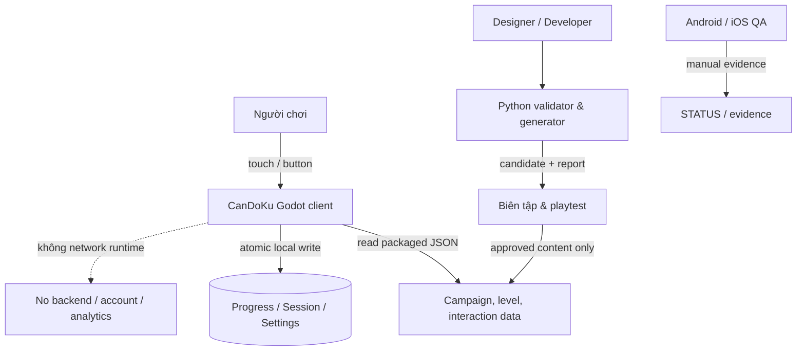
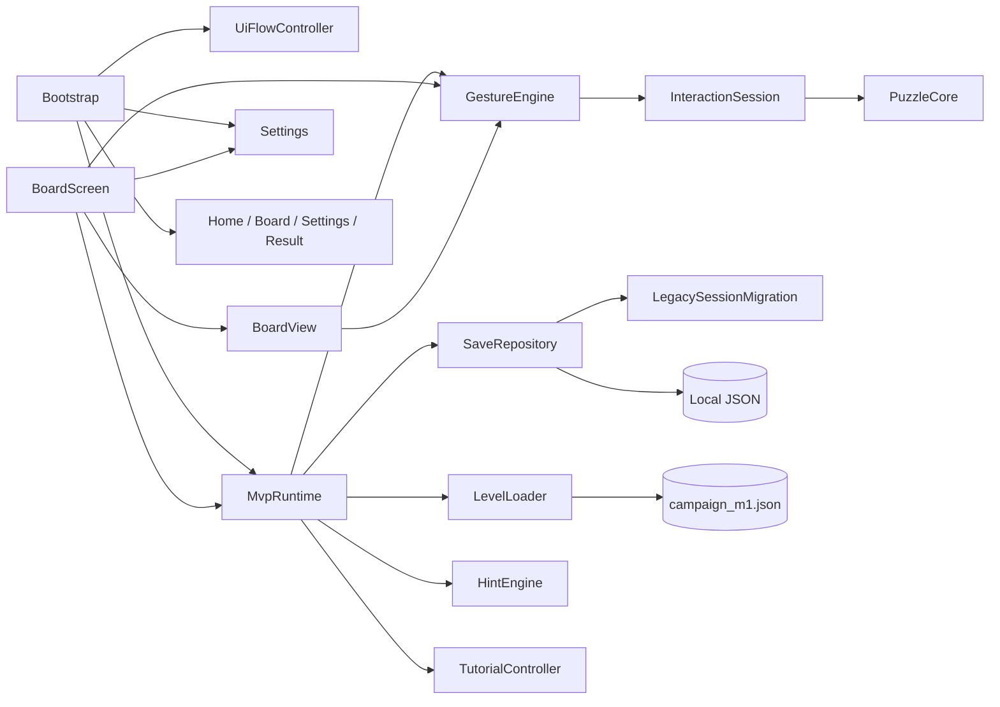
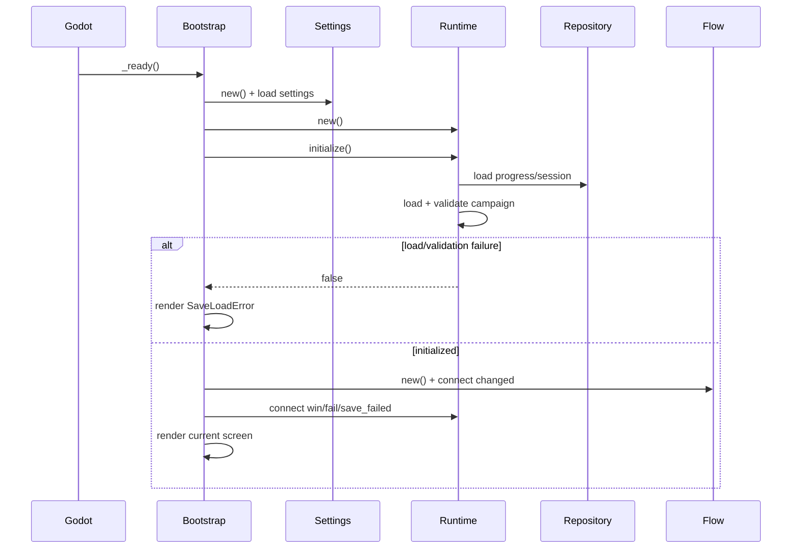
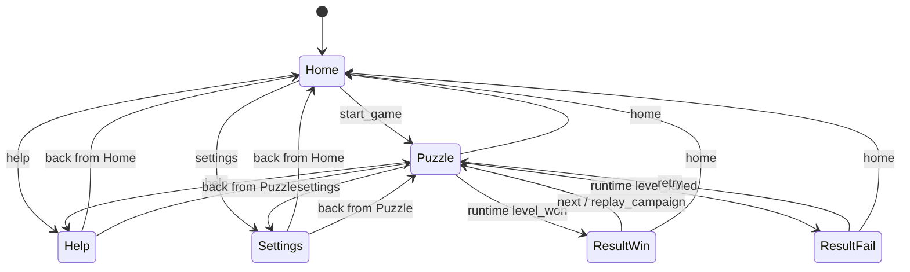
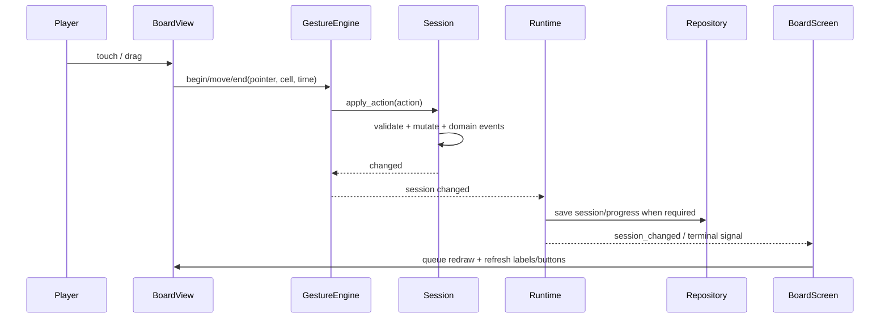
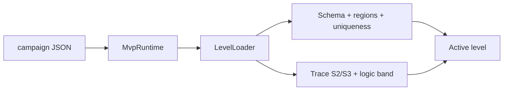
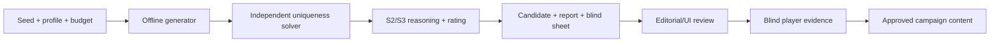
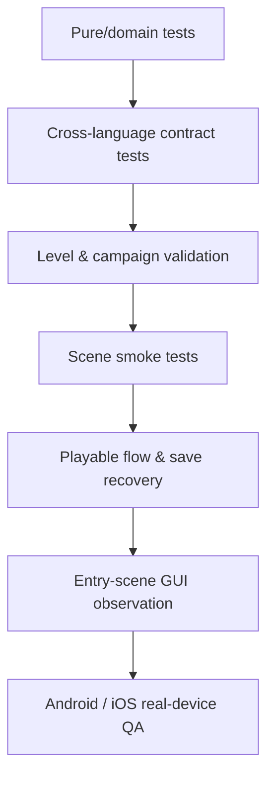

# CanDoKu — Kiến trúc phần mềm

> Kiến trúc đang tồn tại trong repository và hướng tiến hóa tới bản playtest 30 level. Cập nhật: 2026-10-01.

## 1. Phạm vi và nguồn sự thật

Tài liệu này mô tả ranh giới module, ownership state, luồng runtime, dữ liệu và kiểm thử. Nó không tuyên bố mọi phần của kiến trúc mục tiêu đã được triển khai.

- Luật/domain contract: [GDD 02](../GDD/02-luat-choi-va-trang-thai.md).
- Schema và API: [GDD 05](../GDD/05-kien-truc-va-du-lieu.md).
- Stack/build/tooling: [TECH_STACK](TECH_STACK.md).
- Sản phẩm và mốc 30 level: [GAME_OVERVIEW](GAME_OVERVIEW.md).
- Trạng thái thực tế: [STATUS](STATUS.md).

Các bảng dùng ba trạng thái: **hiện hành**, **mục tiêu**, **nợ kỹ thuật**.

## 2. Nguyên tắc kiến trúc

1. Runtime offline; không phụ thuộc backend để chơi hoặc lưu.
2. Luật puzzle tách khỏi scene/UI để kiểm thử xác định.
3. Runtime là owner của campaign/progress; screen chỉ trình bày và gửi intent.
4. Session là owner của trạng thái một lượt; gesture không tự sửa save.
5. Dữ liệu level không được tin mặc định; phải qua validator.
6. Save ghi atomic và không xóa session thắng trước khi progress lưu thành công.
7. Validator Python và GDScript độc lập có chủ đích để phát hiện lệch contract.
8. Scene entry thật là `bootstrap.tscn`; test một scene không thay bằng chứng full flow.
9. Mở rộng 4 → 30 level ưu tiên dữ liệu/configuration, không nhân bản logic theo từng level.

## 3. System context

## 4. Phân lớp hiện hành

| Lớp | Trách nhiệm | Thành phần chính |
| --- | --- | --- |
| Composition/navigation | Khởi tạo dependency, chọn screen, nối signal | `bootstrap.gd`, `ui_flow_controller.gd` |
| Application runtime | Campaign, level hiện tại, progress/session lifecycle, save orchestration | `mvp_runtime.gd` |
| Domain | Luật trạng thái ô, hành động, Hint, tutorial | `puzzle_core.gd`, `interaction_session.gd`, `hint_engine.gd`, `tutorial_controller.gd` |
| Input adapter | Chuyển touch/mouse thành action domain | `gesture_engine.gd`, `board_view.gd` |
| Presentation | Scene, layout, render board, toolbar, modal | `home_screen.gd`, `board_screen.gd`, `settings_screen.gd`, `.tscn` |
| Persistence/config | Progress, session, migration, settings | `save_repository.gd`, `legacy_session_migration.gd`, `settings.gd` |
| Content validation | Parse/schema/uniqueness/trace | `level_loader.gd`, `GDD/tools/validate_levels.py` |
| Offline content tooling | Sinh candidate, reasoning, report | `GDD/tools/generate_levels.py`, `level_reasoning.py`, `pilot_report.py` |
| Verification | Test discovery, runner, evidence | `tools/verify.py`, `game/tests`, `GDD/tools/test_*.py` |

## 5. Sơ đồ component runtime

## 6. Startup và dependency composition

Entry point: [`game/scenes/bootstrap.tscn`](../game/scenes/bootstrap.tscn) với script `bootstrap.gd`.

`Bootstrap` là composition root và screen host. Nó tạo Settings/Runtime/Flow, instantiate scene, nối button và phản ứng với signal. Các test có thể inject runtime/settings trước `_ready()` để cô lập filesystem.

### Trách nhiệm hiện quá rộng của Bootstrap

Ngoài composition/navigation, `bootstrap.gd` còn:

- tạo Help shell bằng code;
- sửa nội dung Home/Result;
- nối từng toggle Settings;
- hiển thị save error và retry;
- chứa cờ replay MVP.

Đây là nợ kỹ thuật chấp nhận được cho R1 nhưng cần theo dõi khi flow playtest tăng. Không tách chỉ để làm đẹp; chỉ tách khi có thay đổi thật cần boundary riêng.

## 7. Navigation state machine

`UiFlowController` chỉ giữ `current_screen` và `previous_screen`, nhận action semantic và phát `changed(screen_id)`.

Các screen ID hiện hành:

- `home`
- `puzzle`
- `result_win`
- `result_fail`
- `help`
- `settings`

`Bootstrap._render()` xóa screen cũ trong `ScreenHost` và instantiate screen mới. Progress không nằm trong Flow; Flow chỉ quyết định màn hình. Runtime quyết định level/session.

Khi rời Puzzle, input pending phải được settle: chạm đơn đã nhấc được commit; gesture đang giữ bị hủy theo contract lifecycle.

## 8. Campaign và application runtime

`MvpRuntime` là application service chính.

### State sở hữu

- `levels`: map level ID → level dictionary;
- `level_ids`: order campaign;
- `progress`: progress v2;
- `active_level`, `current_level_id`;
- `engine`: `GestureEngine` và session của nó;
- `tutorial_state`, `tutorial_controller`;
- `last_hint`;
- `progress_save_pending`;
- `repository`.

### Public lifecycle

| Method/signal | Vai trò |
| --- | --- |
| `initialize()` | Đọc contract/campaign, validate level, load progress và active session |
| `start_level(id, resume, persist)` | Chọn level, tạo engine/session hoặc resume session hợp lệ |
| `apply_action(action)` | Gửi action domain vào session qua engine/runtime |
| `use_hint()` | Xin Hint, áp kết quả hợp lệ và tăng count |
| `process_tutorial_action(action)` | Cập nhật milestone tutorial |
| `save_current_session()` | Ghi snapshot session |
| `retry_pending_save()` | Thử lại progress/session đang chờ |
| `level_ready` | Level đã sẵn cho UI |
| `session_changed` | Public state thay đổi |
| `level_won`, `level_failed` | Terminal event cho navigation |
| `save_failed` | Yêu cầu UI thông báo/retry |

Runtime hiện đọc campaign mặc định từ `res://data/campaign_m1.json`, nhưng constructor nhận `campaign_file`, cho phép test hoặc playtest inject campaign khác.

## 9. Gameplay domain

### 9.1 PuzzleCore

`puzzle_core.gd` giữ các phép toán thuần dữ liệu: kiểm quan hệ xung đột, nghiệm và quy tắc cơ bản. Nó không biết scene, file save hoặc button.

### 9.2 InteractionSession

Owner của một lượt chơi:

- level;
- map trạng thái ô;
- tim, lỗi, Hint;
- `attempt_state`;
- `undo_diff`;
- event arrays và `last_action`;
- tutorial-safe cell.

Action semantic gồm nhóm Mark/Clear X, stroke, Undo, TryCandy, Hint và Restart. Session từ chối action không hợp lệ trên given/candy/x_error, cập nhật domain event, tính Win/Failed và phát `changed`.

### 9.3 GestureEngine

GestureEngine là adapter input có state, không phải owner của progress. Nó:

- chỉ nhận pointer chính bắt đầu trong board;
- giữ pointer ID đến khi kết thúc;
- preview chạm đơn trước khi commit;
- phân biệt tap/drag bằng touch slop;
- phân biệt double tap bằng window thời gian;
- quét đủ ô trung gian khi kéo;
- flush pending tap hoặc cancel active gesture theo lifecycle;
- chuyển kết quả thành action cho `InteractionSession`.

### 9.4 HintEngine

HintEngine nhận level + public session payload và trả kết quả có evidence. Nó tìm S2 trước rồi S3; không dùng `solution` để chọn đáp án. Kết quả invalid/no-hint không được session tính như Hint thành công.

### 9.5 TutorialController

Tutorial hiện áp dụng cho ID tương thích L01/T01/1, giữ sáu milestone T1–T6 và policy riêng cho `TryCandy` ở ô hướng dẫn. State tutorial được runtime persist cùng session ở dạng cho phép.

## 10. Luồng một thao tác

Nếu save terminal/progress thất bại, runtime giữ trạng thái pending và phát `save_failed`; UI cho phép retry. Không được báo thắng hoàn tất bền vững nếu progress chưa ghi thành công.

## 11. Presentation architecture

### Home

`home.tscn` + `home_screen.gd` hiển thị tên game, CTA, Help/Settings và level hiện tại. Copy/layout có thể đọc `home_ui_config.json`; progress được Bootstrap truyền vào bằng `set_campaign_state()`.

### Board

`board.tscn` chỉ chứa root script; `board_screen.gd` dựng phần lớn interface bằng code. Nó là presenter/coordinator cho toolbar, status, Hint, tutorial, progress icon và modal Restart. `board_view.gd` chịu trách nhiệm hit-test/input forwarding và vẽ lưới/trạng thái ô.

`board_screen.gd` đang lớn vì chứa UI construction và presentation logic. Khi cần thay đổi lớn cho 30 level, ưu tiên tách widget theo responsibility (header, toolbar, hint panel) nếu test boundary rõ; không chuyển domain state vào widget.

### Settings

`settings.tscn` giữ layout; `settings_screen.gd` áp token từ `SettingsUIConfig`; `pill_switch.gd` render/tương tác switch. `Bootstrap` nối toggle với singleton-like Settings instance được inject vào screen/board.

### Result và Help

Win/Fail là scene tĩnh được Bootstrap bọc vào Stack và điền score/action. Help hiện được dựng động trong Bootstrap. Đây là implementation hiện hành, không phải yêu cầu kiến trúc lâu dài.

## 12. Persistence architecture

### 12.1 SaveRepository

`SaveRepository` quản lý progress/session và không phụ thuộc UI.

- progress v2 và session v3 có validator riêng;
- session bị ràng buộc bởi `levelId` + `puzzleHash`;
- JSON lỗi/không đúng schema không được âm thầm dùng;
- write dùng file tạm và backup để giảm nguy cơ hỏng save;
- session v2 đi qua `LegacySessionMigration` trên bản sao;
- `clear_session()` tách khỏi `clear_all()`.

### 12.2 Ownership và recovery

| Tình huống | Hành vi mong đợi |
| --- | --- |
| Startup đọc progress lỗi | Dừng flow, giữ dữ liệu, hiện lỗi đọc |
| Session không khớp level/hash | Không resume session sai puzzle |
| Save session thường thất bại | Báo lỗi; không giả vờ đã lưu |
| Win nhưng progress save thất bại | Giữ pending; retry trước khi xóa session/chuyển bền vững |
| App nền/chuyển màn | Flush tap đã nhấc, hủy gesture đang giữ, lưu snapshot hợp lệ |
| Session v2 hợp lệ | Migrate in-memory; lần save sau ghi v3 |

### 12.3 Settings store

Settings version 1 lưu riêng khỏi progress/session. Default hiện có: audio, haptic, reduced motion, high contrast, large text. Listener cho phép UI refresh khi setting đổi. Audio/haptic toggle chưa đồng nghĩa hệ thống output đã hoàn tất.

## 13. Content architecture

### 13.1 Packaged content

Level schema v4 chứa `solution` để validate/runtime kiểm đúng, nhưng Hint/trace không được dùng solution như oracle suy luận.

### 13.2 Offline authoring pipeline

Trạng thái nội dung:

1. `CANDIDATE`: mới sinh/biên tập.
2. `MACHINE_VALIDATED`: qua cổng máy được report ghi lại.
3. `RELEASE_REVIEWED`: qua duyệt người/UI/campaign theo profile được chốt.

Runtime không sinh level. Generator không ghi đè campaign và không tự promote candidate.

## 14. Validation strategy

Hai validator thực hiện cùng contract ở hai môi trường:

- GDScript `level_loader.gd` chặn content sai khi runtime/test load.
- Python `validate_levels.py` dùng cho authoring, CI/local gate và independent DFS.

Sự trùng lặp là boundary kiểm chéo, không phải code cần DRY bằng cách cho runtime gọi Python. Khi schema đổi, phải cập nhật cả hai và test cross-language.

Validator hiện có cổng `--release` cho campaign 24 level lịch sử. Mốc playtest 30 level cần gate có tên/phạm vi riêng và test chứng minh order 1–30; không dùng cờ legacy để tuyên bố đạt.

## 15. Error handling

| Boundary | Chiến lược |
| --- | --- |
| JSON parse | Trả lỗi có context; không dùng object nửa hợp lệ |
| Level validation | Fail closed; ID/reason rõ |
| Save read | Giữ file, không overwrite bằng default nếu chưa có quyết định recovery |
| Save write | Temp + backup + retry surface |
| Invalid UI route/action | Không mutate domain; fallback screen ở route không hợp lệ |
| Hint không tìm được | Trả reason; không tăng Hint như success |
| Generator hết budget | `INCOMPLETE`/exit 2, ghi unmet slots; không hạ tiêu chuẩn |
| Device/tool thiếu | Verification fail hoặc ghi NOT RUN; không coi là PASS |

## 16. Testing architecture

Các boundary chính:

- `run_puzzle_core_tests.gd`: luật thuần.
- `run_interaction_contract.gd` + Python vector test: input/session contract.
- `run_level_loader_tests.gd` + Python validator tests: schema/trace/uniqueness.
- `run_hint_engine_tests.gd`, `run_tutorial_tests.gd`: reasoning/tutorial.
- `run_save_repository_tests.gd`, `run_save_failure_tests.gd`: persistence/recovery.
- `run_ui_flow_tests.gd`, `run_ui_shell_tests.gd`, `run_board_scene_smoke.gd`: wiring/layout contract.
- `run_playable_flow_tests.gd`, `run_mvp_runtime_tests.gd`: application lifecycle.
- capture/thiết bị: quan sát thật, không được discovery như `run_*.gd` nếu cần GPU/tương tác.

## 17. Kiến trúc mục tiêu cho playtest 30 level

### Giữ nguyên

- Level schema v4, progress v2, session v3 nếu không phát hiện nhu cầu migration thật.
- Runtime/data separation và campaign injection.
- Domain rules S1–S3 hiện hành.
- Offline generation + independent validation + human review.
- Save local/offline và không backend.

### Cần bổ sung

1. **Campaign profile 30**: order 1–30, ID bất biến, band 25–30 được phê duyệt.
2. **Playtest gate**: validator/test riêng cho 30 level; cờ legacy 24 không được tái dùng mơ hồ.
3. **Content packaging**: campaign playtest tách rõ khỏi fixture/bốn level R1.
4. **Long-campaign tests**: resume ở đầu/giữa/cuối, level 30, completed state và replay policy.
5. **Migration policy**: nếu tester nâng build giữa hai revision, ID/hash thay đổi phải có quyết định giữ/reset dữ liệu.
6. **Operational metadata**: build ID/revision và puzzle hash có trong phiếu/dataset playtest.
7. **Device budget**: đo load/memory/render với asset và campaign đại diện.
8. **Distribution configuration**: Android/iOS signing, versioning và kênh phát build hạn chế.

### Không thêm trước khi có quyết định

- backend/content download;
- runtime generator;
- account/cloud save;
- level select/chapter map;
- telemetry mạng;
- schema v5 chỉ để đổi số lượng level;
- service locator hoặc dependency injection framework.

## 18. Known gaps và nợ kỹ thuật

| Gap | Tác động | Điều kiện xử lý |
| --- | --- | --- |
| Campaign runtime chỉ có bốn level | Chưa kiểm scale 30 | Khi profile/content batch đầu được duyệt |
| `--release` hard-code gate 24 | Không thể chứng nhận playtest 30 | Trước tích hợp campaign 30 |
| Interaction contract nằm dưới `res://tests/fixtures` nhưng runtime đọc | Test data trở thành dependency đóng gói | Chuyển contract runtime sang `game/data` khi sửa packaging, giữ regression |
| Bootstrap có nhiều trách nhiệm | Khó mở rộng nhiều modal/route | Tách khi có feature cụ thể làm file khó kiểm soát |
| BoardScreen dựng UI bằng code và khá lớn | Khó review layout/presenter | Tách widget khi thay đổi lớn cho playtest, không refactor rỗng |
| Audio/haptic chỉ có setting | Toggle có thể gây kỳ vọng sai | Kết nối output hoặc disable/copy rõ trong playtest |
| Replay cuối campaign là cờ MVP | Hành vi playtest chưa chốt | Quyết định trước build phân phối |
| iOS signing trống | Không có build iOS | Chủ dự án cung cấp Mac/team/signing |
| Không hosted CI | Gate phụ thuộc runner local | Chỉ thêm CI khi môi trường/secret/build strategy được chốt |

## 19. Quy tắc thay đổi kiến trúc

- Thay luật, schema, save version, release scope hoặc network capability phải có quyết định mới trong `DECISIONS.md`.
- Thay public action/event phải cập nhật vector tương tác, Python reference và Godot tests.
- Thay schema level phải cập nhật loader GDScript, validator Python, fixture, generator và migration/content.
- Thay campaign phải kiểm ID/order/hash, progress/session compatibility và full flow.
- Thay UI/input/navigation phải quan sát từ entry scene thật; headless không đủ.
- Không dùng sơ đồ tài liệu để tuyên bố module đã tồn tại; source và STATUS mới là bằng chứng.

## 20. Bản đồ source nhanh

| Câu hỏi | Nơi bắt đầu đọc |
| --- | --- |
| App khởi động và đổi màn thế nào? | `game/scripts/bootstrap.gd`, `ui_flow_controller.gd` |
| Ai giữ progress và level hiện tại? | `game/scripts/mvp_runtime.gd` |
| Một action đổi state ra sao? | `gesture_engine.gd`, `interaction_session.gd`, `puzzle_core.gd` |
| Board render/input ở đâu? | `board_screen.gd`, `board_view.gd`, `board.tscn` |
| Save và migration ở đâu? | `save_repository.gd`, `legacy_session_migration.gd` |
| Level được kiểm thế nào? | `level_loader.gd`, `GDD/tools/validate_levels.py` |
| Candidate được sinh thế nào? | `GDD/tools/generate_levels.py`, `level_reasoning.py` |
| Full gate chạy gì? | `tools/verify.py`, `AGENTS.md` |
| Sản phẩm đang ở đâu? | `docs/STATUS.md`, `docs/ROADMAP.md` |
