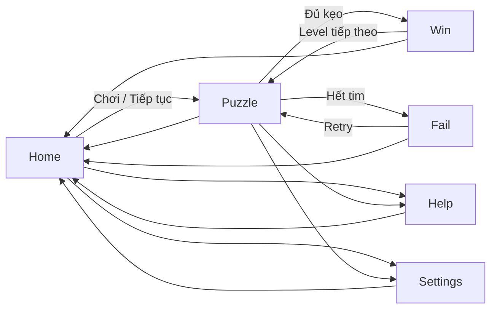

# CanDoKu — Tổng quan game

> Tài liệu dành cho đội phát triển, người mới tham gia dự án và đối tác cần hiểu sản phẩm. Cập nhật: 2026-10-01.

## 1. Vai trò của tài liệu

Tài liệu này giải thích CanDoKu ở cấp sản phẩm: người chơi làm gì, trải nghiệm hướng tới đâu, bản hiện tại có gì và bản playtest 30 level cần đạt gì. Đây không phải nguồn luật duy nhất.

- Luật chuẩn và trạng thái ô: [GDD 02](../GDD/02-luat-choi-va-trang-thai.md).
- Luồng màn hình và UX: [GDD 03](../GDD/03-luong-man-hinh-va-ux.md).
- Tiêu chí level: [GDD 04](../GDD/04-thiet-ke-level.md).
- Quyết định mới có hiệu lực: [DECISIONS](DECISIONS.md).
- Tiến độ và bằng chứng mới nhất: [STATUS](STATUS.md).
- Công nghệ và cách vận hành: [TECH_STACK](TECH_STACK.md).
- Cấu trúc phần mềm và luồng dữ liệu: [ARCHITECTURE](ARCHITECTURE.md).

Khi tài liệu tổng quan khác GDD 02 về luật, GDD 02 thắng. Khi số liệu tiến độ khác STATUS, STATUS thắng.

## 2. Tóm tắt sản phẩm

CanDoKu là game puzzle suy luận 2D, chơi dọc, một người và offline. Trên mỗi bàn `N×N`, người chơi tìm đúng một viên kẹo trong mỗi hàng, mỗi cột và mỗi vùng. Các viên kẹo không được chạm nhau theo đường chéo. Người chơi đánh dấu `X` vào ô bị loại, dùng Hint khi cần và hoàn thành bàn bằng suy luận thay vì đoán.

Lời hứa trải nghiệm:

- luật ít nhưng tạo được chuỗi suy luận rõ ràng;
- một lượt chơi ngắn, có thể dừng và tiếp tục;
- phản hồi chạm phù hợp màn hình cảm ứng;
- không tài khoản, quảng cáo, IAP hoặc analytics mạng trong phạm vi hiện tại;
- level và tài sản là nội dung gốc của dự án.

## 3. Trạng thái sản phẩm

| Mốc | Trạng thái | Ý nghĩa |
| --- | --- | --- |
| R1 hiện tại | Đã có client bốn level; chưa nghiệm thu đầy đủ thiết bị | Kiểm vòng chơi, save/resume, tutorial, Hint, Undo, Settings và Result |
| Nghiệm thu R1 | Đang còn việc | Cần thao tác thật trọn bốn level và QA Android; iOS chưa có nguồn lực/signing |
| Playtest trước phát hành | Mục tiêu tiếp theo sau các cổng R1/R2/R3 liên quan | Campaign tuyến tính 30 level để thu phản hồi và hiệu chỉnh |
| Bản chính thức | Chưa chốt | Quy mô nội dung và thay đổi sản phẩm được quyết định sau playtest 30 level |

Mốc 30 level là **bản playtest**, không phải tuyên bố sản phẩm đã sẵn sàng phát hành. Mục tiêu 24 level trước đây được thay thế ở cấp kế hoạch bởi RST-011; các bằng chứng lịch sử vẫn giữ nguyên theo revision của chúng.

## 4. Luật cốt lõi

Với bàn kích thước `N×N`:

1. Có đúng `N` viên kẹo.
2. Mỗi hàng có đúng một viên kẹo.
3. Mỗi cột có đúng một viên kẹo.
4. Mỗi vùng có đúng một viên kẹo; mỗi ô thuộc đúng một vùng.
5. Hai viên kẹo không được chạm nhau theo đường chéo.
6. Level phát hành hoặc playtest phải có đúng một nghiệm.
7. Lời giải công bố phải dùng các quy tắc suy luận được hỗ trợ, không đọc trường `solution` để giả lập suy luận.

Trạng thái ô runtime:

| Trạng thái | Ý nghĩa | Có thể thay đổi bởi người chơi |
| --- | --- | --- |
| `empty` | Chưa đánh dấu | Có |
| `x` | Ô bị loại | Có, chạm lại để xóa |
| `x_error` | Lần thử kẹo sai | Không; giữ để thể hiện lỗi |
| `candy` | Kẹo đúng hoặc given | Không |

Tọa độ trong JSON/code là zero-based `(r,c)`. Nội dung hiển thị cho người chơi dùng hàng/cột one-based.

## 5. Điều khiển và phản hồi

| Thao tác | Kết quả |
| --- | --- |
| Chạm đơn | Đặt hoặc xóa `X` |
| Kéo | Đặt/xóa một nét `X` qua nhiều ô hợp lệ |
| Chạm đôi cùng ô | Thử tìm kẹo |
| Undo | Hoàn tác thao tác `X` gần nhất theo hợp đồng session |
| Hint | Xin một bước suy luận hợp lệ; không tự đọc đáp án |
| Restart | Tạo lại lượt hiện tại sau xác nhận |

Hợp đồng hiện hành dùng cửa sổ chạm đôi 280 ms và ngưỡng kéo 12 điểm logic. Đây là tham số cần playtest trên thiết bị, không phải hằng số trải nghiệm đã được chứng minh tối ưu.

Người chơi bắt đầu với ba tim. Thử sai tạo `x_error`, giảm một tim và tăng bộ đếm lỗi. Hết tim chuyển sang Fail; tìm đủ kẹo chuyển sang Win. Cách tính điểm chi tiết thuộc GDD 02 và session runtime.

## 6. Vòng lặp người chơi

Runtime lưu level hiện tại, kết quả đã hoàn thành và session đang chơi. Bản R1 cho phép chơi lại từ L01 sau cuối campaign bằng cờ kiểm thử; bản playtest phải chốt hành vi cuối campaign trước khi phân phối.

## 7. Các hệ thống đã có trong client

- Home hiển thị level hiện tại và trạng thái tiếp tục/chơi lại.
- Board hỗ trợ bàn 4×4–6×6 hiện hành, màu vùng, kẹo, tim và thanh công cụ.
- Gesture engine xử lý chạm đơn, chạm đôi, kéo, multi-touch phụ và hủy/flush khi đổi lifecycle.
- Session giữ trạng thái ô, tim, lỗi, Hint, Undo và trạng thái `Playing/Won/Failed`.
- Hint engine hỗ trợ S2 và S3 theo chứng cứ hiện có.
- Tutorial có sáu milestone và chính sách miễn phạt đúng phạm vi.
- Save local dùng progress v2 và session v3, ghi atomic và có backup.
- Settings lưu audio, haptic, reduced motion, high contrast và large text; audio/haptic chưa có asset/output hoàn chỉnh.
- Help, Settings, Win và Fail đã nối vào flow.
- Validator Python và validator GDScript kiểm schema level v4, uniqueness và trace.
- Generator offline có thể tạo ứng viên N=4–6; ứng viên chưa tự trở thành campaign.

Các mục trên mô tả khả năng có trong code, không thay thế bằng chứng GUI/thiết bị ở STATUS.

## 8. Mục tiêu bản playtest 30 level

### 8.1 Mục đích

Bản 30 level dùng để kiểm tra:

- người mới có hiểu luật, `X`, chạm đôi và Hint không;
- đường cong học có tăng hợp lý trên 30 màn liên tiếp không;
- thời gian giải, lỗi, Hint, bỏ cuộc và điểm kẹt thực tế;
- vùng có dễ đọc trên màn hình điện thoại không;
- save/resume, Retry, Home và cuối campaign có ổn định trên một campaign dài hơn không;
- hiệu năng và layout trên Android/iOS mục tiêu.

### 8.2 Phạm vi nội dung

- 30 level gốc, ID ổn định, order liên tục 1–30.
- Kích thước phát hành thử N=4–6; schema vẫn giữ khả năng N=4–12 nhưng N>6 không thuộc mốc này.
- Campaign tuyến tính, không chọn màn hoặc bỏ qua level chưa thắng.
- Level 1 tiếp tục là tutorial.
- Order 1–18 giữ baseline S1/S2; order 19–24 giữ baseline cần S3.
- Phân bố chi tiết của order 25–30 chưa được quyết định bằng dữ liệu người chơi. Chúng phải ở trong ruleset S1–S3 hiện hành, không tự mở S4/S5, và phải có profile nội dung được duyệt trước khi sản xuất.
- Không đưa candidate máy sinh thẳng vào campaign; từng level cần uniqueness, trace, duyệt hình vùng, UI và playtest.

### 8.3 Không thuộc mốc playtest

- Endless hoặc sinh level trong runtime.
- Daily challenge, leaderboard, tài khoản, cloud save hoặc analytics mạng.
- Quảng cáo, IAP, tiền tệ, cứu lượt hoặc bộ sưu tập.
- Bàn N>6, zoom/pan hoặc luật suy luận mới ngoài S1–S3.
- Cam kết số level hay ngày phát hành chính thức.

## 9. Kế hoạch tiến hóa sản phẩm

| Giai đoạn | Đầu ra | Cổng chuyển tiếp |
| --- | --- | --- |
| 1. Chốt R1 | Vòng chơi bốn level ổn định | Desktop journey, gesture thật, save/resume và Android QA có bằng chứng |
| 2. Kiểm người mới | Tutorial/UX được sửa theo quan sát | Ít nhất 8/10 người mới hoàn thành hướng dẫn và hiểu `X` theo tiêu chí GDD |
| 3. Sản xuất nội dung | 30 level qua cổng máy và biên tập | Schema, uniqueness, trace, logic band, chống trùng và duyệt hình vùng |
| 4. Playtest 30 level | Build phân phối hạn chế và dữ liệu cục bộ có đồng ý | Báo cáo hoàn thành, thời gian, Hint, lỗi, bỏ cuộc, UX và thiết bị |
| 5. Quyết định bản chính thức | Phạm vi release được chủ dự án chốt | Dựa trên bằng chứng playtest; cập nhật GDD, validator và release gate riêng |

## 10. Dữ liệu playtest cần thu

Không thu analytics mạng. Người điều phối ghi dữ liệu cục bộ theo phạm vi người tham gia đồng ý:

- mã người chơi ẩn danh và mức kinh nghiệm;
- revision/build và hash level;
- thứ tự level trong buổi thử;
- thời gian chủ động, thời gian nghỉ và kết quả hoàn thành/bỏ cuộc;
- số Hint, lỗi, Retry và vị trí bị kẹt;
- lỗi hiểu luật, thao tác hoặc nội dung;
- thiết bị, OS, kích thước màn hình và vấn đề safe area;
- nhận xét định tính sau lượt chơi.

Không điền `0` thay cho dữ liệu chưa đo. Phân tích tách nhóm hoàn thành không trợ giúp, hoàn thành có trợ giúp và bỏ cuộc.

## 11. Tiêu chí thành công và giới hạn

Bản playtest được coi là đủ dữ liệu để ra quyết định khi:

- toàn bộ 30 level có nguồn gốc, schema, nghiệm duy nhất và trace hợp lệ;
- luồng fresh/resume/Win/Fail/Retry/Home/cuối campaign chạy trên build chốt;
- tutorial đạt tiêu chí hiểu thao tác hiện hành;
- mỗi level có dữ liệu người chơi mục tiêu đủ để đánh giá, thay vì chỉ có rating máy;
- không còn crash, mất save, sai luật hoặc lỗi chặn campaign;
- giới hạn Android/iOS được ghi rõ, không lấy headless thay QA thiết bị.

Playtest thành công không tự động đồng nghĩa sẵn sàng phát hành. Sau playtest, chủ dự án quyết định số level chính thức, nội dung cần thay, mức polish, nền tảng và lịch phát hành.

## 12. Thuật ngữ

| Thuật ngữ | Nghĩa trong dự án |
| --- | --- |
| Candidate | Level mới tạo, chưa qua toàn bộ cổng |
| `MACHINE_VALIDATED` | Đã qua cổng máy được ghi trong report; chưa qua người/UI |
| Playtest build | Build phân phối hạn chế để học từ người chơi; không phải release chính thức |
| Campaign | Chuỗi level tuyến tính mà runtime tải và lưu tiến trình |
| Logic trace | Chuỗi bước S2/S3 tái hiện được mà không đọc đáp án |
| Puzzle hash | Hash nội dung level dùng để buộc session đúng puzzle |
| R1–R4 | Các mốc sản phẩm trong [ROADMAP](ROADMAP.md), không phải version marketing |
