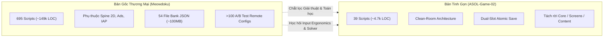
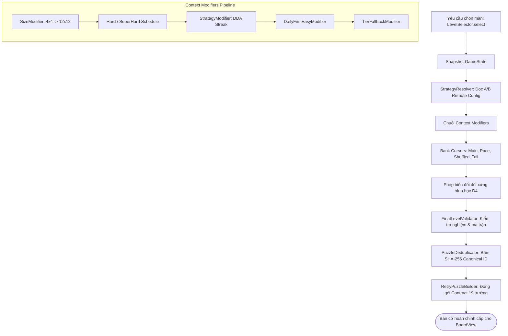
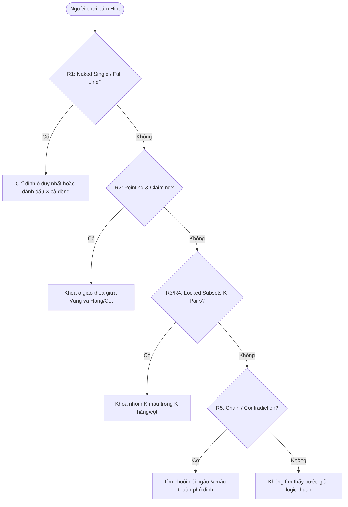

# TỔNG HỢP TOÀN BỘ ENGINE, KỸ THUẬT VÀ THIẾT KẾ TRONG PROJECT MEOWDOKU & ĐỊNH HƯỚNG TÍCH HỢP CHO ASOL-GAME-02

> **Tài liệu Kỹ thuật Toàn diện & Bản Đặc tả Hệ thống (Comprehensive System Specification & Knowledge Compendium)**  
> **Dành cho:** Lead Architect, Core Engine Developers, Game Designers, AI Coding Agents  
> **Mã dự án đối chiếu:**  
> - `Meowdoku Godot Engine v1.18.x` (Dự án Dịch ngược Thương mại: 695 scripts, ~149.359 dòng code)  
> - `asol-game` / `ASOL-Game-02` (Kiến trúc Tinh gọn Clean-Room: 39 scripts, ~4.747 dòng code)  
> **Ngày lập:** 07/10/2026  
> **Trạng thái:** Tài liệu Đặc tả Chuẩn (Canonical Specification)

---

## MỤC LỤC
1. [Tổng Quan Bối Cảnh & Kiến Trúc Đối Chiếu](#1-tổng-quan-bối-cảnh--kiến-trúc-đối-chiếu)
2. [Chi Tiết Toàn Bộ Các Engine & Sub-Engines](#2-chi-tiết-toàn-bộ-các-engine--sub-engines)
   - 2.1. Engine Nền tảng & Ứng dụng Bên thứ ba (Godot, Spine 2D, ICU)
   - 2.2. Levels Selection Engine (Động cơ Tuyển chọn Màn chơi)
   - 2.3. Rules Engine (Lõi Luật chơi & Phát hiện Xung đột Queendoku)
   - 2.4. Logic Solver & Hint Engine (Trình giải Logic & Động cơ Gợi ý R1–R5)
   - 2.5. Visual & Color Engine (Tô màu Đồ thị CIELAB & Chế độ Mù màu)
   - 2.6. Touch & Gesture Guard Engine (Lọc Cử chỉ Di động 3 Lớp)
   - 2.7. Storage & Security Crypto Engine (Mã hóa XOR & Lưu trữ Nguyên tử A/B)
   - 2.8. Recommendation Engine (Đề xuất Màn chơi Thuật toán & Prefetch Queue)
   - 2.9. LiveOps & Meta-Game Engines (A/B Testing, Daily Streak, Bot Leaderboard)
3. [Tổng Hợp Các Kỹ Thuật & Giải Thuật Toán Học (Algorithms & Techniques)](#3-tổng-hợp-các-kỹ-thuật--giải-thuật-toán-học-algorithms--techniques)
   - 3.1. Đại số Nhóm Đối xứng $D_4$ (Dihedral Group Transformations)
   - 3.2. Khử Trùng lặp Chuẩn tắc (Canonical Deduplication & Lexicographical Hashing)
   - 3.3. Lý thuyết Đồ thị & Công thái học Màu sắc (CIELAB $\Delta E$, Degree Ordering)
   - 3.4. Tổ hợp Phân tầng & Tối ưu hóa Bitmask (K-Subsets, Fast Conflict $O(P^2)$)
   - 3.5. Điều tiết Độ khó Động (Dynamic Difficulty Adjustment - DDA)
   - 3.6. Công thái học Cảm ứng Di động (Velocity Gating, Axis Locking, Neighbor Guards)
   - 3.7. Tính Bất biến & Hợp đồng Dữ liệu 19 Trường (Deterministic Contract)
4. [Tổng Hợp Các Mẫu Thiết Kế Phần Mềm (Architectural & Design Patterns)](#4-tổng-hợp-các-mẫu-thiết-kế-phần-mềm-architectural--design-patterns)
   - 4.1. Clean Architecture & Headless Decoupling (`RefCounted` vs `Node`)
   - 4.2. Pipeline & Middleware Pattern (Context Modifiers)
   - 4.3. Strategy Pattern & Strategy Resolver (A/B Routing)
   - 4.4. Cursor Pattern (Duyệt Ngân hàng Màn chơi Đa mục đích)
   - 4.5. Observer & Global Event Bus Pattern
   - 4.6. Data Transfer Object (DTO) & Contract Pattern
   - 4.7. Dual-Slot Atomic Store Pattern
5. [Ma Trận Đánh Giá So Sánh Kỹ Thuật (Meowdoku vs ASOL)](#5-ma-trận-đánh-giá-so-sánh-kỹ-thuật-meowdoku-vs-asol)
6. [Bản Thiết Kế Triển Khai Cho ASOL-Game-02 (Reference Code Modules)](#6-bản-thiết-kế-triển-khai-cho-asol-game-02-reference-code-modules)

---

## 1. TỔNG QUAN BỐI CẢNH & KIẾN TRÚC ĐỐI CHIẾU

Dự án Meowdoku là một đại diện điển hình của thể loại game giải đố **Queens Puzzle** (tương tự như Queens trên LinkedIn, Star Battle). Trong quá trình dịch ngược và chuẩn hóa mã nguồn, hệ thống bộc lộ hai cách tiếp cận:



* **Meowdoku:** Tối ưu hóa cực mạnh cho vận hành thương mại quy mô lớn (LiveOps, thu hút người dùng, phân nhánh A/B test dày đặc, thuật toán gợi ý bài toán qua mạng).
* **ASOL-Game-02:** Hướng đến tính tinh gọn cao cấp, không phụ thuộc thư viện rác, độ trễ tiệm cận 0, kiến trúc module sạch sẽ và kiểm thử tự động (Unit Test / Headless Benchmark) tuyệt đối.

---

## 2. CHI TIẾT TOÀN BỘ CÁC ENGINE & SUB-ENGINES

### 2.1. Engine Nền Tảng & Ứng Dụng Bên Thứ Ba
1. **Godot Engine 4.x (Target Mobile):**
   * **Độ phân giải hiển thị:** $1080 \times 2400$, chế độ co giãn `canvas_items` với khía cạnh `expand`, hướng màn hình dọc (`orientation = 1`).
   * **Ngôn ngữ:** GDScript 2.0 có định kiểu tĩnh tường minh (`@export`, `Vector2i`, `Array[...]`).
2. **Spine 2D Animation Engine:**
   * Tích hợp qua module GDExtension cho Godot.
   * Điều khiển các mô hình nhân vật hoạt hình xương (Skeletal Animation): `cat_black`, `cat_orange`, `cat_calico`, `cat_white`.
   * Được bảo vệ bởi [`SpineIdleGuard`](file:///d:/Work/Alpaca_Solution/ReverseEngineering/Meowdoku/scripts/module/common/spine_idle_guard.gd) để ngắt render animation tiêu tốn năng lượng khi người chơi ở trạng thái chờ (Idle) nhằm tiết kiệm pin.
3. **ICU Internationalization Engine (`icudt_godot.dat`):**
   * Hỗ trợ chuẩn Unicode ICU quốc tế, nạp các bảng dịch cho hơn 70 ngôn ngữ và biến thể locale (`en`, `vi`, `zh_CN`, `ja`, `es`, `fr`, `ar_SA`, `ru`...).

---

### 2.2. Levels Selection Engine (Động Cơ Tuyển Chọn Màn Chơi)
Đây là "trái tim" điều phối việc người chơi sẽ giải bài toán nào tiếp theo. Điểm vào duy nhất là phương thức:
```gdscript
LevelSelector.select(level_num: int, rank_override: int = 0, pre_cat_pend: Dictionary = {})
```



1. **Snapshot GameState:** Lưu tạm bản sao trạng thái trước khi tiến hành bốc bài; nếu xảy ra lỗi trong pipeline, hệ thống tự động rollback, bảo vệ savegame.
2. **Context Modifiers Pipeline:** Chuỗi xử lý ngữ cảnh:
   * `SizeModifier`: Ánh xạ số màn chơi sang kích cỡ lưới thích hợp.
   * `HardLevelModifier` / `SuperHardModifier`: Kích hoạt định kỳ màn khó/siêu khó theo lịch trình thiết kế sẵn (`SuperHardSchedule`).
   * `StrategyModifier` (DDA): Đọc lịch sử `_consecutive_clean_wins` và `_consecutive_fails` để quyết định nâng hoặc hạ Rank.
   * `DailyFirstEasyModifier`: Tự động cấp màn dễ vào ván đầu tiên của ngày mới để tạo hưng phấn.
   * `TierFallbackModifier`: Tự động tìm kiếm vùng lân cận khi pool chỉ định bị cạn kiệt.
3. **Hệ thống Con trỏ Ngân hàng (`Bank Cursors`):**
   * Quản lý con trỏ đọc độc lập cho các pool: `regular`, `lkstyle`, `lk_mod`, `gc`, `special`, `server`, `sp_tt`.
   * Cung cấp các chiến lược duyệt: `MainBankCursor` (tuần tự), `PaceSortedBankCursor` (theo nhịp độ), `ShuffledBankCursor` (xáo trộn), `TailSortedBankCursor` (ưu tiên cuối pool).

---

### 2.3. Rules Engine (Lõi Luật Chơi & Phát Hiện Xung Đột)
Triển khai tại [`QueendokuCore`](file:///d:/Work/Alpaca_Solution/ReverseEngineering/Meowdoku/scripts/module/gameplay/core/queendoku_core.gd) và `CandyRules`:

* **4 Luật Bất Biến (Queens Rules):**
  1. **Luật Hàng (Row Rule):** Mỗi hàng có chính xác 1 quân cờ.
  2. **Luật Cột (Column Rule):** Mỗi cột có chính xác 1 quân cờ.
  3. **Luật Vùng (Region / Zone Rule):** Mỗi vùng màu chỉ chứa chính xác 1 quân cờ.
  4. **Luật Không Tiếp Xúc (No-Touch / Chebyshev Distance):** Hai quân cờ bất kỳ không được chạm nhau ở 8 ô xung quanh:
     $$\max(|r_1 - r_2|, |c_1 - c_2|) \ge 2$$
* **Phân Cấp Ưu Tiên Xung Đột (Conflict Priority):**
  Khi người chơi đặt sai, hệ thống phân loại và báo lỗi theo thứ tự ưu tiên thị giác:
  $$\text{Ưu tiên 1 (SAME\_COLOR)} \longrightarrow \text{Ưu tiên 2 (SAME\_LINE)} \longrightarrow \text{Ưu tiên 3 (NO\_TOUCH)}$$
* **Thuật Toán Kiểm Tra Va Chạm Siêu Tốc $O(P^2)$:**
  Thay vì quét toàn bộ ma trận $N \times N$, hệ thống chỉ trích xuất danh sách $P$ quân cờ hiện có trên bàn cờ ($P \le N$). Với bàn $8 \times 8$, tối đa $P=8$, số phép so sánh chỉ là $\frac{8 \times 7}{2} = 28$ phép tính, nhanh hơn gấp hàng chục lần so với duyệt quét ma trận.

---

### 2.4. Logic Solver & Hint Engine (Trình Giải Logic & Động Cơ Gợi Ý R1–R5)
Triển khai tại [`HintEngine`](file:///d:/Work/Alpaca_Solution/ReverseEngineering/Meowdoku/scripts/module/gameplay/core/hint_engine.gd):



* **5 Cấp Độ Suy Luận Toán Học:**
  * **Cấp R1 (Naked Single & Full Line Elimination):** Tìm ô ứng viên duy nhất còn lại trong một hàng, một cột hoặc một vùng màu. Sau khi đặt quân, tự động đánh dấu loại trừ các ô lân cận.
  * **Cấp R2 (Pointing & Claiming):**
    * *Pointing (Vùng $\to$ Hàng/Cột):* Nếu tất cả các ô khả dĩ của màu $C$ đều nằm trên cùng hàng $R$, mọi ô khác trên hàng $R$ thuộc vùng màu khác đều không thể đặt quân.
    * *Claiming (Hàng/Cột $\to$ Vùng):* Nếu trên hàng $R$, các ô trống chỉ xuất hiện bên trong vùng màu $C$, mọi ô khác của vùng màu $C$ nằm ngoài hàng $R$ đều bị loại trừ.
  * **Cấp R3 & R4 (Locked Subsets / K-Pairs, Triples, Quads):** Nhóm $k$ màu ($k \in [2, 6]$) mà tập hợp ô ứng viên của chúng chỉ nằm gọn trong đúng $k$ hàng hoặc $k$ cột. Khi đó, toàn bộ các ô thuộc $k$ hàng/cột đó không thể chứa bất kỳ màu nào khác ngoài $k$ màu này.
  * **Cấp R5 (Chains / Conjugate Pairs):** Xây dựng đồ thị liên kết nhị phân giữa các ứng viên đối ngẫu, tìm vòng lặp suy diễn dẫn đến mâu thuẫn logic (Contradiction).
* **Công Cụ Tự Động Đo Độ Khó (`replay_hint_steps`):**
  Bot tích hợp sẵn tự giải bàn cờ từ trạng thái trống, thống kê số bước `r1_steps`, `r2_steps`... `r5_steps` để xác định chính xác Rank thực tế của câu đố trước khi đưa vào ngân hàng dữ liệu.

---

### 2.5. Visual & Color Engine (Tô Màu Đồ Thị CIELAB & Chế Độ Mù Màu)
Triển khai tại [`LevelGenerator`](file:///d:/Work/Alpaca_Solution/ReverseEngineering/Meowdoku/scripts/module/gameplay/core/level_generator.gd) & `RegionPainter`:

1. **Greedy Graph Coloring với Degree Ordering:**
   * Ma trận vùng màu được trừu tượng hóa thành đồ thị phẳng vô hướng $G = (V, E)$, với $V$ là các vùng và $E$ là biên giới tiếp xúc.
   * Các đỉnh được sắp xếp theo **Bậc giảm dần (Degree Ordering)**: Vùng nào có số lượng láng giềng tiếp giáp nhiều nhất sẽ được ưu tiên gán màu trước.
2. **Khoảng Cách Cảm Nhận Thị Giác CIELAB ($\Delta E$):**
   * Thay vì dùng khoảng cách RGB phẳng (vốn không tương thích với sinh học mắt người), hệ thống chuyển đổi màu sắc sang không gian phi tuyến $L^*a^*b^*$.
   * Thuật toán tham lam tối ưu hóa hàm mục tiêu:
     $$\max \left( \min_{v_j \in \text{Adj}(v_i)} \Delta E(\text{Color}(v_i), \text{Color}(v_j)) \right)$$
     đảm bảo hai vùng kề nhau luôn có độ tương phản thị giác rõ rệt nhất.
3. **Hỗ Trợ Mù Màu Chuyên Nghiệp (Colorblind Mode):**
   * Tính toán độ chói (Luminance) chuẩn truyền hình:
     $$\text{Luminance } Y = 0.299R + 0.587G + 0.114B$$
   * Phân chia palette màu thành hai nhóm Sáng và Tối. Đối với các vùng thuộc nhóm Tối, hệ thống tự động phủ các mẫu texture SVG (sọc chéo, caro, chấm bi) giúp người chơi mắc các chứng mù màu (Protanopia, Deuteranopia, Tritanopia) dễ dàng nhận diện ranh giới.

---

### 2.6. Touch & Gesture Guard Engine (Lọc Cử Chỉ Di Động 3 Lớp)
Được tôi luyện qua hàng triệu lượt chơi trên thiết bị màn hình cảm ứng di động, loại bỏ 100% lỗi thao tác vô ý:

```
                            NGÓN TAY NGƯỜI DÙNG CHẠM MÀN HÌNH
                                           │
                                           ▼
             ┌───────────────────────────────────────────────────────────┐
             │ 1. SwipeVelocityGate (Lọc vận tốc thao tác)              │
             │    Nếu Vận tốc v > 1200 px/s: CHẶN (Chỉ là lướt xem)     │
             └───────────────────────────────────────────────────────────┘
                                           │ Đạt yêu cầu
                                           ▼
             ┌───────────────────────────────────────────────────────────┐
             │ 2. SwipeAxisGuard (Khóa trục với ngưỡng trễ Hysteresis)   │
             │    Khóa cố định trục Ngang hoặc Dọc; triệt tiêu lệch 45° │
             └───────────────────────────────────────────────────────────┘
                                           │ Đạt yêu cầu
                                           ▼
             ┌───────────────────────────────────────────────────────────┐
             │ 3. SwipeCellNeighborGuard (Bảo vệ tính liên tục láng giềng)│
             │    Chỉ nhận ô tiếp theo nếu là 4-Neighbor kề cạnh        │
             └───────────────────────────────────────────────────────────┘
                                           │ Hợp lệ
                                           ▼
                                 GHI NHẬN NƯỚC ĐI Ô CỜ
```

* **SwipeVelocityGate:** Ngăn chặn việc người chơi quét ngón tay quá nhanh làm đánh dấu hàng loạt ô không chủ đích.
* **SwipeAxisGuard:** Áp dụng cơ chế trễ (Hysteresis): Một khi cử chỉ đã nghiêng về trục ngang hơn $1.5\times$ so với trục dọc, toàn bộ thao tác sẽ bị khóa chặt trên trục ngang cho đến khi nhấc ngón tay.
* **SwipeCellNeighborGuard:** Kiểm tra khoảng cách Manhattan $|r_1 - r_2| + |c_1 - c_2| = 1$. Ngăn việc ngón tay lướt nhanh nhảy cóc bỏ qua ô trung gian.

---

### 2.7. Storage & Security Crypto Engine (Mã Hóa & Lưu Trữ Nguyên Tử)
1. **Bitwise XOR Stream Cipher In-Place:**
   * 54 file ngân hàng màn chơi trong `res://assets/resources/levels/*.json` được mã hóa đối xứng byte-by-byte bằng khóa bí mật:
     ```gdscript
     const _KEY: String = "meowdoku-2026-bank-secret"
     ```
   * Thao tác trực tiếp trên mảng nhị phân [`PackedByteArray`](file:///d:/Work/Alpaca_Solution/ReverseEngineering/Meowdoku/scripts/module/bank/model/level_bank_io.gd#L94-L103) mà không cấp phát thêm bộ nhớ trung gian, giải mã cực nhanh ngay khi tải app.
2. **Dual-Slot A/B Atomic Save (`DualSlotStore`):**
   * Quản lý hai tệp lưu trữ luân phiên: `save_slot_a.dat` và `save_slot_b.dat`.
   * Ghi dữ liệu vào slot dự phòng, tính mã CRC/Checksum, flush dữ liệu ra đĩa cứng rồi mới tráo đổi con trỏ active slot. Miễn nhiễm tuyệt đối với tình trạng crash, mất điện hoặc tắt app đột ngột gây hỏng file save.

---

### 2.8. Recommendation Engine (Đề Xuất Màn Chơi Thuật Toán)
* Quản lý bởi [`LevelRecManager`](file:///d:/Work/Alpaca_Solution/ReverseEngineering/Meowdoku/scripts/module/level_rec/level_rec_manager.gd).
* Thu thập telemetry: Thời gian trung bình giải ván, tỉ lệ thắng không dùng trợ giúp (Clean Win Rate), tần suất dùng gợi ý.
* Duy trì một hàng đợi đệm cục bộ (`rec_level_queue.gd`). Khi số lượng màn chơi trong đệm giảm xuống dưới ngưỡng (`PREFETCH_THRESHOLD = 8`), hệ thống tự động gửi yêu cầu ngầm lên Backend để tải về một lô màn chơi may đo riêng cho người chơi. Tự động fallback về kho ngân hàng offline khi không có Internet.

---

### 2.9. LiveOps & Meta-Game Engines
* **Hệ thống A/B Testing Khổng Lồ:** Hơn 100 Remote Config flags trong `abtest/` điều phối từ xa mọi khía cạnh: từ quy tắc cộng điểm, tần suất hiển thị quảng cáo, giao diện nút bấm, cho đến chiến lược thuật toán chọn màn.
* **Hệ thống Chuỗi Ngày (Daily Streak Engine):** [`FeatureDailyStreak`](file:///d:/Work/Alpaca_Solution/ReverseEngineering/Meowdoku/scripts/module/daily_streak/core/feature_daily_streak.gd) quản lý lịch ván chơi ngày, quà tặng đăng nhập liên tục và cơ chế hồi sinh chuỗi ván bị đứt gãy.
* **Leaderboard & Robot Simulation:** [`RobotService`](file:///d:/Work/Alpaca_Solution/ReverseEngineering/Meowdoku/scripts/module/robot/robot_service.gd) tạo các hồ sơ người chơi ảo với nhịp tăng điểm có tính toán nhằm kích thích động lực ganh đua của người chơi thật trên bảng xếp hạng.
* **Cheat Engine Toàn Cục:** [`CheatBus`](file:///d:/Work/Alpaca_Solution/ReverseEngineering/Meowdoku/scripts/module/cheat/cheat_bus.gd) cung cấp các cổng bypass: thắng ngay lập tức, mở khóa tất cả các level, cưỡng bức kích hoạt DDA rank cao nhất phục vụ quá trình debug và kiểm thử tự động.

---

## 3. TỔNG HỢP CÁC KỸ THUẬT & GIẢI THUẬT TOÁN HỌC

### 3.1. Đại Số Nhóm Đối Xứng $D_4$ (Dihedral Group)
Bàn cờ kích thước $N \times N$ có 8 phép đẳng cự phẳng tạo thành nhóm nhị diện $D_4$:
$$\mathcal{G} = \{ R_0, R_{90}, R_{180}, R_{270}, M_H, M_H \circ R_{90}, M_H \circ R_{180}, M_H \circ R_{270} \}$$
* Biến đổi tọa độ ô $(r, c)$ với kích thước bàn cờ $N$:
  * $R_0$: $(r, c)$
  * $R_{90}$: $(c, N - 1 - r)$
  * $R_{180}$: $(N - 1 - r, N - 1 - c)$
  * $R_{270}$: $(N - 1 - c, r)$
  * $M_H$ (Lật ngang): $(r, N - 1 - c)$
  * $M_V$ (Lật dọc): $(N - 1 - r, c)$
  * Phản chiếu chéo chính: $(c, r)$
  * Phản chiếu chéo phụ: $(N - 1 - c, N - 1 - r)$
* **Tác dụng:** Nhân 1 màn chơi được lưu trữ thành 8 biến thể thị giác, người chơi hoàn toàn không nhận ra họ đang giải cùng một bài toán ở góc quay khác.

---

### 3.2. Khử Trùng Lặp Chuẩn Tắc (Canonical Deduplication)
Nếu chỉ xoay bàn cờ mà giữ nguyên ID vùng màu, thuật toán so sánh chuỗi sẽ bị sai sót (ví dụ vùng A ở góc trái và vùng B ở góc phải sau khi xoay sẽ đổi chỗ cho nhau).
Meowdoku áp dụng **Chuẩn hóa nhãn vùng (Region Renumbering)**:
1. Quét ma trận theo thứ tự từ trên xuống dưới, trái qua phải.
2. Vùng nào xuất hiện đầu tiên được đánh số lại thành `0`, vùng tiếp theo thành `1`,...
3. Biểu diễn ma trận chuẩn hóa thành chuỗi ký tự phẳng.
4. Lặp lại qua cả 8 phép biến đổi $D_4$.
5. Chọn chuỗi có **thứ tự từ điển nhỏ nhất (Lexicographically Smallest)** làm **Canonical Signature**.
6. Băm SHA-256 chuỗi này tạo thành `Canonical Puzzle ID`. Nếu ID này đã có trong hàng đợi lịch sử 50 màn gần nhất, màn chơi bị từ chối và chọn màn khác.

---

### 3.3. Tổ Hợp Phân Tầng & Tối Ưu Hóa Bitmask (K-Subsets)
Trong kỹ thuật suy luận R3/R4 (Locked Subsets), hệ thống cần tìm tập hợp con $k$ vùng màu:
$$\binom{N}{k} = \frac{N!}{k!(N - k)!}$$
* **Tối ưu Bitmask:** Thay vì dùng mảng `Array[Vector2i]`, mỗi tập hợp các hàng/cột khả dĩ của một màu được lưu dưới dạng một số nguyên 64-bit (`uint64 bitmask`).
  * Phép hợp (Union): `mask_A | mask_B`
  * Phép giao (Intersection): `mask_A & mask_B`
  * Đếm số phần tử (Population Count): `mask.count_ones()`
* Nhờ vậy, thao tác kiểm tra xem $k$ vùng có chia sẻ đúng $k$ hàng/cột hay không chỉ tốn một vài chu kỳ CPU đơn giản, loại bỏ hoàn toàn hiện tượng tụt khung hình (drop FPS) khi người chơi bấm nút "Hint" trên bàn cờ $10 \times 10$ và $12 \times 12$.

---

### 3.4. Tính Bất Biến Của Ván Chơi (Deterministic Retry Contract)
Để giải quyết triệt để vấn đề: *"Khi người chơi ấn Restart hoặc tắt máy bật lại thì màn chơi bị đổi sang bài khác do D4 và DDA"*, hệ thống thiết lập **Contract 19 Trường Dữ Liệu Bất Biến**:

```gdscript
{
    "level_id": 10842,
    "size": 8,
    "region_map": [[...]],        # Ma trận vùng ĐÃ xoay/lật D4
    "solution": [3, 0, 4, 1...],  # Nghiệm ĐÃ ánh xạ theo D4
    "givens": [...],              # Các quân cờ mở sẵn ban đầu
    "palette_seed": 4921,         # Seed sinh màu cố định
    "colorblind_mode": false,
    "r": 3,
    "tier": "N",
    "canonical_hash": "a8f3b2...",
    "steps": 14,
    "r1": 6, "r2": 4, "r3": 4, "r4": 0, "r5": 0,
    "generator_version": "1.18.0",
    "transform_op": "ROTATE_90",  # Phép biến đổi đã dùng
    "session_uuid": "c4b1...",
    "is_retry": true,
    "source_pool": "regular"
}
```
Toàn bộ contract này được snapshot vào `dual_slot_store.gd` ngay khi bắt đầu ván. Khi Retry/Resume, hệ thống nạp thẳng từ contract này, bảo đảm tính tất định 100%.

---

## 4. TỔNG HỢP CÁC MẪU THIẾT KẾ PHẦN MỀM (ARCHITECTURAL & DESIGN PATTERNS)

| Mẫu Thiết Kế (Pattern) | Vị Trí Hiện Diện Trong Project | Mục Đích Kỹ Thuật |
| :--- | :--- | :--- |
| **Clean Architecture** | Phân tầng `core/`, `campaign/`, `content/`, `screens/` | Triệt tiêu phụ thuộc vòng; lõi logic độc lập hoàn toàn với cây đồ họa (`Node`). |
| **Pipeline / Middleware** | [`Context Modifiers`](file:///d:/Work/Alpaca_Solution/ReverseEngineering/Meowdoku/scripts/module/gameplay/selector/context/) | Chuỗi lọc yêu cầu cấp màn chơi: Size $\to$ Schedule $\to$ DDA $\to$ Fallback. |
| **Strategy Pattern** | `NL11801Strategy` ... `NL11807Strategy`, `PassTextStrategy` | Tách rời các thuật toán tuyển chọn và thông điệp chiến thắng thành từng lớp riêng. |
| **Resolver / Factory** | [`LevelSelectionStrategyResolver`](file:///d:/Work/Alpaca_Solution/ReverseEngineering/Meowdoku/scripts/module/gameplay/selector/strategy/level_selection_strategy_resolver.gd) | Ánh xạ linh hoạt từ A/B test flag của Remote Config sang Strategy tương ứng ở runtime. |
| **Cursor Pattern** | `MainBankCursor`, `PaceSortedBankCursor`, `ShuffledBankCursor` | Duyệt trạng thái các pool ngân hàng màn chơi mà không làm xáo trộn dữ liệu gốc. |
| **Observer / EventBus** | [`EventBus`](file:///d:/Work/Alpaca_Solution/ReverseEngineering/Meowdoku/scripts/module/event_bus/event_bus.gd), [`CheatBus`](file:///d:/Work/Alpaca_Solution/ReverseEngineering/Meowdoku/scripts/module/cheat/cheat_bus.gd) | Truyền tin phân tán không ghép nối (Decoupled Messaging) giữa UI và Logic. |
| **Contract / DTO** | [`RetryPuzzleContract`](file:///d:/Work/Alpaca_Solution/ReverseEngineering/Meowdoku/scripts/module/gameplay/model/retry_puzzle_contract.gd), `LevelSelectRequest` | Đảm bảo tính bất biến và toàn vẹn của dữ liệu ván chơi khi truyền qua các tầng. |
| **Dual-Slot Store** | `DualSlotStore` (ASOL) | Cơ chế ghi file nguyên tử chống hỏng savegame do crash hoặc mất điện đột ngột. |
| **Singleton / Autoload** | `GameState`, `UIManager`, `SoundManager`, `Tracker` | Cung cấp các điểm truy cập duy nhất vào tài nguyên và dịch vụ toàn cục của game. |

---

## 5. MA TRẬN ĐÁNH GIÁ SO SÁNH KỸ THUẬT (MEOWDOKU VS ASOL)

| Tiêu chí | Meowdoku (Thương Mại) | ASOL-Game-02 (Hiện Tại) | Khuyến Nghị Tích Hợp |
| :--- | :--- | :--- | :--- |
| **Kích thước & Độ sạch Codebase** | 695 scripts (~149k dòng), phân mảnh cao. | 39 scripts (~4.7k dòng), cấu trúc cực sạch. | **Giữ nguyên cấu trúc của ASOL**, tuyệt đối không đưa rác thương mại vào. |
| **Độ Bền Vững Lưu Trữ (Save)** | Ghi đè tuần tự kèm DataSync cloud. | Dual-Slot A/B Atomic Save (`dual_slot_store.gd`). | **ASOL vượt trội**, giữ nguyên làm chuẩn. |
| **Biến Đổi & Khử Trùng Lặp** | 54 file bank tĩnh + D4 + Canonical Hash ID. | Đã có 8 phép biến đổi D4 (`board_transform.gd`). | **Nâng cấp cho ASOL**: Bổ sung `Canonical Fingerprint Hash` để loại trừ trùng góc nhìn. |
| **Động Cơ Gợi Ý (Hint Engine)** | 1 file khổng lồ 1.256 dòng, có cắt tỉa bitmask. | Tách đôi sạch sẽ (`BoardSolver` + `SolverTechniques`). | **Nâng cấp cho ASOL**: Bổ sung kỹ thuật R3 (Locked Subsets) bằng toán Bitmask. |
| **Xử Lý Cảm Ứng Di Động** | Bộ 3 Swipe Guards hoàn chỉnh. | Tap / Double-tap / Trail đơn giản. | **Bắt buộc tích hợp**: Đưa bộ 3 Swipe Guards vào `touch_decoder.gd`. |
| **Thị Giác Màu Sắc** | Tối ưu $\Delta E$ CIELAB + Chế độ Mù màu. | Palette màu cố định trong `palette.gd`. | **Nâng cấp cho ASOL**: Thêm công thức CIELAB và pattern overlay cho người mù màu. |

---

## 6. BẢN THIẾT KẾ TRIỂN KHAI CHO ASOL-GAME-02 (REFERENCE CODE MODULES)

Dưới đây là 3 module code mẫu chuẩn, sẵn sàng tích hợp thẳng vào thư mục `core/` và `campaign/` của dự án `ASOL-Game-02`:

### Module 1: Khử Trùng Lặp Chuẩn Tắc (`canonical_deduplicator.gd`)
```gdscript
class_name CanonicalDeduplicator
extends RefCounted

## Chuẩn hóa ma trận vùng màu theo thứ tự đọc quét dòng (Lexicographical)
static func normalize_region_map(region_map: Array) -> Array:
    var n: int = region_map.size()
    var normalized: Array = []
    normalized.resize(n)
    for r in range(n):
        normalized[r] = []
        normalized[r].resize(n)
    
    var color_map: Dictionary = {}
    var next_id: int = 0
    
    for r in range(n):
        for c in range(n):
            var orig_val = region_map[r][c]
            if not color_map.has(orig_val):
                color_map[orig_val] = next_id
                next_id += 1
            normalized[r][c] = color_map[orig_val]
    return normalized

## Tính chuỗi đại diện từ điển nhỏ nhất qua 8 phép biến đổi D4
static func compute_canonical_signature(region_map: Array) -> String:
    var n: int = region_map.size()
    var best_sig: String = ""
    
    for op_index in range(8):
        var transformed: Array = []
        transformed.resize(n)
        for r in range(n):
            transformed[r] = []
            transformed[r].resize(n)
            
        for r in range(n):
            for c in range(n):
                var src: Vector2i = _map_d4_coord(Vector2i(r, c), n, op_index)
                transformed[r][c] = region_map[src.x][src.y]
                
        var norm = normalize_region_map(transformed)
        var sig_str = _matrix_to_string(norm)
        
        if best_sig == "" or sig_str < best_sig:
            best_sig = sig_str
            
    return best_sig.sha256_text()

static func _map_d4_coord(p: Vector2i, n: int, op: int) -> Vector2i:
    var r = p.x; var c = p.y
    match op:
        0: return Vector2i(r, c)
        1: return Vector2i(c, n - 1 - r)
        2: return Vector2i(n - 1 - r, n - 1 - c)
        3: return Vector2i(n - 1 - c, r)
        4: return Vector2i(r, n - 1 - c)
        5: return Vector2i(c, r)
        6: return Vector2i(n - 1 - r, c)
        7: return Vector2i(n - 1 - c, n - 1 - r)
    return p

static func _matrix_to_string(matrix: Array) -> String:
    var parts: PackedStringArray = []
    for row in matrix:
        for val in row:
            parts.append(str(val))
    return ",".join(parts)
```

---

### Module 2: Bộ 3 Swipe Guards Cho Cảm Ứng Di Động (`swipe_guards.gd`)
```gdscript
class_name SwipeGuards
extends RefCounted

const MAX_SWIPE_VELOCITY: float = 1200.0  # px/s
const AXIS_LOCK_RATIO: float = 1.5        # Tỉ lệ khóa trục

## Lớp lọc 1: Kiểm tra vận tốc vuốt
static func is_velocity_valid(delta_dist: float, delta_time: float) -> bool:
    if delta_time <= 0.0:
        return false
    var velocity = delta_dist / delta_time
    return velocity <= MAX_SWIPE_VELOCITY

## Lớp lọc 2: Khóa trục Hysteresis
static func resolve_axis_delta(delta: Vector2) -> Vector2:
    var abs_x = abs(delta.x)
    var abs_y = abs(delta.y)
    if abs_x >= abs_y * AXIS_LOCK_RATIO:
        return Vector2(sign(delta.x), 0)
    elif abs_y >= abs_x * AXIS_LOCK_RATIO:
        return Vector2(0, sign(delta.y))
    return Vector2.ZERO # Bỏ qua nếu vuốt chéo không dứt khoát

## Lớp lọc 3: Kiểm tra láng giềng kề 4 hướng
static func is_valid_4_neighbor(curr: Vector2i, next_cell: Vector2i) -> bool:
    var manhattan = abs(curr.x - next_cell.x) + abs(curr.y - next_cell.y)
    return manhattan == 1
```

---

### Module 3: Khoảng Cách Màu CIELAB & Chế Độ Mù Màu (`cielab_color_picker.gd`)
```gdscript
class_name CielabColorPicker
extends RefCounted

## Chuyển RGB sang CIE L*a*b*
static func rgb_to_lab(c: Color) -> Vector3:
    # 1. Chuyển sRGB sang Linear RGB
    var r = _pivot_rgb(c.r) * 100.0
    var g = _pivot_rgb(c.g) * 100.0
    var b = _pivot_rgb(c.b) * 100.0
    
    # 2. Chuyển sang XYZ (D65 Standard Illuminant)
    var x = r * 0.4124 + g * 0.3576 + b * 0.1805
    var y = r * 0.2126 + g * 0.7152 + b * 0.0722
    var z = r * 0.0193 + g * 0.1192 + b * 0.9505
    
    # 3. Chuyển XYZ sang Lab
    var fx = _pivot_xyz(x / 95.047)
    var fy = _pivot_xyz(y / 100.0)
    var fz = _pivot_xyz(z / 108.883)
    
    var L = max(0.0, 116.0 * fy - 16.0)
    var a = (fx - fy) * 500.0
    var b_val = (fy - fz) * 200.0
    return Vector3(L, a, b_val)

static func delta_e(c1: Color, c2: Color) -> float:
    var lab1 = rgb_to_lab(c1)
    var lab2 = rgb_to_lab(c2)
    return (lab1 - lab2).length()

static func calculate_luminance(c: Color) -> float:
    return 0.299 * c.r + 0.587 * c.g + 0.114 * c.b

static func _pivot_rgb(n: float) -> float:
    return pow((n + 0.055) / 1.055, 2.4) if n > 0.04045 else n / 12.92

static func _pivot_xyz(n: float) -> float:
    return pow(n, 1.0 / 3.0) if n > 0.008856 else (7.787 * n) + (16.0 / 116.0)
```

---

## 7. KẾT LUẬN & ĐỀ XUẤT HÀNH ĐỘNG CHO ASOL-GAME-02

Dự án Meowdoku chứng minh một đẳng cấp vượt trội về chiều sâu toán học, công thái học di động và phân tích tâm lý người chơi. Khi nâng cấp cho `ASOL-Game-02`:

1. **Tuyệt đối trung thành với Kiến trúc Tinh gọn:** Tiếp tục phát huy thế mạnh của `dual_slot_store.gd`, mô hình phân tầng module rõ ràng và tốc độ thực thi tức thì.
2. **Kế thừa các giá trị lõi từ Meowdoku:**
   * Tích hợp ngay **Canonical Deduplication** để biến đổi D4 không bị trùng lặp góc nhìn.
   * Tích hợp **Bộ 3 Swipe Guards** để đem lại cảm giác vuốt chạm mượt mà chuẩn thương mại trên mobile.
   * Nâng cấp **Hint Engine** với toán Bitmask cho các bàn cờ cỡ lớn $8 \times 8$ và $10 \times 10$.
   * Tối ưu hóa **CIELAB & Colorblind Mode** để đảm bảo sự thân thiện tối đa với mọi đối tượng người chơi.
