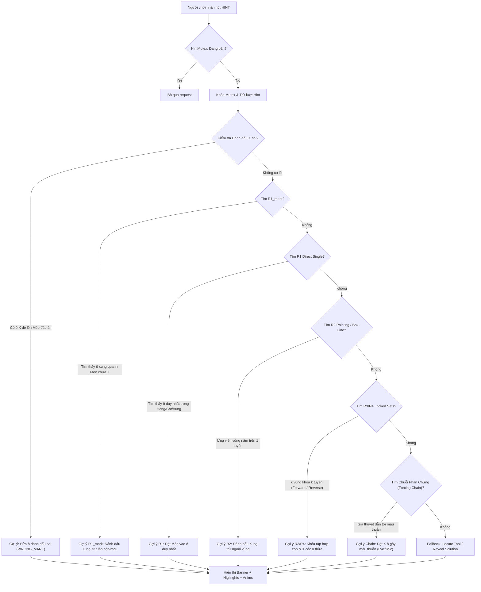
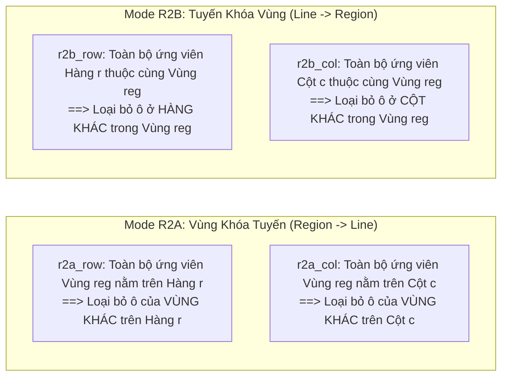
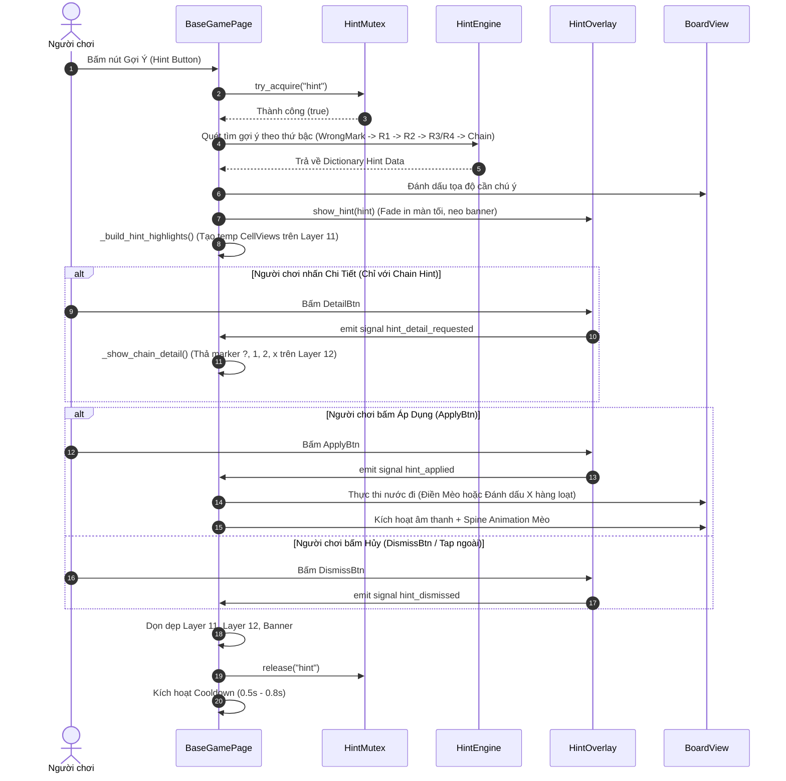
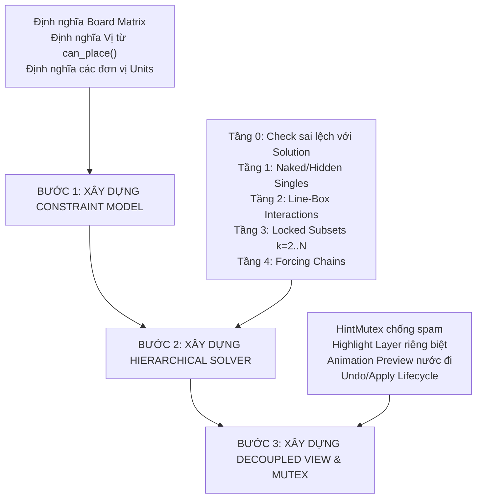

# TÀI LIỆU KỸ THUẬT TOÀN DIỆN: KIẾN TRÚC & THIẾT KẾ HINT ENGINE (MEOWDOKU)
## Deep-Dive Specification & Engineering Reference for AI Agents & Game Developers

> **Tệp tài liệu:** `docs_analysis/HINT_ENGINE_ARCHITECTURE_AND_SPECIFICATION.md`  
> **Dự án gốc:** Meowdoku (*Queendoku / Star Battle Variant*) — Godot Engine 4.6.1  
> **Mục đích:** Đóng gói toàn bộ kiến trúc, lý thuyết toán học, giải thuật suy luận logic hình thức, quy trình UI/UX và hệ sinh thái kiểm thử/DDA của **Hint Engine** để làm tài liệu đối chiếu cho lập trình viên và các AI Agents khi triển khai vào các tựa game puzzle mới.

---

## MỤC LỤC TỔNG QUAN

1. [Tổng Quan & Triết Lý Thiết Kế Của Hint Engine](#1-tổng-quan--triết-lý-thiết-kế-của-hint-engine)
2. [Bản Đồ Thành Phần & Đối Chiếu Mã Nguồn](#2-bản-đồ-thành-phần--đối-chiếu-mã-nguồn)
3. [Mô Hình Toán Học & Tiên Đề Ràng Buộc (Mathematical Modeling)](#3-mô-hình-toán-học--tiên-đề-ràng-buộc-mathematical-modeling)
4. [Tầng Suy Luận Thứ Bậc (Hierarchical Deduction Pipeline)](#4-tầng-suy-luận-thứ-bậc-hierarchical-deduction-pipeline)
   - [4.0. Tiền kiểm: Phát hiện đánh dấu sai (Wrong Mark Correction)](#40-tiền-kiểm-phát-hiện-đánh-dấu-sai-wrong-mark-correction)
   - [4.1. Chiến lược R1_mark: Tự động loại trừ lân cận & vùng](#41-chiến-lược-r1_mark-tự-động-loại-trừ-lân-cận--vùng)
   - [4.2. Chiến lược R1: Ô đơn lập duy nhất (Naked & Hidden Single)](#42-chiến-lược-r1-ô-đơn-lập-duy-nhất-naked--hidden-single)
   - [4.3. Chiến lược R2: Khóa tương giao Vùng - Tuyến (Pointing Candidates / Box-Line Reduction)](#43-chiến-lược-r2-khóa-tương-giao-vùng---tuyến-pointing-candidates--box-line-reduction)
   - [4.4. Chiến lược R3 & R4: Khóa tập hợp con (Locked Sets & Reverse Set Locking)](#44-chiến-lược-r3--r4-khóa-tập-hợp-con-locked-sets--reverse-set-locking)
   - [4.5. Chiến lược R4_chain & R5_chain: Chuỗi suy diễn mâu thuẫn (Forcing Chains / Proof by Contradiction)](#45-chiến-lược-r4_chain--r5_chain-chuỗi-suy-diễn-mâu-thuẫn-forcing-chains--proof-by-contradiction)
   - [4.6. Chiến lược Fallback (Locate Tool)](#46-chiến-lược-fallback-locate-tool)
5. [Hệ Thống Phân Tích Meta-Engine & Đánh Giá Độ Khó](#5-hệ-thống-phân-tích-meta-engine--đánh-giá-độ-khó)
   - [5.1. Xếp hạng độ khó từng ô (`compute_cell_ranks`)](#51-xếp-hạng-độ-khó-từng-ô-compute_cell_ranks)
   - [5.2. Chuỗi chữ ký chiến lược (`compute_strategy_sequence`)](#52-chuỗi-chữ-ký-chiến-lược-compute_strategy_sequence)
   - [5.3. Mô phỏng giải tự động & Xác minh màn chơi (`replay_hint_steps`)](#53-mô-phỏng-giải-tự-động--xác-minh-màn-chơi-replay_hint_steps)
   - [5.4. Tự động điều chỉnh độ khó DDA (`PreCatDecider`)](#54-tự-động-điều-chỉnh-độ-khó-dda-precatdecider)
   - [5.5. Kiểm định màn mở đầu Onboarding (`compute_is_hidden_single_l1`)](#55-kiểm-định-màn-mở-đầu-onboarding-compute_is_hidden_single_l1)
6. [Kiến Trúc UI/UX & Pipeline Trình Diễn Hình Ảnh](#6-kiến-trúc-uiux--pipeline-trình-diễn-hình-ảnh)
   - [6.1. Quản lý đồng thời & Chống xung đột (`HintMutex`)](#61-quản-lý-đồng-thời--chống-xung-đột-hintmutex)
   - [6.2. Cấu trúc lớp hiển thị 4 tầng (Multi-layer Rendering Stack)](#62-cấu-trúc-lớp-hiển-thị-4-tầng-multi-layer-rendering-stack)
   - [6.3. Hệ thống minh họa chuỗi mâu thuẫn sinh động (`_show_chain_detail`)](#63-hệ-thống-minh-họa-chuỗi-mâu-thuẫn-sinh-động-_show_chain_detail)
7. [Hệ Thống Thử Nghiệm Từ Xa (Remote Config & A/B Testing)](#7-hệ-thống-thử-nghiệm-từ-xa-remote-config--ab-testing)
8. [Bộ Kiểm Thử Tự Động Harness & Unit Tests](#8-bộ-kiểm-thử-tự-động-harness--unit-tests)
9. [Hướng Dẫn Chuyển Giao & Tái Sử Dụng Cho Game Mới (Blueprint Cho Agent & Dev)](#9-hướng-dẫn-chuyển-giao--tái-sử-dụng-cho-game-mới-blueprint-cho-agent--dev)

---

## 1. TỔNG QUAN & TRIẾT LÝ THIẾT KẾ CỦA HINT ENGINE

Trong đa số các game câu đố thương mại đơn giản, tính năng "Gợi ý" (Hint) thường chỉ thực hiện một việc tầm thường: **so sánh trạng thái bàn cờ hiện tại với mảng đáp án tĩnh (`solution`) rồi điền bừa một nước đi đúng**. 

Cách làm này có những nhược điểm chí mạng:
1. **Không có tính sư phạm:** Người chơi không học được logic giải đố, không hiểu *tại sao* nước đi đó lại đúng.
2. **Triệt tiêu trải nghiệm thỏa mãn (Aha! Moment):** Việc "bị mớm đáp án" làm giảm động lực giải đố và giảm retention dài hạn.
3. **Không thể sử dụng cho hệ thống tạo màn & cân bằng:** Một hint engine "mớm đáp án" không thể đóng vai trò là công cụ thẩm định chất lượng câu đố tự động.

### Triết Lý Cốt Lõi Của Meowdoku Hint Engine
Meowdoku xây dựng một **Bộ máy suy luận logic hình thức có khả năng giải thích (Explainable Formal Logic Solver)**:
- **Nguyên tắc "Human-Like Reasoning":** Máy tính tư duy chính xác theo cách một cao thủ con người suy luận: từ các quy tắc đơn giản nhất (tìm ô cô lập) cho đến các kỹ thuật cao cấp (khóa tập hợp, giả thuyết phản chứng).
- **Nguyên tắc "Min-Step Explanation":** Luôn ưu tiên giải thích bằng quy tắc đơn giản nhất có thể trước (`R1` $\rightarrow$ `R2` $\rightarrow$ `R3` $\rightarrow$ `R4` $\rightarrow$ `Chain`). Nếu phải dùng phản chứng, luôn chọn chuỗi suy luận có **độ sâu ngắn nhất** (`min depth`).
- **Nguyên tắc "Correction First":** Nếu người chơi đang có nước đi sai ngăn cản suy luận logic, gợi ý sẽ chỉ ra ô sai trước tiên thay vì tiếp tục đi tiếp trong vô vọng.
- **Tính lưỡng dụng (Dual-Purpose Engine):** Cùng một codebase được sử dụng đồng thời cho **Runtime Gameplay Hint** (hướng dẫn người chơi) và **Offline Level Generation / DDA** (xếp hạng độ khó câu đố, tính toán nhịp độ pacing).



---

## 2. BẢN ĐỒ THÀNH PHẦN & ĐỐI CHIẾU MÃ NGUỒN

Để các lập trình viên và AI agents có thể tra cứu và đối chiếu trực tiếp vào repo `Meowdoku-new`, dưới đây là danh mục tệp nguồn chính:

| Thành Phần | Đường Dẫn File Nguồn | Vai Trò & Trách Nhiệm |
| :--- | :--- | :--- |
| **Thuật toán lõi** | [`HintEngine`](file:///D:/Work/Alpaca_Solution/ReverseEngineering/Meowdoku-new/scripts/module/gameplay/core/hint_engine.gd) | Chứa toàn bộ các hàm static tìm kiếm gợi ý: R1, R2, R3/R4, Chains, xếp hạng cell rank, mô phỏng bước đi. |
| **Quy tắc trò chơi** | [`QueendokuCore`](file:///D:/Work/Alpaca_Solution/ReverseEngineering/Meowdoku-new/scripts/module/gameplay/core/queendoku_core.gd) | Định nghĩa các tiên đề ràng buộc Star Battle, phân loại vi phạm và phát hiện xung đột giữa các quân cờ. |
| **Trạng thái ô cờ** | [`CellState`](file:///D:/Work/Alpaca_Solution/ReverseEngineering/Meowdoku-new/scripts/module/gameplay/model/cell_state.gd) | Enum trạng thái ô: `EMPTY(0)`, `CAT(1)`, `MARK(2)`, `ERROR(3)`, `DRAFT_CROSS(4)`, `DRAFT_CAT(5)`, `LOCKED_MARK(6)`. |
| **Điều phối giao diện** | [`BaseGamePage`](file:///D:/Work/Alpaca_Solution/ReverseEngineering/Meowdoku-new/scripts/module/game/view/base_game_page.gd) | Quản lý quy trình bấm hint (`_on_hint_btn_pressed`), dựng highlight animations, thực thi nước đi (`_on_hint_applied`). |
| **Overlay giao diện** | [`HintOverlay`](file:///D:/Work/Alpaca_Solution/ReverseEngineering/Meowdoku-new/scripts/module/game/view/hint_overlay.gd) | CanvasLayer UI hiển thị banner giải thích, nút Apply, Dismiss, nút xem chi tiết chuỗi suy luận (DetailBtn). |
| **Chống xung đột** | [`HintMutex`](file:///D:/Work/Alpaca_Solution/ReverseEngineering/Meowdoku-new/scripts/module/game/view/hint_mutex.gd) | Khóa đồng bộ đơn luồng tránh hiện tượng spam nhấn gợi ý hoặc xung đột animation. |
| **DDA Pre-fill** | [`PreCatDecider`](file:///D:/Work/Alpaca_Solution/ReverseEngineering/Meowdoku-new/scripts/module/gameplay/core/pre_cat_decider.gd) | Sử dụng `compute_cell_ranks` của HintEngine để chọn ô khó nhất điền trước Mèo khi người chơi gặp chuỗi thua. |
| **Cấu hình A/B** | [`HintFuncConfig`](file:///D:/Work/Alpaca_Solution/ReverseEngineering/Meowdoku-new/scripts/module/abtest/config/hint_func_config.gd) | Điều khiển bật/tắt tính năng `has_color_exclude` và `has_reverse_set_locking` từ server. |
| **Bộ Unit Tests** | [`test_hint_engine_hint_func.gd`](file:///D:/Work/Alpaca_Solution/ReverseEngineering/Meowdoku-new/scripts/module/gameplay/test/test_hint_engine_hint_func.gd) | SceneTree test tự động 17 ca kiểm thử biên cho HintEngine (Forward/Reverse, Cat-on-board, No-new-info). |
| **Debug Server API** | [`DebugApiServerManager`](file:///D:/Work/Alpaca_Solution/ReverseEngineering/Meowdoku-new/scripts/module/debug/debug_api_server_manager.gd) | Expose API kiểm thử hint qua cổng HTTP cục bộ 8090 (`/debug/hint`, `/debug/auto_mark_positions`). |

---

## 3. MÔ HÌNH TOÁN HỌC & TIÊN ĐỀ RÀNG BUỘC (MATHEMATICAL MODELING)

Bản chất của bài toán Meowdoku là bài toán **Thỏa Mãn Ràng Buộc (Constraint Satisfaction Problem - CSP)** mở rộng từ bài toán *Eight Queens* và *Star Battle*:

### 3.1. Không Gian Trạng Thái
- Cho một lưới vuông kích thước $N \times N$, với tọa độ mỗi ô là $(r, c)$ với $0 \le r, c < N$.
- Lưới được phân hoạch thành đúng $N$ phân vùng (regions/màu sắc), ký hiệu là $R_0, R_1, \dots, R_{N-1}$, sao cho:
  $$\bigcup_{k=0}^{N-1} R_k = \{ (r, c) \mid 0 \le r, c < N \} \quad \text{và} \quad R_i \cap R_j = \emptyset \; (\forall i \ne j)$$
- Trạng thái bàn cờ tại thời điểm $t$ là một ma trận $B \in \{ \text{EMPTY}, \text{CAT}, \text{MARK} \}^{N \times N}$.

### 3.2. Bốn Tiên Đề Ràng Buộc Hợp Lệ
Một lời giải hoàn chỉnh hợp lệ $S \in \{0, 1\}^{N \times N}$ thỏa mãn:
1. **Ràng buộc Hàng (Row Constraint):** Mỗi hàng chứa đúng 1 chú Mèo:
   $$\sum_{c=0}^{N-1} S(r, c) = 1, \quad \forall r \in [0, N-1]$$
2. **Ràng buộc Cột (Column Constraint):** Mỗi cột chứa đúng 1 chú Mèo:
   $$\sum_{r=0}^{N-1} S(r, c) = 1, \quad \forall c \in [0, N-1]$$
3. **Ràng buộc Vùng Màu (Region Constraint):** Mỗi vùng chứa đúng 1 chú Mèo:
   $$\sum_{(r, c) \in R_k} S(r, c) = 1, \quad \forall k \in [0, N-1]$$
4. **Ràng buộc Không Chạm (Chebyshev Distance / No-Touch Constraint):** Hai chú Mèo bất kỳ không được nằm kề nhau theo 8 hướng (kể cả đường chéo):
   $$\forall (r_1, c_1) \ne (r_2, c_2) \text{ thỏa } S(r_1, c_1) = S(r_2, c_2) = 1 \implies \max(|r_1 - r_2|, |c_1 - c_2|) > 1$$

### 3.3. Vị Từ Khả Đặt (`_can_place`)
Một ô $(r, c)$ được gọi là **Ứng viên Khả Đặt (Candidate)** tại trạng thái hiện tại $B$ nếu và chỉ nếu thỏa mãn hàm vị từ [`_can_place()`](file:///D:/Work/Alpaca_Solution/ReverseEngineering/Meowdoku-new/scripts/module/gameplay/core/hint_engine.gd#L202-L218):

```gdscript
static func _can_place(r: int, c: int, board: Array, size: int, regions: Array, 
		row_piece: Array[bool], col_piece: Array[bool], reg_piece: Array[bool]) -> bool:
	# 1. Ô phải đang trống (EMPTY)
	if board[r][c] != CellState.EMPTY:
		return false
	# 2. Hàng, Cột và Vùng tương ứng chưa có Mèo nào
	if row_piece[r] or col_piece[c] or reg_piece[regions[r][c]]:
		return false
	# 3. 8 ô lân cận xung quanh (Chebyshev radius 1) không có Mèo nào
	for dr in range(-1, 2):
		for dc in range(-1, 2):
			if dr == 0 and dc == 0:
				continue
			var nr: = r + dr
			var nc: = c + dc
			if nr >= 0 and nr < size and nc >= 0 and nc < size:
				if board[nr][nc] == CellState.CAT:
					return false
	return true
```

---

## 4. TẦNG SUY LUẬN THỨ BẬC (HIERARCHICAL DEDUCTION PIPELINE)

Khi hàm xử lý hint được gọi từ [`BaseGamePage._on_hint_btn_pressed()`](file:///D:/Work/Alpaca_Solution/ReverseEngineering/Meowdoku-new/scripts/module/game/view/base_game_page.gd#L7976-L8004), hệ thống duyệt qua các tầng suy luận theo thứ tự nghiêm ngặt sau:

### 4.0. Tiền kiểm: Phát hiện đánh dấu sai (Wrong Mark Correction)
- **Mã nguồn:** [`BaseGamePage`](file:///D:/Work/Alpaca_Solution/ReverseEngineering/Meowdoku-new/scripts/module/game/view/base_game_page.gd#L7980-L7994) & [`DebugApiServerManager._try_wrong_mark_hint()`](file:///D:/Work/Alpaca_Solution/ReverseEngineering/Meowdoku-new/scripts/module/debug/debug_api_server_manager.gd#L300-L312).
- **Vấn đề:** Nếu người chơi vô tình đánh dấu X (`MARK`) đè lên một ô mà thực chất ô đó chính là Mèo trong nghiệm (`solution[r][c] == true`), toàn bộ các thuật toán suy luận logic tiếp theo có thể dẫn tới bế tắc hoặc vô nghiệm.
- **Giải pháp:** Quét toàn bộ bàn cờ. Nếu tìm thấy:
  $$S(r, c) = 1 \quad \wedge \quad B(r, c) == \text{MARK}$$
  Hệ thống lập tức trả về gợi ý:
  ```json
  {
    "found": true,
    "strategy": "",
    "cell": [r, c],
    "unit_cells": [[r, c]],
    "description": "HINT_WRONG_MARK",
    "wrong_mark": true
  }
  ```
  Khi người chơi nhấn Apply, hệ thống sẽ **xóa dấu X** để khôi phục ô về trạng thái `EMPTY`, kèm hiệu ứng rung `VibrateManager.Pos.HINT_CLEAR`.

---

### 4.1. Chiến lược R1_mark: Tự động loại trừ lân cận & vùng
- **Mã nguồn:** [`HintEngine.find_mark_hint()`](file:///D:/Work/Alpaca_Solution/ReverseEngineering/Meowdoku-new/scripts/module/gameplay/core/hint_engine.gd#L124-L175).
- **Logic toán học:** Nếu một ô $(r, c)$ đã chứa Mèo ($B(r, c) == \text{CAT}$):
  1. Toàn bộ các ô còn lại trên hàng $r$: $\{(r, cc) \mid cc \ne c, B(r, cc) == \text{EMPTY}\}$
  2. Toàn bộ các ô còn lại trên cột $c$: $\{(rr, c) \mid rr \ne r, B(rr, c) == \text{EMPTY}\}$
  3. Toàn bộ 8 ô kề cạnh: $\{(r+dr, c+dc) \mid dr, dc \in \{-1, 0, 1\}, (dr, dc) \ne (0,0), B == \text{EMPTY}\}$
  4. *(Nếu bật A/B Test `include_region`)*: Toàn bộ các ô còn lại trong cùng vùng $R_{regions[r][c]}$:
     $$\{ (rr, cc) \mid regions[rr][cc] == regions[r][c], (rr, cc) \ne (r, c), B == \text{EMPTY} \}$$
  Tất cả các ô này **bắt buộc không thể chứa Mèo** và phải được đánh dấu X.
- **Dữ liệu trả về:**
  ```gdscript
  return {
      "found": true,
      "strategy": "R1_mark",
      "cell": to_mark[0],
      "cat_cell": Vector2i(r, c),
      "unit_cells": to_mark,
      "description": tr("HINT_R1_MARK_COMBINE") # nếu có include_region
  }
  ```

---

### 4.2. Chiến lược R1: Ô đơn lập duy nhất (Naked & Hidden Single)
- **Mã nguồn:** [`HintEngine.find_r1_hint()`](file:///D:/Work/Alpaca_Solution/ReverseEngineering/Meowdoku-new/scripts/module/gameplay/core/hint_engine.gd#L13-L108).
- **Quy tắc giải quyết:** Tìm kiếm đơn vị (Unit) nào chỉ còn duy nhất 1 ứng viên hợp lệ. Có 4 bước quét:

#### Bước 4.2.0: Quy tắc Giao thoa toàn bộ (Full Line Intersection)
- Nếu toàn bộ một hàng $r$ nằm trọn trong cùng một vùng $reg$ ($regions[r][c] == reg, \forall c$), và tồn tại cột $c$ mà toàn bộ cột $c$ cũng nằm trọn trong vùng $reg$.
- Khi đó ô giao điểm $(r, c)$ là điểm bắt buộc duy nhất có thể dung hòa cả hàng, cột và vùng đó.
- Trả về `unit_type: "full_line"`.

#### Bước 4.2.1: Duyệt Hàng (Row Single)
- Duyệt từng hàng $r$ chưa có Mèo (`not row_piece[r]`).
- Đếm số lượng ô thỏa mãn `_can_place(r, c)`.
- Nếu số ứng viên $\text{candidates}(r) == 1 \implies$ Chắc chắn ô đó là Mèo!
- Trả về `unit_type: "row"`, `unit_cells: _row_cells(r, size)`.

#### Bước 4.2.2: Duyệt Cột (Col Single)
- Duyệt từng cột $c$ chưa có Mèo.
- Nếu $\text{candidates}(c) == 1 \implies$ Chắc chắn ô đó là Mèo!
- Trả về `unit_type: "col"`, `unit_cells: _col_cells(c, size)`.

#### Bước 4.2.3: Duyệt Vùng Màu (Region Single)
- Duyệt từng vùng màu $reg$ chưa có Mèo.
- Lấy tất cả tọa độ thuộc vùng $reg$. Đếm số ô thỏa mãn `_can_place()`.
- Nếu $\text{candidates}(reg) == 1 \implies$ Ô đó là Mèo!
- Trả về `unit_type: "region"`.

---

### 4.3. Chiến lược R2: Khóa tương giao Vùng - Tuyến (Pointing Candidates / Box-Line Reduction)
- **Mã nguồn:** [`HintEngine.find_r2_hint()`](file:///D:/Work/Alpaca_Solution/ReverseEngineering/Meowdoku-new/scripts/module/gameplay/core/hint_engine.gd#L503-L603).
- **Nguyên lý:** Phân tích sự phụ thuộc hình học giữa Vùng Màu và Hàng/Cột. Gồm 4 chế độ phụ:



#### Phân tích chi tiết 4 chế độ:
1. **`r2a_row` (Vùng thu gọn vào 1 hàng):**
   - Vùng $reg$ có $\ge 2$ ứng viên, và tất cả ứng viên đều có hoành độ $x = r$.
   - **Hệ quả:** Mèo của vùng $reg$ chắc chắn phải nằm ở hàng $r$. Do hàng $r$ chỉ được phép có đúng 1 Mèo, nên **mọi ô khác trên hàng $r$ mà không thuộc vùng $reg$** tuyệt đối không thể có Mèo $\rightarrow$ Đánh dấu X!
2. **`r2a_col` (Vùng thu gọn vào 1 cột):**
   - Toàn bộ ứng viên của vùng $reg$ nằm trên cột $c$.
   - **Hệ quả:** Loại trừ tất cả các ô trên cột $c$ thuộc các vùng khác.
3. **`r2b_row` (Hàng thu gọn vào 1 vùng):**
   - Hàng $r$ có $\ge 2$ ứng viên, và tất cả ứng viên đều thuộc cùng một vùng $reg$.
   - **Hệ quả:** Mèo của hàng $r$ chắc chắn cũng là Mèo của vùng $reg$. Do đó, **mọi ô khác trong vùng $reg$ nhưng nằm ở các hàng khác ($rr \ne r$)** không thể chứa Mèo $\rightarrow$ Đánh dấu X!
4. **`r2b_col` (Cột thu gọn vào 1 vùng):**
   - Toàn bộ ứng viên của cột $c$ thuộc cùng một vùng $reg$.
   - **Hệ quả:** Loại trừ tất cả các ô trong vùng $reg$ nằm ở các cột khác ($cc \ne c$).

- **Cơ chế chống gợi ý rác:** Hệ thống chỉ trả về kết quả nếu phát hiện có **ít nhất 1 ô mới có thể loại trừ** (`has_new == true`). Nếu các ô xung quanh đã bị đánh dấu X từ trước, gợi ý sẽ tự động bỏ qua để tránh làm phiền người chơi.

---

### 4.4. Chiến lược R3 & R4: Khóa tập hợp con (Locked Sets & Reverse Set Locking)
- **Mã nguồn:** [`HintEngine.find_r3_r4_hint()`](file:///D:/Work/Alpaca_Solution/ReverseEngineering/Meowdoku-new/scripts/module/gameplay/core/hint_engine.gd#L255-L468).
- **Lý thuyết nền tảng:** Định lý Hôn nhân của Hall / Nguyên lý Chuồng Bồ Câu suy rộng (Generalized Pigeonhole Principle).
- Khi xét một tập con gồm $k$ phần tử ($2 \le k \le \min(|unplaced| - 1, 6)$):
  - Nếu $k \in \{2, 3\} \implies$ Được phân loại là độ khó **R3** (Pairs / Triples).
  - Nếu $k \ge 4 \implies$ Được phân loại là độ khó **R4** (Quads, Quintuples, Sextuples).

#### 4.4.1. Khóa Tập Hợp Thuận (Forward Set Locking: Regions $\rightarrow$ Rows/Cols)
1. Chọn một tổ hợp chập $k$ của các vùng chưa đặt Mèo: $\mathcal{R}_{sub} = \{ reg_1, reg_2, \dots, reg_k \}$.
2. Tập hợp tất cả các hàng mà các vùng này có thể đặt Mèo:
   $$\text{AllRows}(\mathcal{R}_{sub}) = \bigcup_{reg \in \mathcal{R}_{sub}} \text{RowsWithCandidates}(reg)$$
3. **Điều kiện khóa:** Nếu $|\text{AllRows}(\mathcal{R}_{sub})| == k$:
   - Nghĩa là: $k$ chú Mèo của $k$ vùng này **chỉ có thể phân bổ vào đúng $k$ hàng cụ thể**.
   - Do mỗi hàng trong $k$ hàng đó chỉ chứa đúng 1 Mèo, nên toàn bộ $k$ hàng này **đã bị lấp đầy** bởi $k$ chú Mèo của tập $\mathcal{R}_{sub}$.
   - **Hành động loại trừ:** Bất kỳ ô nào nằm trên $k$ hàng này mà **thuộc về một vùng khác** ($\notin \mathcal{R}_{sub}$) bắt buộc phải đánh dấu X!
4. Tương tự đối với cột: Nếu $k$ vùng chỉ có ứng viên trên đúng $k$ cột $\implies$ Loại bỏ mọi ô của các vùng khác trên $k$ cột đó.

#### 4.4.2. Khóa Tập Hợp Nghịch (Reverse Set Locking: Rows/Cols $\rightarrow$ Regions)
*Tính năng này được kiểm soát bởi cờ A/B Test `ABTestManager.hint_func.has_reverse_set_locking()` (gọi là R3b / R4b).*
1. Chọn một tổ hợp chập $k$ của các **Hàng chưa có Mèo**: $\mathcal{H}_{sub} = \{ r_1, r_2, \dots, r_k \}$.
2. Tập hợp tất cả các vùng màu xuất hiện trong ứng viên của $k$ hàng này:
   $$\text{ColorSet}(\mathcal{H}_{sub}) = \bigcup_{r \in \mathcal{H}_{sub}} \text{RegionsInRowCandidates}(r)$$
3. **Điều kiện khóa:** Nếu $|\text{ColorSet}(\mathcal{H}_{sub})| == k$:
   - Nghĩa là: $k$ hàng này chỉ lấy Mèo từ đúng $k$ vùng màu này.
   - Do đó, $k$ vùng màu này **đã bị tiêu thụ hết** bởi $k$ hàng trong $\mathcal{H}_{sub}$.
   - **Hành động loại trừ:** Trong toàn bộ bàn cờ, ở bất kỳ hàng nào khác ($r \notin \mathcal{H}_{sub}$), các ô mang màu thuộc $\text{ColorSet}$ tuyệt đối không thể chứa Mèo $\rightarrow$ Đánh dấu X!
4. Tương tự áp dụng cho $k$ Cột chưa có Mèo đối với tập vùng màu.

```gdscript
# Đoạn mã sinh tổ hợp subsets chập k
static func _gen_subsets(arr: Array[int], k: int) -> Array:
	var result: Array = []
	_gen_sub_helper(arr, k, 0, [], result)
	return result

static func _gen_sub_helper(arr: Array[int], k: int, start: int, cur: Array, result: Array) -> void:
	if cur.size() == k:
		result.append(cur.duplicate())
		return
	for i in range(start, arr.size()):
		cur.append(arr[i])
		_gen_sub_helper(arr, k, i + 1, cur, result)
		cur.pop_back()
```

---

### 4.5. Chiến lược R4_chain & R5_chain: Chuỗi suy diễn mâu thuẫn (Forcing Chains / Proof by Contradiction)
- **Mã nguồn:** [`HintEngine.find_chain_hint()`](file:///D:/Work/Alpaca_Solution/ReverseEngineering/Meowdoku-new/scripts/module/gameplay/core/hint_engine.gd#L766-L980).
- **Bản chất:** Khi tất cả các quy tắc tĩnh (R1, R2, R3, R4) không thể tìm ra nước đi mới, game kích hoạt thuật toán **Chứng minh bằng Phản chứng (Proof by Contradiction)**.

#### Thuật Toán Duyệt Chuỗi:
1. Duyệt qua tất cả các ô $(r, c)$ đang là ứng viên hợp lệ trên bàn cờ.
2. Với mỗi ô, đặt giả thuyết: **"Điều gì xảy ra nếu ta đặt Mèo tại $(r, c)$?"**
3. Thực hiện lan truyền suy luận bắt buộc (Unit Single Propagation):
   - Đặt Mèo tại $(r, c)$, gạch bỏ hàng $r$, cột $c$, vùng $reg$, và 8 ô lân cận.
   - Trong vòng lặp `while progress`:
     - Kiểm tra nếu bất kỳ hàng nào còn lại chỉ có duy nhất 1 ứng viên $\implies$ Ép buộc đặt Mèo tại đó, tăng biến `depth`, tiếp tục lan truyền.
     - Kiểm tra nếu bất kỳ cột nào còn lại chỉ có duy nhất 1 ứng viên $\implies$ Ép buộc đặt Mèo.
     - Kiểm tra nếu bất kỳ vùng nào còn lại chỉ có duy nhất 1 ứng viên $\implies$ Ép buộc đặt Mèo.
4. **Kiểm tra Mâu thuẫn (Contradiction Check):**
   - Nếu tồn tại một hàng chưa có Mèo mà số ứng viên $= 0$.
   - HOẶC tồn tại một cột chưa có Mèo mà số ứng viên $= 0$.
   - HOẶC tồn tại một vùng chưa có Mèo mà số ứng viên $= 0$.
   $\implies$ **MÂU THUẪN XẢY RA!**
5. **Kết luận logic:** Giả thuyết ban đầu là sai! Do đó, ô $(r, c)$ **chắc chắn không thể là Mèo**, và người chơi phải **đánh dấu X** vào ô $(r, c)$!
6. **Heuristic tối ưu:** Thuật toán duyệt qua mọi ô ứng viên và tìm ô có **`best_depth` nhỏ nhất**:
   - Nếu `best_depth <= 2` $\implies$ Phân loại là **`R4_chain`**.
   - Nếu `best_depth > 2` $\implies$ Phân loại là **`R5_chain`**.
   - Việc chọn chuỗi ngắn nhất đảm bảo người chơi có thể dễ dàng theo dõi lời giải thích mà không bị quá tải nhận thức.

```json
// Cấu trúc dữ liệu chi tiết của một Chain Hint
{
  "found": true,
  "strategy": "R4_chain",
  "cell": [2, 3],              // Ô giả thuyết (Hypothesis) cần đánh dấu X
  "description": "HINT_CHAIN_STEPS",
  "chain": {
    "depth": 2,                // Số bước lan truyền trước khi nổ mâu thuẫn
    "steps": [[1, 4], [3, 0]], // Các ô bị ép buộc đi theo thứ tự
    "contra_type": "row",      // Đơn vị bị triệt tiêu ứng viên (row / col / region)
    "contra_index": 4          // Chỉ số đơn vị bị mâu thuẫn (Hàng số 5)
  }
}
```

---

### 4.6. Chiến lược Fallback (Locate Tool)
- Nếu bàn cờ rơi vào trạng thái bế tắc mà cả Chuỗi phản chứng cũng không tìm ra (hoặc thuộc các biến thể siêu khó), game kích hoạt fallback:
  - Nếu level có cấu hình `bank_sp: true`: Kích hoạt công cụ định vị vị trí (`_on_locate_btn_pressed`).
  - Điền thẳng 1 ô Mèo dựa trên ma trận nghiệm `_puzzle["solution"]`.

---

## 5. HỆ THỐNG PHÂN TÍCH META-ENGINE & ĐÁNH GIÁ ĐỘ KHÓ

Bên cạnh việc cung cấp gợi ý lúc chơi, `HintEngine` cung cấp một bộ công cụ phân tích tĩnh mạnh mẽ chạy ngầm:

### 5.1. Xếp hạng độ khó từng ô (`compute_cell_ranks`)
- **Mã nguồn:** [`HintEngine.compute_cell_ranks()`](file:///D:/Work/Alpaca_Solution/ReverseEngineering/Meowdoku-new/scripts/module/gameplay/core/hint_engine.gd#L990-L1038).
- **Mục đích:** Xác định xem mỗi chú Mèo trong lời giải yêu cầu trình độ tư duy nào để tìm ra.
- **Quy trình:**
  1. Khởi tạo bàn cờ làm việc trống.
  2. Vòng lặp giải bằng logic thuần túy:
     - Nếu có `R1_mark` $\rightarrow$ Đánh dấu X.
     - Nếu có `find_r1_hint` $\rightarrow$ Điền Mèo, gán Rank của ô = `current_max`, reset `current_max = 1`.
     - Nếu có `find_r2_hint` $\rightarrow$ Áp dụng dấu X của R2, nâng `current_max = max(current_max, 2)`.
     - Nếu có `find_r3_r4_hint` $\rightarrow$ Áp dụng dấu X của R3, nâng `current_max = max(current_max, 3)`.
  3. Bất kỳ ô Mèo nào còn sót lại chưa giải được bằng R1-R3 sẽ được gán giá trị `fallback_strategy` (Rank 4, 5, 6, 7).
- **Bảng phân loại Rank cờ:**

| Rank Mã Số | Ký Hiệu Hiển Thị | Chiến Lược Yêu Cầu |
| :---: | :---: | :--- |
| **1** | `R1` | Single trực tiếp (Hàng, Cột, Vùng duy nhất) |
| **2** | `R2` | Pointing / Box-Line Reduction |
| **3** | `R3` | Pairs / Triples Locked Sets |
| **4** | `R4` | Quads Locked Sets |
| **5** | `R4H` | R4 bậc cao (Tier Hard) |
| **6** | `R5` | Chuỗi phản chứng ngắn (Forcing Chain) |
| **7** | `R5H` | Chuỗi phản chứng dài / Trial & Error phức tạp |

---

### 5.2. Chuỗi chữ ký chiến lược (`compute_strategy_sequence`)
- **Mã nguồn:** [`HintEngine.compute_strategy_sequence()`](file:///D:/Work/Alpaca_Solution/ReverseEngineering/Meowdoku-new/scripts/module/gameplay/core/hint_engine.gd#L1044-L1082).
- Trả về một mảng số nguyên mô tả lịch sử các chiến lược được kích hoạt để giải quyết từng chú Mèo, ví dụ:
  `[1, 1, 2, 1, 3, 1, 1, 4]`
- Dữ liệu này được đưa vào hệ thống BI Telemetry để lập bản đồ nhịp độ (Pacing Curve) của game.

---

### 5.3. Mô phỏng giải tự động & Xác minh màn chơi (`replay_hint_steps`)
- **Mã nguồn:** [`HintEngine.replay_hint_steps()`](file:///D:/Work/Alpaca_Solution/ReverseEngineering/Meowdoku-new/scripts/module/gameplay/core/hint_engine.gd#L1106-L1155).
- Tự động chạy bộ giải từ bàn cờ trống đến khi hoàn thành, xuất ra mảng chuỗi ký hiệu các bước đi:
  - `"M"`: Đánh dấu X lân cận (Mark).
  - `"1"`: Điền Mèo cấp R1.
  - `"2"`: Loại trừ cấp R2.
  - `"3" / "4"`: Loại trừ tập hợp cấp R3 / R4.
  - `"4c" / "5c"`: Phản chứng Chain.
  - `"X"`: Bế tắc (Unsolvable logically - Câu đố lỗi!).
- **Ứng dụng QA:** Trong CI/CD pipeline, bất kỳ màn chơi nào tạo ra có chứa bước `"X"` sẽ bị loại bỏ ngay lập tức khỏi kho câu đố (`bad_level_predicates.gd`).

---

### 5.4. Tự động điều chỉnh độ khó DDA (`PreCatDecider`)
- **Mã nguồn:** [`PreCatDecider`](file:///D:/Work/Alpaca_Solution/ReverseEngineering/Meowdoku-new/scripts/module/gameplay/core/pre_cat_decider.gd).
- Khi người chơi gặp các tình huống tiêu cực:
  - Vừa vượt qua một màn cực khó (`SCENE_HARD_NEXT = 1`).
  - Thua liên tiếp nhiều lần (`SCENE_CONSECUTIVE_FAIL = 2`).
  - Bị hạ bậc xếp hạng (`SCENE_DEMOTE = 3`).
- Hệ thống quyết định **Điền sẵn 1 chú Mèo (Pre-fill Cat)** vào bàn cờ ngay khi bắt đầu ván đấu.
- **Thuật toán chọn ô thông minh:** Không chọn bừa! `PreCatDecider` gọi `HintEngine.compute_cell_ranks()` và chọn ô có **`rank >= 3`** (hoặc ô có **Rank cao nhất**). Bằng cách điền sẵn Mèo vào "nút thắt cổ chai" khó nhất của câu đố, bàn cờ lập tức sụp đổ về độ khó cơ bản (R1/R2), giúp người chơi lấy lại sự tự tin.

---

### 5.5. Kiểm định màn mở đầu Onboarding (`compute_is_hidden_single_l1`)
- **Mã nguồn:** [`HintEngine.compute_is_hidden_single_l1()`](file:///D:/Work/Alpaca_Solution/ReverseEngineering/Meowdoku-new/scripts/module/gameplay/core/hint_engine.gd#L620-L646).
- Kiểm tra xem ở bàn cờ hoàn toàn trống, người chơi có thể nhìn thấy ngay một ô Naked Single hoặc Hidden Single ở nước đi đầu tiên hay không. Đảm bảo trải nghiệm hướng dẫn (Tutorial) không bị nghẽn.

---

## 6. KIẾN TRÚC UI/UX & PIPELINE TRÌNH DIỄN HÌNH ẢNH

Giao diện gợi ý của Meowdoku được tách biệt hoàn toàn khỏi logic tính toán thông qua mô hình hướng sự kiện và phân tầng View:

### 6.1. Quản lý đồng thời & Chống xung đột (`HintMutex`)
- **Mã nguồn:** [`HintMutex`](file:///D:/Work/Alpaca_Solution/ReverseEngineering/Meowdoku-new/scripts/module/game/view/hint_mutex.gd).
- Sử dụng mô hình kiểm soát truy cập đơn quyền:
  ```gdscript
  func try_acquire(hint_id: String) -> bool:
      if _active_id != "":
          return false
      _active_id = hint_id
      return true
  ```
- Ngăn chặn hoàn toàn lỗi người chơi bấm nút Hint liên tục khi animation trước đó chưa kết thúc, hoặc khi các popup chúc mừng đang xuất hiện.

---

### 6.2. Cấu trúc lớp hiển thị 4 tầng (Multi-layer Rendering Stack)
Hệ thống sử dụng các `CanvasLayer` độc lập để đảm bảo Z-order hiển thị chuẩn xác:

```
[Layer 0]   BoardView & CellViews (Bàn cờ và các ô gốc)
      │
[Layer 10]  HintOverlay (Màn tối bán trong suốt alpha 0.75 + Banner mô tả + Nút bấm)
      │
[Layer 11]  HintHighlightLayer (Các ô cờ ảo tạm thời đè lên bàn cờ để chạy hoạt ảnh pulse/wiggle)
      │
[Layer 12]  ChainDetailLayer (Các huy hiệu số tròn ?, 1, 2, x mô tả chuỗi phản chứng)
```

1. **Hiệu ứng căn chỉnh Banner (`_align_to_board`):**
   - [`HintOverlay`](file:///D:/Work/Alpaca_Solution/ReverseEngineering/Meowdoku-new/scripts/module/game/view/hint_overlay.gd#L151-L168) tự động đo đạc vị trí Viewport của `BoardView`.
   - Banner giải thích luôn neo phía trên mép bàn cờ đúng `15.0px`.
   - Cụm nút bấm Apply / Dismiss neo phía dưới mép bàn cờ đúng `15.0px`.
2. **Hiệu ứng Spawning Cell ảo (`_build_hint_highlights`):**
   - Thay vì đổi màu trực tiếp các ô thật (dễ gây lỗi trạng thái nếu người chơi hủy), game sinh ra các instance `CellView` tạm thời trên `Layer 11` tại cùng tọa độ toàn cục.
   - Gọi các tween tương ứng:
     - `temp.play_hint()`: Nhấp nháy viền vàng kim cho các ô ứng viên bị khóa.
     - `temp.play_r2_preview()`: Hiện mờ dấu X với hiệu ứng trễ dạng thác nước (`index * 0.06s`).
     - `temp.play_prompt_cat()`: Hoạt ảnh mèo vẫy tay mời gọi đặt cờ.

---

### 6.3. Hệ thống minh họa chuỗi mâu thuẫn sinh động (`_show_chain_detail`)
Khi người chơi gặp chuỗi suy luận phức tạp (R4_chain/R5_chain) và bấm nút **"Chi Tiết" (DetailBtn)**:
- Game kích hoạt [`_show_chain_detail()`](file:///D:/Work/Alpaca_Solution/ReverseEngineering/Meowdoku-new/scripts/module/game/view/base_game_page.gd#L7856-L7922).
- Trên `Layer 12`, hệ thống lần lượt thả rơi các vòng tròn chỉ thị theo trình tự thời gian (`delay += 0.05s`):
  1. **Dấu chấm đỏ `?`** (Màu `#ef4444`): Đặt tại ô giả thuyết: *"Giả sử đặt Mèo tại đây?"*
  2. **Các số thứ tự màu hổ phách `1`, `2`, `3`** (Màu `#f59e0b`): Đặt tại các ô bị ép buộc theo dây chuyền: *"Thì ô này bắt buộc phải là Mèo, kéo theo ô kia..."*
  3. **Dấu gạch chéo đỏ đậm `x`** (Màu `#dc2626`): Đặt tại toàn bộ hàng/cột/vùng bị cạn kiệt ô trống: *"Dẫn đến Hàng/Cột này KHÔNG CÒN CHỖ NÀO ĐỂ ĐẶT MÈO $\implies$ Vô lý!"*



---

## 7. HỆ THỐNG THỬ NGHIỆM TỪ XA (REMOTE CONFIG & A/B TESTING)

Hint Engine được cấu trúc linh hoạt để đội ngũ phát hành (LiveOps) có thể tinh chỉnh hành vi của engine từ xa qua các biến A/B testing:

### 7.1. Cấu hình thuật toán: [`HintFuncConfig`](file:///D:/Work/Alpaca_Solution/ReverseEngineering/Meowdoku-new/scripts/module/abtest/config/hint_func_config.gd)
- **Key:** `hint_func`
- **Các giá trị phân nhóm (Cohorts):**
  - `0 - VALUE_CONTROL`: Nhóm đối chứng. R1_mark chỉ loại trừ hàng, cột, 8 ô lân cận. Không bật suy luận ngược R3b/R4b.
  - `1 - VALUE_COLOR_EXCLUDE`: Bật `has_color_exclude()`. R1_mark sẽ gộp luôn toàn bộ các ô trong cùng phân vùng màu vào danh sách đánh dấu X.
  - `2 - VALUE_REVERSE_SET_LOCKING`: Bật `has_reverse_set_locking()`. Kích hoạt giải thuật suy luận ngược từ Hàng/Cột sang Vùng màu (R3b / R4b).
  - `3 - VALUE_BOTH`: Kích hoạt đồng thời cả 2 tính năng tối ưu trên.

### 7.2. Cấu hình hình ảnh nút bấm: [`HintCatConfig`](file:///D:/Work/Alpaca_Solution/ReverseEngineering/Meowdoku-new/scripts/module/abtest/config/hint_cat_config.gd)
- **Key:** `hint_cat`
- Thử nghiệm các icon biểu tượng gợi ý để tối ưu tỷ lệ click (CTR):
  - `0`: Bóng đèn tròn truyền thống (`VALUE_BULB`).
  - `1`: Bóng đèn kèm bàn chân mèo (`VALUE_BULB_PAW`).
  - `2`: Bóng đèn kèm tai mèo viền mỏng (`VALUE_BULB_EAR`).
  - `3`: Cuộn len phát sáng bóng đèn (`VALUE_YARN_BULB`).
  - `4`: Bóng đèn tai mèo đầy đặn (`VALUE_BULB_EAR2`).

### 7.3. Cấu hình luồng trải nghiệm người dùng: [`HintUeConfig`](file:///D:/Work/Alpaca_Solution/ReverseEngineering/Meowdoku-new/scripts/module/abtest/config/hint_ue_config.gd)
- **Key:** `hint_ue`
- Thử nghiệm tương tác người dùng:
  - `0 - VALUE_CONTROL`: Luồng thông thường (Hiện banner + Nút Apply).
  - `1 - VALUE_NEW_FLOW`: Tự động điền không cần xác nhận Apply nếu là bước R1 tầm thường.
  - `2 - VALUE_CLOSE_BTN`: Bổ sung nút "Đóng" (X) rõ ràng thay vì chỉ chạm ra ngoài để hủy.

---

## 8. BỘ KIỂM THỬ TỰ ĐỘNG HARNESS & UNIT TESTS

Toàn bộ độ chính xác toán học của `HintEngine` được bảo đảm thông qua kịch bản kiểm thử độc lập [`test_hint_engine_hint_func.gd`](file:///D:/Work/Alpaca_Solution/ReverseEngineering/Meowdoku-new/scripts/module/gameplay/test/test_hint_engine_hint_func.gd) kế thừa `SceneTree`.

### Danh mục 17 ca kiểm thử cốt lõi:
1. `_test_merged_union_adds_region_cells()`: Xác minh khi bật `include_region = true`, các ô ở xa trong cùng vùng màu được gộp chuẩn xác vào `unit_cells` của `R1_mark`.
2. `_test_merged_default_arg_is_control()`: Đảm bảo tham số mặc định không làm rò rỉ ô xa (giữ vững tính nhất quán của nhóm đối chứng).
3. `_test_merged_region_only_still_hits()`: Trường hợp hàng, cột và 8 ô lân cận đã bị gạch hết, chỉ còn các ô trong vùng màu $\implies$ Gợi ý vẫn phải phát hiện được.
4. `_test_merged_no_duplicates()`: Đảm bảo không trùng lặp tọa độ trong mảng trả về (`unit_cells.size() == uniq.size()`).
5. `_test_region_mark_basic()`, `_test_region_mark_skips_full_region()`, `_test_region_mark_partial()`: Kiểm thử biên cho loại trừ vùng.
6. `_test_reverse_row_hit()`: Kiểm tra bàn cờ 5x5 đặc biệt kích hoạt chuẩn xác chiến lược suy luận ngược `R3b` trên hàng.
7. `_test_reverse_col_hit()`: Kiểm tra ma trận chuyển vị kích hoạt chuẩn xác `R3b` trên cột.
8. `_test_forward_wins()`: Khi cả suy luận thuận (Forward) và suy luận nghịch (Reverse) đều thỏa mãn, **chiến lược thuận R3 luôn được ưu tiên thắng** để người chơi dễ hiểu nhất.
9. `_test_reverse_strategy_name()`: Kiểm tra hàm phân loại tên: $k \in \{2, 3\} \to \text{"R3b"}$, $k \ge 4 \to \text{"R4b"}$.
10. `_test_units_without_piece()`: Kiểm tra hàm lọc các hàng/cột chưa có Mèo.
11. `_test_reverse_with_cat_on_board()`: Đảm bảo khi bàn cờ đã có một số Mèo, thuật toán loại trừ chính xác các hàng/cột/vùng đã hoàn thành khỏi tập hợp con.
12. `_test_reverse_rejects_when_no_new_info()`: **Nguyên tắc vàng:** Nếu chiến lược tìm ra một tập khóa nhưng toàn bộ các ô ngoài lề đã bị gạch X từ trước $\implies$ **Phải từ chối trả về kết quả** (`found: false`), không phát gợi ý thừa thãi!
13. `_test_reverse_r4b_grade()`: Kiểm thử ma trận 6x6 kích hoạt thành công chiến lược cấp 4 nghịch `R4b`.

---

## 9. HƯỚNG DẪN CHUYỂN GIAO & TÁI SỬ DỤNG CHO GAME MỚI (BLUEPRINT CHO AGENT & DEV)

Nếu bạn đang phát triển một tựa game câu đố mới (dù là Sudoku truyền thống, Star Battle, Nonogram, Minesweeper hay game dạng đặt khối), bạn có thể áp dụng nguyên vẹn kiến trúc của Meowdoku Hint Engine theo bản thiết kế sau:

### 9.1. Khung Giao Diện Trừu Tượng (Engine Interface Contract)
Một Hint Engine chuẩn mực cần tuân thủ cấu trúc độc lập (Pure Business Logic), không phụ thuộc vào Node hay Scene của engine game:

```typescript
// Interface gợi ý tổng quát (TypeScript/C#/GDScript tương thích)
interface HintResult {
  found: boolean;              // Có tìm thấy gợi ý logic không?
  strategy: string;            // Định danh chiến lược: "R1", "R2", "R3", "CHAIN", v.v.
  targetCell?: Vector2i;       // Ô đích cần đặt quân cờ hoặc thao tác
  actionType: "PLACE" | "MARK" | "UNDO"; // Hành động người chơi cần làm
  highlightCells: Vector2i[];  // Danh sách các ô liên quan cần phát sáng giải thích
  eliminatedCells: Vector2i[]; // Danh sách các ô sẽ bị gạch bỏ
  explanationKey: string;      // Mã chuỗi đa ngôn ngữ (Localization Key)
  params?: any[];              // Tham số điền vào chuỗi văn bản (%d, %s)
  debugDetails?: any;          // Dữ liệu phục vụ visualization chuỗi phản chứng
}
```

### 9.2. Ba Bước Triển Khai Vào Dự Án Mới



1. **Bước 1: Mô hình hóa các Tiên đề và Đơn vị (Constraint Modeling)**
   - Phân rã bảng câu đố thành các `Units` (trong Sudoku là 9 Hàng, 9 Cột, 9 Khối $3 \times 3$; trong Star Battle là Hàng, Cột, Vùng màu, 8 hướng lân cận).
   - Viết hàm `can_place(cell, piece_type)` thuần túy (pure function).
2. **Bước 2: Triển khai Bộ giải suy luận theo thác đổ (Cascade Solver)**
   - Luôn bắt đầu bằng việc kiểm tra **Nước đi sai của người chơi**.
   - Tiếp theo là **Singles** (duy nhất 1 ứng viên trong đơn vị).
   - Tiếp theo là **Tương giao giữa 2 loại đơn vị** (như Box-Line Reduction).
   - Tiếp theo là **Tập hợp con khóa chéo** (Naked/Hidden Pairs, Triples, Quads bằng thuật toán sinh tổ hợp).
   - Cuối cùng là **Chuỗi phản chứng Forcing Chains** (chọn `min_depth`).
3. **Bước 3: Tách rời Tầng Trình Diễn (Decoupled Visuals)**
   - Không can thiệp trực tiếp vào dữ liệu bàn cờ khi gợi ý.
   - Sử dụng các đối tượng View tạm thời (Ghost / Shadow Views) để vẽ hiệu ứng.
   - Luôn cung cấp 2 nút: **"Xem giải thích"** và **"Tự động điền"** để tôn trọng sự tự chủ của người chơi.

---

## 10. TỔNG KẾT & LỜI KHUYÊN DÀNH CHO CÁC AGENT

Khi một AI Agent đọc tài liệu này để lập trình hệ thống Hint Engine cho người dùng:
- **Đừng viết brute-force backtracking để mớm đáp án:** Hãy viết các bộ nhận diện mẫu logic (Pattern Recognizers).
- **Luôn đính kèm cờ `has_new`:** Đừng gợi ý một mẫu logic đẹp mắt nếu tất cả các ô loại trừ của nó đã được giải quyết từ trước.
- **Bảo toàn tính giải thích được (Explainability):** Mỗi gợi ý trả về phải luôn kèm theo lý do toán học rõ ràng để UI có thể sinh chuỗi text và highlight tương ứng.
- **Tận dụng Engine làm QA Tool:** Sử dụng hàm mô phỏng bước đi (`replay_hint_steps`) để chạy test hàng nghìn màn chơi tự động, đảm bảo 100% màn chơi trong game phát hành đều có thể giải được bằng trí tuệ thuần túy mà không cần đoán mò.
