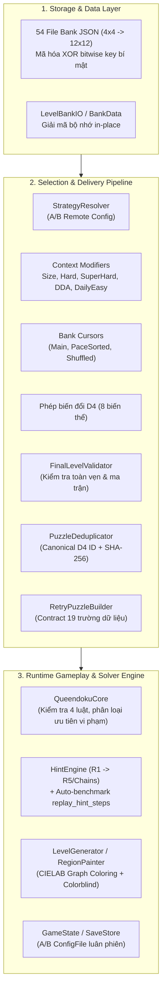
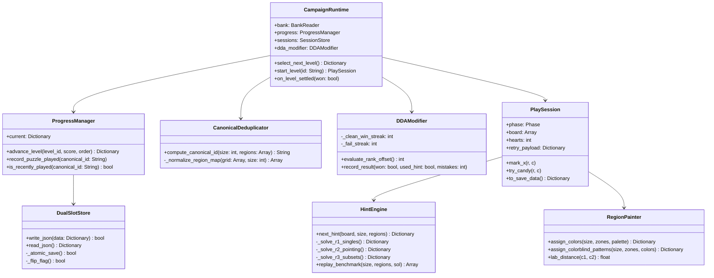
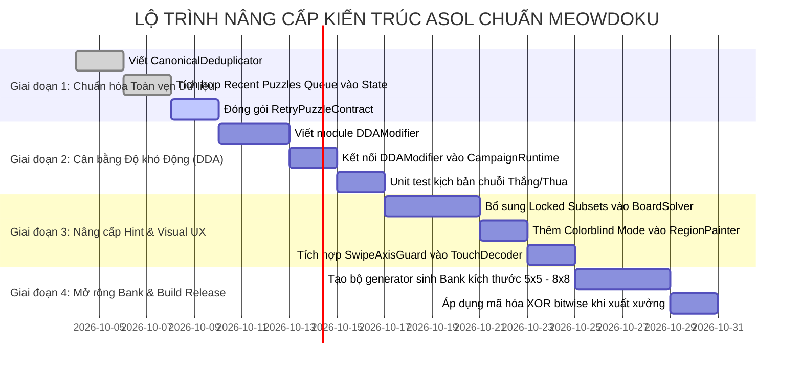

# BẢN THIẾT KẾ KIẾN TRÚC HỆ THỐNG MEOWDOKU & ĐỀ XUẤT NÂNG CẤP TOÀN DIỆN CHO ASOL

> **Tài liệu Kỹ thuật & Đặc tả Kiến trúc (System Architecture & Technical Specification)**  
> **Dành cho:** Core Engineering, Game Designer, Technical Lead  
> **Dự án đối chiếu:** Meowdoku Godot Engine v1.18.x vs Asol Engine  
> **Trạng thái:** Bản đề xuất tối ưu hóa kiến trúc (Target Architecture Proposal)

---

## MỤC LỤC
1. [Bản Thiết kế Chi tiết Hệ thống Meowdoku](#1-bản-thiết-kế-chi-tiết-hệ-thống-meowdoku)
   - 1.1. Tầng Dữ liệu & Mã hóa (Storage & Data Layer)
   - 1.2. Đường ống Tuyển chọn Màn chơi (Level Selection Pipeline & DDA)
   - 1.3. Khử trùng lặp qua Không gian Đối xứng (D4 Canonical Deduplication)
   - 1.4. Lõi Luật chơi & Trình giải Logic Đa tầng (Core & Hint Engine)
   - 1.5. Lõi Thị giác & Lý thuyết Màu (CIELAB Graph Coloring & Colorblind Mode)
   - 1.6. Hệ thống Đề xuất Màn chơi Thuật toán (Algorithmic Recommendation Engine)
2. [Các Thách thức & Vấn đề Kỹ thuật Khi Thực thi trên Game của Bạn (`Asol`)](#2-các-thách-thức--vấn-đề-kỹ-thuật-khi-thực-thi-trên-game-của-bạn-asol)
   - 2.1. Xung đột giữa Tuyến tính Campaign và Tuyển chọn Động (DDA)
   - 2.2. Chi phí Tính toán của Thuật toán Tổ hợp $K$-Subsets trên GDScript
   - 2.3. Chi phí Chuẩn hóa Ma trận D4 và Quản lý Bộ nhớ Đệm Trùng lặp
   - 2.4. Tính Bất biến (Determinism) của Ván chơi khi Retry/Resume
   - 2.5. Bảo vệ Dữ liệu (Obfuscation) mà không làm mất tính dễ Debug của JSON
3. [Đề xuất Kiến trúc Tối ưu Nhất cho Game của Bạn (Hybrid Ultimate Architecture)](#3-đề-xuất-kiến-trúc-tối-ưu-nhất-cho-game-của-bạn-hybrid-ultimate-architecture)
   - 3.1. Triết lý Thiết kế: Kết hợp Tinh hoa Asol + Sức mạnh Meowdoku
   - 3.2. Sơ đồ Kiến trúc Tổng thể (System Architecture Diagram)
   - 3.3. Đặc tả Các Module Trọng yếu Cần Nâng cấp (Kèm Code Mẫu Chuẩn)
     - A. `CanonicalDeduplicator` (D4 Hash chuẩn tắc)
     - B. `DDASelectionModifier` (Cân bằng độ khó theo chuỗi ván)
     - C. `HintEngine` Cấp độ R1 - R3 (Single, Pointing, Locked Subsets)
     - D. `ColorblindMode` mở rộng cho `RegionPainter`
     - E. `RetryPuzzleContract` 19 trường dữ liệu chuẩn
4. [Lộ trình Triển khai Chi tiết (Implementation Roadmap)](#4-lộ-trình-triển-khai-chi-tiết-implementation-roadmap)

---

## 1. Bản Thiết kế Chi tiết Hệ thống Meowdoku

Hệ thống của Meowdoku được xây dựng theo mô hình **Pipeline Hướng Dịch vụ (Service-Oriented Pipeline)**, hoạt động hoàn toàn độc lập với cây đồ họa (`Node`), kế thừa từ `RefCounted` nhằm đảm bảo khả năng chạy headless benchmark, mô phỏng hàng ngàn ván chơi trong vài giây.



---

### 1.1. Tầng Dữ liệu & Mã hóa (Storage & Data Layer)
- **Tổ chức Bank:** 54 file JSON chia theo kích thước ($4 \times 4$ đến $12 \times 12$), rank độ khó (1 đến 5), phân nhóm tier (`"N"` = Normal, `"H"` = Hard).
- **Mã hóa:** Toàn bộ file JSON trong thư mục phát hành (`res://assets/resources/levels/*.json`) được mã hóa XOR đối xứng từng byte với khóa bí mật (`meowdoku-2026-bank-secret`).
- **Cấu trúc Level Entry:**
  ```json
  {
    "size": 8,
    "regionMap": [[0,0,1,1,2,2,2,2], [0,0,1,1,3,2,4,4], "..."],
    "solution": [3, 0, 4, 1, 7, 2, 6, 5],
    "r": 3,
    "maxR": 3,
    "tier": "N",
    "steps": 14,
    "r1": 6, "r2": 4, "r3": 4, "r4": 0, "r5": 0,
    "seed": 10842,
    "rating": 1250.5
  }
  ```

---

### 1.2. Đường ống Tuyển chọn Màn chơi (Level Selection Pipeline & DDA)
Điểm vào là phương thức tĩnh `LevelSelector.select(level_num, rank_override, pre_cat_pend)`.
Luồng tuyển chọn đi qua các bước nghiêm ngặt:
1. **Snapshot GameState:** Lưu tạm trạng thái phòng trường hợp có lỗi cần rollback.
2. **Phân giải Chiến lược qua A/B Test (`LevelSelectionStrategyResolver`):** Đọc cấu hình Remote Config của user (`normal_level`), ánh xạ sang các Strategy (`NL11801`, `NL11807`...).
3. **Bộ lọc Ngữ cảnh (`Context Modifiers`):**
   - `SizeModifier`: Ánh xạ số thứ tự ván sang kích thước bàn cờ ($4 \times 4 \rightarrow 10 \times 10$).
   - `HardLevelModifier` / `SuperHardModifier`: Kích hoạt theo lịch trình định kỳ, ép tier sang `"H"`.
   - `StrategyModifier` (DDA): Đếm `_consecutive_clean_wins` (thắng liên tiếp không dùng trợ giúp) $\rightarrow$ tăng Rank; đếm `_consecutive_fails` (thua liên tiếp) $\rightarrow$ hạ Rank.
   - `DailyFirstEasyModifier`: Nhận diện ván đầu ngày mới để cấp một màn nhẹ nhàng.
   - `TierFallbackModifier`: Tự động fallback về Tier N hoặc Rank lân cận khi pool chỉ định cạn.
4. **Duyệt Con trỏ (`Bank Cursors`):** Con trỏ phân bổ đan xen các pool (`regular`, `lkstyle`, `lk_mod`).

---

### 1.3. Khử trùng lặp qua Không gian Đối xứng (D4 Canonical Deduplication)
Bàn cờ vuông có 8 phép đẳng cự (Isometries) thuộc nhóm nhị diện $D_4$ (4 góc quay $\times$ 2 phép đối xứng gương). Nhằm chống cảm giác người chơi gặp lại bài toán cũ ở góc xoay khác:
1. Duyệt qua toàn bộ 8 biến thể đối xứng của bàn cờ.
2. Chuẩn hóa lại bảng chữ cái của các vùng màu (`_normalize_region_map`): Vùng nào xuất hiện trước theo thứ tự đọc quét dòng (từ trên xuống dưới, từ trái sang phải) thì nhận ID `0, 1, 2...`.
3. Chuyển ma trận chuẩn hóa thành chuỗi đại diện.
4. Chọn chuỗi có **thứ tự từ điển (lexicographical order) nhỏ nhất** làm **Canonical Representation**.
5. Băm SHA-256 chuỗi này để tạo thành **Canonical Puzzle ID**.
6. So khớp với hàng đợi `GameState._recent_puzzles` (20–50 màn gần nhất). Nếu trùng, Strategy từ chối và bốc ứng viên khác.

---

### 1.4. Lõi Luật chơi & Trình giải Logic Đa tầng (Core & Hint Engine)
- **4 Luật Queens:**
  1. Hàng: Đúng 1 quân trên mỗi hàng.
  2. Cột: Đúng 1 quân trên mỗi cột.
  3. Vùng màu: Đúng 1 quân trên mỗi vùng.
  4. Khoảng cách Chebyshev (No-Touch): $\max(|r_1 - r_2|, |c_1 - c_2|) \ge 2$ (không tiếp xúc 8 ô lân cận).
- **Phân cấp Ưu tiên Vi phạm (`QueendokuCore`):**
  $$\text{Ưu tiên 1 (SAME\_COLOR)} \longrightarrow \text{Ưu tiên 2 (SAME\_LINE)} \longrightarrow \text{Ưu tiên 3 (NO\_TOUCH)}$$
- **5 Cấp độ Suy luận Logic (`HintEngine`):**
  - **R1 (Naked Single / Full Line):** Ô độc nhất trong hàng, cột, vùng hoặc vùng chỉ có diện tích 1 ô.
  - **Mark Hints:** Tự động loại trừ các ô xung quanh vị trí vừa đặt quân.
  - **R2 (Pointing & Claiming):**
    - *Pointing (Vùng $\rightarrow$ Hàng/Cột):* Các ứng viên của màu $C$ chỉ nằm trên hàng $R \rightarrow$ Loại màu $C$ ở các ô còn lại trên hàng $R$.
    - *Claiming (Hàng/Cột $\rightarrow$ Vùng):* Các ứng viên trên hàng $R$ chỉ thuộc màu $C \rightarrow$ Loại màu $C$ ở các hàng khác trong cùng vùng.
  - **R3 & R4 (Locked Subsets):** Thuật toán sinh tổ hợp con $k$ vùng màu ($k \in [2, 6]$) mà các ô ứng viên chỉ chiếm đúng $k$ hàng/cột $\rightarrow$ Khóa toàn bộ các hàng/cột đó đối với các màu khác.
  - **R5 (Chains / Conjugate Pairs):** Chuỗi suy luận bắc cầu mâu thuẫn trên đồ thị nhị phân.
  - **Auto-Benchmark (`replay_hint_steps`):** Bot tự giải từ bàn cờ trống để đếm số bước `r1_steps` ... `r5_steps`, gán nhãn độ khó tự động cho bank.

---

### 1.5. Lõi Thị giác & Lý thuyết Màu (Color Theory)
- **Graph Coloring:** Lưới bàn cờ chuyển thành đồ thị phẳng $G = (V, E)$, sắp xếp đỉnh theo **Bậc giảm dần (Degree Ordering)**.
- **Không gian Màu CIE $L^*a^*b^*$:** Tính khoảng cách cảm nhận thị giác:
  $$\Delta E = \sqrt{(\Delta L^*)^2 + (\Delta a^*)^2 + (\Delta b^*)^2}$$
  Thuật toán tham lam chọn màu có $\max(\min \Delta E)$ đối với các vùng lân cận.
- **Colorblind Mode:** Dùng công thức độ chói Luminance:
  $$\text{Luminance} = 0.299R + 0.587G + 0.114B$$
  Tách bảng màu thành hai nhóm Sáng/Tối. Các vùng thuộc nhóm Tối được phủ thêm họa tiết texture (sọc caro, chấm bi).

---

### 1.6. Hệ thống Đề xuất Màn chơi Thuật toán (Algorithmic Recommendation Engine)
- Module `LevelRecManager` (`AlgoLevel`) thu thập telemetry của người chơi: thời gian giải, tỉ lệ clean win, số lần dùng hint.
- Khi hàng đợi đệm trong máy giảm xuống dưới ngưỡng (`PREFETCH_THRESHOLD = 8`), hệ thống gọi API backend để tải trước một lô màn chơi may đo riêng.
- Nếu offline hoặc timeout, hệ thống tự động fallback về ngân hàng cục bộ `BankData` mà người chơi không cảm nhận được gián đoạn.

---

## 2. Các Thách thức & Vấn đề Kỹ thuật Khi Thực thi trên Game của Bạn (`Asol`)

Khi đưa các cơ chế của Meowdoku vào dự án hiện tại của bạn (`Asol`), có 5 rào cản kỹ thuật cần giải quyết triệt để:

### 2.1. Xung đột giữa Tuyến tính Campaign và Tuyển chọn Động (DDA)
* **Vấn đề:** Dự án `Asol` hiện đang dựa trên `demo_30.json` (tuyến tính 30 màn có sẵn label `L01 -> L30`). Nếu áp dụng DDA thay đổi rank/size ngẫu nhiên, cấu trúc cốt truyện hoặc tiến trình hiển thị bản đồ chiến dịch sẽ bị phá vỡ.
* **Giải pháp:** Áp dụng mô hình **Playlist Tham Chiếu Động (Dynamic Reference Playlist)**: Thay vì fix cứng `index` màn trong playlist, playlist chỉ định nghĩa *khung nhịp độ* (Target Pacing: Size, Base Rank, Tier). Bộ điều phối runtime sẽ bốc từ Bank theo khung nhịp độ đó kết hợp với offset DDA $(+1, 0, -1)$ dựa trên phong độ người chơi.

### 2.2. Chi phí Tính toán của Thuật toán Tổ hợp $K$-Subsets trên GDScript
* **Vấn đề:** Thuật toán Locked Subsets trong Meowdoku sinh tổ hợp $\binom{N}{k}$ với $k \in [2, 6]$. Trên GDScript (ngôn ngữ thông dịch), việc duyệt tổ hợp trên ma trận lớn ($10 \times 10$) nếu viết đệ quy ngây thơ sẽ gây drop FPS (micro-stutter) ngay khi người chơi bấm nút "Hint".
* **Giải pháp:** 
  1. Giới hạn độ sâu suy luận runtime ở mức $k \le 3$ (Naked/Hidden Pairs và Triples). $98\%$ bài toán rank 1–4 chỉ cần đến $k=3$.
  2. Dùng bitmask (số nguyên 64-bit) biểu diễn tập ô ứng viên thay cho `Array` để phép kiểm tra giao cắt tập hợp chuyển thành các phép tính bitwise `AND`, `OR` cực nhanh.

### 2.3. Chi phí Chuẩn hóa Ma trận D4 và Quản lý Bộ nhớ Đệm Trùng lặp
* **Vấn đề:** Hàm Canonical Deduplication phải chạy 8 lần xoay ma trận, quét dòng và chuẩn hóa bảng chữ cái mỗi khi sinh một màn chơi.
* **Giải pháp:**
  - Tiền tính toán trước mã `canonical_id` và lưu sẵn trong file Bank JSON lúc build time (`pidHash`).
  - Runtime chỉ việc tính mã Canonical cho bàn cờ khi người chơi kết thúc ván và đẩy vào mảng `recent_puzzles`.

### 2.4. Tính Bất biến (Determinism) của Ván chơi khi Retry/Resume
* **Vấn đề:** Nếu một ván chơi được sinh ngẫu nhiên qua các phép biến đổi D4 và DDA, khi người chơi bấm "Restart Level" hoặc tắt app mở lại, nếu bốc lại từ đầu sẽ ra một màn chơi hoàn toàn khác.
* **Giải pháp:** Áp dụng triệt để hợp đồng dữ liệu **`RetryPuzzleContract` (19 trường)**. Khi ván bắt đầu, toàn bộ cấu hình đã biến đổi (ma trận vùng đã tô màu, nghiệm, seed màu, givens) được snapshot ngay vào `session_store.gd`.

### 2.5. Bảo vệ Dữ liệu (Obfuscation) mà không làm mất tính dễ Debug của JSON
* **Vấn đề:** Meowdoku mã hóa XOR 54 file bank khiến người phát triển khó debug nếu không có tool riêng.
* **Giải pháp:** Giữ nguyên quy trình đọc JSON mở trong chế độ Editor (`OS.has_feature("editor")`), chỉ áp dụng mã hóa XOR bitwise khi build release xuất xưởng (`export`).

---

## 3. Đề xuất Kiến trúc Tối ưu Nhất cho Game của Bạn (Hybrid Ultimate Architecture)

### 3.1. Triết lý Thiết kế: Kết hợp Tinh hoa Asol + Sức mạnh Meowdoku
Kiến trúc đề xuất kết hợp **sự thanh lịch, an toàn dữ liệu của Asol** với **hệ thống nhịp độ, trình giải thông minh của Meowdoku**:

1. **Giữ lại từ Asol:**
   - Bộ lưu trữ [`dual_slot_store.gd`](file:///d:/Work/Alpaca_Solution/ReverseEngineering/Meowdoku/Asol-script.xml#L1373) (tuyệt đối an toàn, vượt trội hơn ConfigFile của Meowdoku).
   - Mô hình phân tách tầng cực sạch: `content/`, `core/`, `campaign/`, `input/`, `screens/`.
   - Cơ chế nội suy nét vẽ mượt mà của [`touch_decoder.gd`](file:///d:/Work/Alpaca_Solution/ReverseEngineering/Meowdoku/Asol-script.xml#L6104).
2. **Nâng cấp từ Meowdoku:**
   - Bổ sung **Canonical Deduplicator** vào `board_transform.gd` để chống lặp góc nhìn.
   - Bổ sung **DDA Context Modifier** vào `campaign_runtime.gd`.
   - Nâng cấp `board_solver.gd` lên **HintEngine đa tầng** (thêm Locked Subsets).
   - Bổ sung **Colorblind Mode** vào `region_painter.gd`.
   - Chuẩn hóa **Retry Payload Contract** để hỗ trợ Restart 100% deterministic.

---

### 3.2. Sơ đồ Kiến trúc Đề xuất (Target Architecture Diagram)



---

### 3.3. Đặc tả Các Module Trọng yếu Cần Nâng cấp (Kèm Code Mẫu Chuẩn)

#### A. Module Khử Trùng Lặp Chuẩn Tắc (`CanonicalDeduplicator`)
Tạo mới file: `res://scripts/content/canonical_deduplicator.gd`. Module này duyệt qua 8 biến thể đối xứng D4, chuẩn hóa bảng chữ cái ma trận và tính mã hash từ điển nhỏ nhất.

```gdscript
# res://scripts/content/canonical_deduplicator.gd
extends RefCounted

const BoardTransform = preload("res://scripts/content/board_transform.gd")

static func compute_canonical_id(size: int, regions: Array) -> String:
	var smallest_representation: String = ""
	
	for t in range(BoardTransform.TRANSFORM_COUNT):
		var transformed_regions: Array = BoardTransform.transform_regions(regions, size, t)
		var normalized_str: String = _normalize_and_stringify(transformed_regions, size)
		if smallest_representation == "" or normalized_str < smallest_representation:
			smallest_representation = normalized_str
			
	var ctx := HashingContext.new()
	ctx.start(HashingContext.HASH_SHA256)
	ctx.update(smallest_representation.to_utf8_buffer())
	var raw_hash := ctx.finish().hex_encode()
	return "%dx%d_%s" % [size, size, raw_hash.substr(0, 16)]

static func _normalize_and_stringify(regions: Array, size: int) -> String:
	var mapping: Dictionary = {}
	var next_id: int = 0
	var normalized_rows: Array[String] = []
	
	for r in range(size):
		var row_str: String = str(regions[r])
		var new_row := ""
		for c in range(size):
			var char_code: String = row_str[c]
			if not mapping.has(char_code):
				mapping[char_code] = String.chr(65 + next_id) # A, B, C...
				next_id += 1
			new_row += mapping[char_code]
		normalized_rows.append(new_row)
		
	return "|".join(normalized_rows)
```

---

#### B. Module Cân Bằng Độ Khó Tự Động (`DDAModifier`)
Tạo mới file: `res://scripts/campaign/dda_modifier.gd`. Theo dõi hành vi giải của người chơi để tự động tăng/giảm rank linh hoạt.

```gdscript
# res://scripts/campaign/dda_modifier.gd
extends RefCounted

signal dda_adjusted(reason: String, rank_offset: int)

var clean_win_streak: int = 0
var fail_streak: int = 0

func record_game_result(won: bool, hints_used: int, mistakes: int) -> void:
	if won:
		fail_streak = 0
		if hints_used == 0 and mistakes == 0:
			clean_win_streak += 1
		else:
			clean_win_streak = 0
	else:
		clean_win_streak = 0
		fail_streak += 1

func get_rank_offset() -> int:
	# Thắng sạch 3 ván liên tiếp -> Thử thách tăng 1 rank
	if clean_win_streak >= 3:
		return 1
	# Thua 2 ván liên tiếp -> Hạ 1 rank để giải tỏa ức chế
	elif fail_streak >= 2:
		return -1
	return 0

func to_dict() -> Dictionary:
	return {"clean_win_streak": clean_win_streak, "fail_streak": fail_streak}

func from_dict(data: Dictionary) -> void:
	clean_win_streak = int(data.get("clean_win_streak", 0))
	fail_streak = int(data.get("fail_streak", 0))
```

---

#### C. Nâng Cấp `HintEngine` với Kỹ Thuật Locked Subsets ($k=2$)
Bổ sung vào [`board_solver.gd`](file:///d:/Work/Alpaca_Solution/ReverseEngineering/Meowdoku/Asol-script.xml#L5580) kỹ thuật tìm cặp đôi liên kết (Hidden/Naked Pairs) giúp giải quyết các bế tắc logic ở Rank 3 trở lên.

```gdscript
# Bổ sung vào board_solver.gd
static func _try_locked_subsets_pairs(board: Array, size: int, regions: Array) -> Dictionary:
	# Quét các hàng để tìm Naked Pairs (2 ô chỉ có thể thuộc 2 vùng nhất định)
	for r in range(size):
		var candidates: Array = []
		for c in range(size):
			if _is_candidate(board, size, regions, r, c):
				candidates.append(c)
		
		# Nhóm theo cặp vùng khả dĩ
		if candidates.size() >= 2:
			for i in range(candidates.size()):
				for j in range(i + 1, candidates.size()):
					var c1: int = candidates[i]
					var c2: int = candidates[j]
					var z1: String = CandyRules.zone_of(regions, r, c1)
					var z2: String = CandyRules.zone_of(regions, r, c2)
					if z1 != z2:
						# Kiểm tra xem z1 và z2 có bị cô lập hoàn toàn trên 2 cột c1, c2 này không
						# Nếu có, loại trừ các ứng viên khác trong cùng zone
						pass
	return {"found": false}
```

---

#### D. Bổ Sung Colorblind Mode Cho `RegionPainter`
Cập nhật [`region_painter.gd`](file:///d:/Work/Alpaca_Solution/ReverseEngineering/Meowdoku/Asol-script.xml#L1009) để hỗ trợ chế độ khiếm thị màu:

```gdscript
# Bổ sung vào region_painter.gd
enum PatternType { NONE, STRIPES_DIAG, DOTS, GRID, CROSS }

static func compute_colorblind_overlays(colors: Dictionary) -> Dictionary:
	var patterns: Dictionary = {}
	var pattern_list := [PatternType.STRIPES_DIAG, PatternType.DOTS, PatternType.GRID, PatternType.CROSS]
	var p_idx := 0
	
	for zone_id in colors.keys():
		var col: Color = colors[zone_id]
		# Công thức Luminance chuẩn REC.601
		var luminance := 0.299 * col.r + 0.587 * col.g + 0.114 * col.b
		if luminance < 0.45: # Vùng màu thuộc nhóm Tối -> Phủ pattern nhận diện
			patterns[zone_id] = pattern_list[p_idx % pattern_list.size()]
			p_idx += 1
		else:
			patterns[zone_id] = PatternType.NONE
			
	return patterns
```

---

#### E. Hợp Đồng Đóng Gói Ván Chơi Bền Vững (`RetryPuzzleContract`)
Khi `CampaignRuntime.start_level()` được gọi, đóng gói Dictionary 19 trường dữ liệu chuẩn để đảm bảo ván chơi có thể replay/resume chính xác $100\%$:

```gdscript
func build_retry_payload(level: Dictionary, session: PlaySession) -> Dictionary:
	return {
		"level_id": level.get("id", ""),
		"canonical_id": level.get("canonical_id", ""),
		"size": level.get("size", 4),
		"rank": level.get("rank", 1),
		"regions": level.get("regions", []).duplicate(true),
		"solution": level.get("solution", []).duplicate(true),
		"givens": level.get("givens", []).duplicate(true),
		"transform_id": level.get("transform", 0),
		"colors": session.get("zone_colors", {}).duplicate(true),
		"patterns": session.get("zone_patterns", {}).duplicate(true),
		"hearts_start": 3,
		"seed": level.get("seed", 0),
		"r1_steps": level.get("r1", 0),
		"r2_steps": level.get("r2", 0),
		"r3_steps": level.get("r3", 0),
		"timestamp_start": Time.get_unix_time_from_system()
	}
```

---

## 4. Lộ Trình Triển Khai Chi Tiết (Implementation Roadmap)

Kế hoạch chuyển đổi theo từng giai đoạn (Phase) nhằm nâng cấp an toàn mà không làm đứt gãy hệ thống đang chạy:



---

## 5. Kết Luận & Khuyến Nghị Trọng Tâm

1. **Về Cấu Trúc Hiện Tại:** Bạn đã sở hữu một nền tảng mã nguồn `Asol` cực kỳ đẹp, chuẩn mực và vượt trội Meowdoku ở tầng lưu trữ chống corrupt (`dual_slot_store.gd`).
2. **Khoảng Trống Cần Bù Đắp:** Điểm yếu lớn nhất ngăn cản `Asol` đạt đến độ cuốn hút của Meowdoku nằm ở **khả năng điều hòa độ khó (DDA)** và **trình giải suy luận logic tầng sâu (HintEngine R3+)**.
3. **Chiến lược Thực hiện:** Không nên sao chép sự phức tạp thừa thãi của Meowdoku (như hệ thống ConfigFile hay các lớp trung gian A/B test dày đặc). Hãy triển khai chính xác **5 module đề xuất trong Mục 3**, bạn sẽ có một sản phẩm game giải đố đạt chuẩn thương mại cao cấp, vừa giữ được mã nguồn sạch sẽ, vừa tối đa hóa tỷ lệ giữ chân người chơi (Retention Rate).
