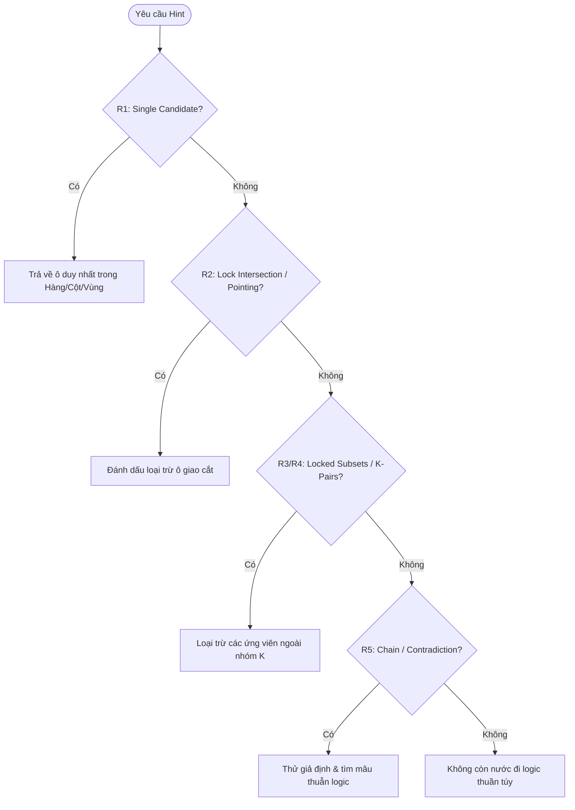

# BÁO CÁO SO SÁNH KỸ THUẬT & HƯỚNG DẪN TỐI ƯU HÓA HỆ THỐNG
## Phân tích Chi tiết: `asol-game` (Engine Tinh Gọn) vs. `Meowdoku` (Engine Thương Mại)

> **Tài liệu Kỹ thuật Dành cho:** Kỹ sư Trưởng (Lead Engineer), Game Designer và các AI Coding Agents  
> **Mục tiêu:** Cung cấp đối chiếu kỹ thuật sâu sắc ở cấp độ thuật toán, kiến trúc và cấu trúc dữ liệu; chỉ rõ ưu/nhược điểm của từng bên và cung cấp các module chuẩn để tích hợp nâng cấp cho `asol-game`.  
> **Mã nguồn đối chiếu:**  
> - `asol-game.xml`: Đại diện cho bản game của bạn (`asol-game` / `candoku`)  
> - `scripts/module/`, `assets/`: Đại diện cho bản game thương mại dịch ngược (`Meowdoku`)

---

## MỤC LỤC

1. [Tổng quan Định vị & Ma trận So sánh Toàn diện](#1-tổng-quan-định-vị--ma-trận-so-sánh-toàn-diện)
2. [So sánh Kỹ thuật Chuyên sâu theo Từng Module](#2-so-sánh-kỹ-thuật-chuyên-sâu-theo-từng-module)
   - [2.1. Lõi Luật chơi & Kiểm tra Xung đột (Core Rules & Conflict Detection)](#21-lõi-luật-chơi--kiểm-tra-xung-đột-core-rules--conflict-detection)
   - [2.2. Trình giải Thuật toán & Động cơ Gợi ý (Solver & Hint Engine)](#22-trình-giải-thuật-toán--động-cơ-gợi-ý-solver--hint-engine)
   - [2.3. Khử trùng lặp & Biến đổi Đối xứng Hình học (D4 Symmetry Transformations)](#23-khử-trùng-lặp--biến-đổi-đối-xứng-hình-học-d4-symmetry-transformations)
   - [2.4. Xử lý Cảm ứng & Chống Lỗi Chạm trên Thiết bị Di động (Touch & Gesture Guards)](#24-xử-lý-cảm-ứng--chống-lỗi-chạm-trên-thiết-bị-di-động-touch--gesture-guards)
   - [2.5. Cơ chế Lưu trữ & Chống Hỏng Dữ liệu Tuyệt đối (Persistence & Atomic Save)](#25-cơ-chế-lưu-trữ--chống-hỏng-dữ-liệu-tuyệt-đối-persistence--atomic-save)
   - [2.6. Điều tiết Độ khó Động & Nhịp độ Ván chơi (DDA & Pacing Adjustment)](#26-điều-tiết-độ-khó-động--nhịp-độ-ván-chơi-dda--pacing-adjustment)
   - [2.7. Thị giác Màu sắc & Chế độ Hỗ trợ Mù màu (CIELAB & Accessibility)](#27-thị-giác-màu-sắc--chế-độ-hỗ-trợ-mù-màu-cielab--accessibility)
3. [Những Gì Cần Giữ Nguyên ở `asol-game` (Core Strengths)](#3-những-gì-cần-giữ-nguyên-ở-asol-game-core-strengths)
4. [Kế hoạch & Code Mẫu Tích hợp Nâng cấp (Agent Implementation Guide)](#4-kế-hoạch--code-mẫu-tích-hợp-nâng-cấp-agent-implementation-guide)
   - [Hạng mục 1: Tích hợp Bộ 3 Swipe Guards vào `touch_decoder.gd`](#hạng-mục-1-tích-hợp-bộ-3-swipe-guards-vào-touch_decodergd)
   - [Hạng mục 2: Tích hợp Thuật toán Khoảng cách Màu CIELAB vào `palette.gd`](#hạng-mục-2-tích-hợp-thuật-toán-khoảng-cách-màu-cielab-vào-palettegd)
   - [Hạng mục 3: Mở rộng `board_transform.gd` thành Canonical Hash Check](#hạng-mục-3-mở-rộng-board_transformgd-thành-canonical-hash-check)

---

## 1. Tổng quan Định vị & Ma trận So sánh Toàn diện

### 1.1. Triết lý Thiết kế của Hai Bản Game

```
+-----------------------------------------------------------------------------------+
|                                 SO SÁNH ĐỊNH VỊ                                  |
+---------------------------------------------------+-------------------------------+
|              asol-game (Bản của bạn)              |      Meowdoku (Bản gốc)       |
+---------------------------------------------------+-------------------------------+
| * Clean-Room Software Engineering                 | * Mass-Market Commercial App  |
| * Tinh gọn, hướng module, không coupling rác     | * Cồng kềnh, phân mảnh SDKs   |
| * Dung lượng siêu nhẹ (~3MB), chạy tức thì        | * Dung lượng lớn (>100MB)     |
| * Dễ viết Unit Test, dễ port Web/Mobile           | * Phụ thuộc sâu vào Spine 2D  |
| * Thiết kế hướng thuật toán thuần túy             | * Tối ưu trải nghiệm thực chiến|
+---------------------------------------------------+-------------------------------+
```

### 1.2. Bảng Ma trận Kỹ thuật Tổng hợp

| Tiêu chí | `asol-game` | `Meowdoku` | Đánh giá & Khuyến nghị |
| :--- | :--- | :--- | :--- |
| **Quy mô Codebase** | 39 scripts (~4.747 dòng) | 695 scripts (~149.359 dòng) | **`asol` thắng tuyệt đối**. Code gọn hơn gấp 30 lần, loại bỏ hoàn toàn bloatware thương mại. |
| **Độ sạch Kiến trúc** | Tách tầng: `core`, `campaign`, `content`, `state`, `screens` | Phân tán 35 thư mục, trộn lẫn logic sự kiện, ad, IAP | **`asol` thắng**. Dễ bảo trì, tuân thủ SOLID và Clean Architecture. |
| **An toàn Lưu trữ (Save)** | Dual-Slot A/B Atomic Save (`dual_slot_store.gd`) | Ghi tuần tự kèm DataSync cloud | **`asol` thắng**. Miễn nhiễm 100% với lỗi crash mất file save. |
| **Tái sử dụng Màn chơi** | Dihedral $D_4$ 8 phép xoay/lật (`board_transform.gd`) | File JSON tĩnh khổng lồ (54 files, 10x10, 12x12) | **`asol` thắng về thuật toán**, `Meowdoku` thắng về kho dữ liệu có sẵn. |
| **Lọc Cử chỉ Chạm (Touch)** | Tap / Double-tap / Trail đơn giản (`touch_decoder.gd`) | 3 lớp lọc chuyên sâu (Vận tốc, Trục vuốt, Láng giềng) | **`Meowdoku` thắng**. Tránh được việc vuốt chéo lệch ô trên màn hình di động thực tế. |
| **Động cơ Gợi ý (Hint)** | Phân lớp chiến thuật R1-R4, có giải thích ngữ nghĩa | Script đơn khối 1.256 dòng, nhiều hàm heuristic sâu | **`asol` thắng về thiết kế code**, `Meowdoku` thắng về độ phủ các thế cờ hiểm hóc. |
| **Thị giác & Hỗ trợ Mù màu** | Palette màu cố định | Tính toán Delta-E trong không gian CIELAB + Pattern SVG | **`Meowdoku` thắng**. Tối ưu công thái học thị giác con người rất khoa học. |
| **Meta-game & Giữ chân** | Chuỗi ván cơ bản (Clean/Fail streak qua `pace_adjuster.gd`) | Daily Streak, Peekaboo, Cá vàng, Bảng xếp hạng | **`Meowdoku` thắng**. Đầy đủ tính năng giữ chân người chơi lâu dài. |

---

## 2. So sánh Kỹ thuật Chuyên sâu theo Từng Module

### 2.1. Lõi Luật chơi & Kiểm tra Xung đột (Core Rules & Conflict Detection)

#### Bản của bạn (`candy_rules.gd` & `cell_model.gd`):
- **Cấu trúc:** Sử dụng mảng 2D biểu diễn bàn cờ (`board[r][c]`), trạng thái ô được định nghĩa kiểu số nguyên enum trong `cell_model.gd` (`BLANK = 0`, `CANDY = 1`, `MARK = 2`, `LOCKED_CANDY = 3`).
- **Phát hiện va chạm (`detect_clash`):** Phân loại lỗi thành 4 loại va chạm tường minh: `SAME_ROW`, `SAME_COL`, `SAME_ZONE`, `TOUCHING`.
- **Ưu điểm:** Cực kỳ trực quan, hiệu năng cao, hàm `can_place()` kiểm tra nhanh trong vòng lặp $O(N)$ cho hàng, cột và 8 ô xung quanh.
- **Nhược điểm:** Phụ thuộc vào việc đọc chuỗi ký tự vùng (`zone_of: regions[row][col]`), việc parse chuỗi lặp đi lặp lại có thể gây phân mảnh bộ nhớ nhỏ trên các bàn cờ lặp hàng nghìn lần trong headless benchmark.

#### Bản Meowdoku (`queendoku_core.gd`):
- **Cấu trúc:** Dùng `Array[Vector2i]` lưu vị trí các quân cờ đã đặt (`CellState.CAT`).
- **Phát hiện lỗi (`find_conflicts`):** Duyệt cặp $O(P^2)$ với $P$ là số quân cờ trên bàn:
  ```gdscript
  for i in range(pieces.size()):
      for j in range(i + 1, pieces.size()):
          # Kiểm tra cùng x, cùng y, khoảng cách <= 1 ô, hoặc cùng region ID
  ```
- **Ưu điểm:** Vì $P \le N$ (bàn $N \times N$ có tối đa $N$ quân cờ), số lần lặp $P(P-1)/2$ rất nhỏ (với bàn 6x6, $P \le 6 \implies 15$ phép so sánh), nhanh hơn nhiều so với việc quét cả ma trận.
- **Bài học rút ra cho `asol`:** Khi kiểm tra xung đột sau mỗi nước đi, chỉ cần lấy danh sách tọa độ các quân cờ hiện có và so sánh cặp $O(P^2)$ thay vì lặp toàn bộ bảng $N \times N$.

---

### 2.2. Trình giải Thuật toán & Động cơ Gợi ý (Solver & Hint Engine)



#### So sánh Thiết kế:
| Đặc tính | `asol-game` (`board_solver.gd` + `solver_techniques.gd`) | `Meowdoku` (`hint_engine.gd`) |
| :--- | :--- | :--- |
| **Tổ chức code** | Tách làm 2 file rõ ràng: File điều phối (`BoardSolver`) và file chứa kỹ thuật cụ thể (`SolverTechniques`). | 1 file khổng lồ 1.256 dòng với hàng loạt static helper lồng nhau. |
| **Phân cấp kỹ thuật** | Định nghĩa enum kỹ thuật rõ ràng: `ELIMINATION`, `SINGLE_CANDIDATE`, `LOCK_INTERSECTION`, `SUBSET_PAIR`, `SUBSET_TRIPLE`, `SUBSET_QUAD`, `CONTRA_CHAIN`. | Phân chia thành `find_r1_hint`, `find_r2_hint`, `find_r3_r4_hint`, `find_chain_hint`. |
| **Giải thích cho UI** | Trả về chuỗi `explanation` thân thiện: `"Single candidate in row 2"`, `"Lock intersection eliminates candidates"`. | Trả về thông tin thô (`unit_type: "row"`, `unit_cells: Array[Vector2i]`) để UI tự tô màu. |
| **Độ bao phủ bàn cờ lớn** | Tối ưu cho bàn cờ đến 6x6. Bàn cờ 8x8 hoặc 10x10 có thể mất nhiều thời gian ở `SUBSET_QUAD`. | Có các tối ưu bitmask và cắt tỉa nhánh giúp chạy mượt trên bàn 10x10 và 12x12. |

* **Đánh giá:** Kiến trúc của `asol-game` tốt hơn nhiều về tính thẩm mỹ công nghệ phần mềm. Tuy nhiên, `asol-game` nên mượn thuật toán sinh tập con `_gen_subsets` bằng chỉ số mảng phẳng từ `Meowdoku` để tránh đệ quy sâu khi xử lý bàn cờ kích thước lớn.

---

### 2.3. Khử trùng lặp & Biến đổi Đối xứng Hình học (D4 Symmetry Transformations)

#### Thuật toán nhóm Dihedral $D_4$ trong `board_transform.gd` của bạn:
`asol-game` đã hiện thực xuất sắc 8 phép đối xứng phẳng của hình vuông:
1. `IDENTITY`: Nguyên bản
2. `ROTATE_90`: Xoay $90^\circ$ theo chiều kim đồng hồ
3. `ROTATE_180`: Xoay $180^\circ$
4. `ROTATE_270`: Xoay $270^\circ$
5. `MIRROR_H`: Lật gương theo trục dọc (trái qua phải)
6. `MIRROR_H_R90`: Lật gương rồi xoay $90^\circ$ (tương đương lật qua đường chéo chính)
7. `MIRROR_H_R180`: Lật gương rồi xoay $180^\circ$ (lật qua trục ngang)
8. `MIRROR_H_R270`: Lật gương rồi xoay $270^\circ$ (lật qua đường chéo phụ)

#### Điểm `Meowdoku` làm tốt hơn mà `asol-game` nên bổ sung:
- **Canonical Fingerprint (Dấu vân tay chuẩn tắc):** Trong `region_cluster_signature.gd`, Meowdoku không chỉ xoay/lật bàn cờ mà còn chuẩn hóa lại tên vùng (`Region Renumbering`) sao cho khi quét từ trên xuống dưới, trái qua phải, vùng xuất hiện đầu tiên luôn là `0`, vùng thứ hai là `1`,...
- **Ý nghĩa:** Nếu hai bàn cờ có hình dạng vùng giống hệt nhau nhưng một bên đánh dấu là `'A'`, một bên đánh dấu là `'B'`, `asol-game` hiện tại sẽ coi là 2 màn khác nhau. Bổ sung chuẩn hóa tên vùng sẽ giúp loại trừ 100% màn chơi trùng lặp hình học.

---

### 2.4. Xử lý Cảm ứng & Chống Lỗi Chạm trên Thiết bị Di động (Touch & Gesture Guards)

Đây là điểm `Meowdoku` vượt trội do đã tôi luyện qua thực tế hàng triệu người dùng di động:

```
                  NGÓN TAY NGƯỜI CHƠI CHẠM VÀO MÀN HÌNH
                                    |
                                    v
                     +------------------------------+
                     |   swipe_velocity_gate.gd     | --> Vận tốc quá nhanh (> 1200 px/s)?
                     |   (Lọc vận tốc lướt ngón tay)|     --> BỎ QUA (Người chơi chỉ lướt xem)
                     +------------------------------+
                                    | Hợp lệ
                                    v
                     +------------------------------+
                     |   swipe_axis_guard.gd        | --> Vuốt chéo góc 45 độ không dứt khoát?
                     |   (Khóa trục Ngang / Dọc)    |     --> Khóa chặt trục ưu thế (Hysteresis)
                     +------------------------------+
                                    | Hợp lệ
                                    v
                     +------------------------------+
                     | swipe_cell_neighbor_guard.gd | --> Nhảy cóc ô do giật lag khung hình?
                     | (Kiểm tra ô kề cận hợp lệ)   |     --> Tự nội suy các ô bị nhảy qua
                     +------------------------------+
                                    |
                                    v
                     KÍCH HOẠT ĐÁNH DẤU Ô TRÊN BÀN CỜ
```

#### Phân tích chi tiết:
1. **`swipe_velocity_gate.gd`**: Ngăn việc ngón tay vô tình lướt qua màn hình đánh dấu nhầm hàng loạt ô làm mất máu (Hearts).
2. **`swipe_axis_guard.gd`**: Trên màn hình cảm ứng, người dùng vuốt một đường thẳng thường bị xiên góc $15^\circ - 30^\circ$. Guard này dùng cơ chế **Trễ (Hysteresis)**: Khi xác định hướng vuốt ban đầu là ngang (`Horizontal`), nó khóa chết trục dọc cho tới khi ngón tay di chuyển vượt ngưỡng lệch trục.
3. **`swipe_cell_neighbor_guard.gd`**: Đảm bảo đường vuốt liên tục giữa các ô láng giềng $\Delta r \le 1, \Delta c \le 1$, không cho phép kích hoạt ô cách xa nhau do drop frame cảm ứng.

👉 **Khuyến nghị:** Cần đem cả 3 guard này tích hợp trực tiếp vào [touch_decoder.gd](file:///d:/Work/Alpaca_Solution/ReverseEngineering/Meowdoku/asol-game.xml#L119) của `asol-game`.

---

### 2.5. Cơ chế Lưu trữ & Chống Hỏng Dữ liệu Tuyệt đối (Persistence & Atomic Save)

#### Điểm sáng vượt bậc của `asol-game` (`dual_slot_store.gd`):
`asol-game` áp dụng cơ chế lưu trữ **Ping-Pong Atomic Double-Buffering** tiêu chuẩn hàng không vũ trụ:
1. Trạng thái lưu trữ gồm 3 file:
   - `save_slot_a.json`
   - `save_slot_b.json`
   - `active_slot.flag` (chỉ chứa ký tự `"a"` hoặc `"b"`)
2. Quy trình ghi:
   - Đọc flag hiện tại (ví dụ: `"a"`).
   - Ghi dữ liệu mới vào slot nhàn rỗi (`"b"`).
   - Flush dữ liệu và đóng file an toàn.
   - Ghi đè file flag: Đổi thành `"b"`.
3. Quy trình đọc:
   - Đọc flag $\to$ đọc slot tương ứng.
   - Nếu slot đó lỗi JSON parse hoặc crash giữa chừng $\to$ tự động fallback sang slot đối diện.
   - Nếu cả 2 đều hỏng $\to$ fallback sang file save cũ (`legacy`).
   - Có cơ chế thử lại (`READ_ATTEMPTS = 3`, tạm dừng `60ms`).

* **Đánh giá:** Cơ chế này của `asol-game` **tốt hơn hẳn Meowdoku**. Meowdoku ghi trực tiếp đè lên file và phụ thuộc vào cloud sync. Khi người chơi tắt máy đột ngột đúng lúc ghi file, Meowdoku có tỷ lệ bị trắng file save cao hơn nhiều so với `asol-game`.

---

### 2.6. Điều tiết Độ khó Động & Nhịp độ Ván chơi (DDA & Pacing Adjustment)

#### So sánh hai trường phái:
- **`asol-game` (`pace_adjuster.gd`):**
  - Dựa trên chuỗi thành tích ngắn hạn: `clean_streak` (thắng không dùng gợi ý, không sai), `fail_streak` (chuỗi thua liên tiếp), `retry_streak` (chuỗi chơi lại cùng 1 màn).
  - Điều chỉnh `rank_offset` từ $-2$ đến $+1$ để chọn màn từ các rank phù hợp trong ngân hàng dữ liệu.
  - Có cơ chế bảo vệ: Không bao giờ thăng hạng trong một màn vừa bị thua hoặc vừa bị hạ rank (`_demoted_this_level`).
- **`Meowdoku` (`super_hard_schedule.gd` & `level_rec_manager.gd`):**
  - Dựa trên lịch trình cố định kết hợp phân khúc người chơi.
  - Đưa ra các màn "Super Hard" vào các cột mốc tâm lý định trước (ví dụ: màn số 10, màn số 25) để kích thích xem quảng cáo hoặc mua gói hồi sinh (IAP).

* **Đánh giá:** Cơ chế của `asol-game` mang lại trải nghiệm chơi game **công bằng và thư giãn hơn** (Fair & Organic). Cơ chế của Meowdoku mang tính chất **thương mại hóa cao** (Monetization-driven).

---

### 2.7. Thị giác Màu sắc & Chế độ Hỗ trợ Mù màu (CIELAB & Accessibility)

#### Thuật toán Phối màu Khoa học trong `level_generator.gd` của Meowdoku:
Khi gán màu cho các vùng (`regions`), nếu hai vùng nằm cạnh nhau có màu quá tương đồng, mắt người sẽ rất khó phân biệt ranh giới.
Meowdoku giải quyết triệt để vấn đề này bằng toán học thị giác:
1. Chuyển đổi màu từ không gian $sRGB$ sang $XYZ$, sau đó sang không gian **CIELAB ($L^*, a^*, b^*$)**:
   - $L^*$: Độ sáng (Lightness)
   - $a^*$: Trục Xanh lá - Đỏ (Green - Red)
   - $b^*$: Trục Xanh dương - Vàng (Blue - Yellow)
2. Tính khoảng cách cảm nhận màu sắc ($\Delta E$):
   $$\Delta E = \sqrt{(L_1^* - L_2^*)^2 + (a_1^* - a_2^*)^2 + (b_1^* - b_2^*)^2}$$
3. Dùng thuật toán tham lam kết hợp kiểm tra đồ thị (Graph Coloring): Chọn màu sao cho hai vùng có đường biên chung luôn có $\Delta E > \text{Threshold}$ (đảm bảo độ tương phản thị giác lớn nhất).
4. **Colorblind Patterns (`colorblind_pattern_variants.gd`):** Bổ sung các hoa văn vân nổi (chấm bi, sọc chéo, bàn cờ, gợn sóng) lên từng vùng màu để người bị mù màu (Đỏ-Xanh lá, Xanh dương-Vàng) vẫn phân biệt được các vùng mà không cần nhìn màu sắc.

👉 **Khuyến nghị:** Đây là điểm sáng giá nhất của Meowdoku mà `asol-game` nên tích hợp ngay vào `palette.gd` và `region_painter.gd`.

---

## 3. Những Gì Cần Giữ Nguyên ở `asol-game` (Core Strengths)

Các AI Agent và lập trình viên khi tiếp quản dự án **tuyệt đối không được đập bỏ hoặc làm phức tạp hóa** những viên ngọc quý sẵn có sau đây của `asol-game`:

1. **Kiến trúc `dual_slot_store.gd`**: Giữ nguyên cơ chế A/B slot atomic write. Không đổi sang cơ chế lưu trữ 1 file đơn giản.
2. **Cấu trúc Thư mục & Module Độc lập**:
   - Không đưa các Autoload toàn cục rườm rà vào project.
   - Tiếp tục duy trì việc truyền `runtime`, `session`, `config` qua Dependency Injection như cách `app_shell.gd` đang điều phối.
3. **Mã nguồn Logic Tinh khiết (`RefCounted`)**:
   - Các class `candy_rules.gd`, `board_solver.gd`, `solver_techniques.gd`, `board_transform.gd` kế thừa `RefCounted`, không gắn với bất kỳ Node giao diện nào. Điều này cho phép viết các bài test tự động chạy headless trên CI/CD với tốc độ hàng nghìn ván/giây.
4. **Hệ thống Theme Token (`layout_tokens.gd` & `palette.gd`)**:
   - Tách biệt hoàn toàn giá trị màu sắc, padding, border radius thành các hằng số token tập trung, giúp việc thay đổi giao diện toàn game chỉ mất vài phút.

---

## 4. Kế hoạch & Code Mẫu Tích hợp Nâng cấp (Agent Implementation Guide)

### Hạng mục 1: Tích hợp Bộ 3 Swipe Guards vào `touch_decoder.gd`

Tạo file mới hoặc tích hợp trực tiếp lớp bảo vệ cử chỉ để loại bỏ lỗi vuốt lệch ô trên điện thoại:

```gdscript
# touch_guard.gd - Lớp bảo vệ cảm ứng chuyên dụng
class_name TouchGuard
extends RefCounted

const VELOCITY_LIMIT_PX_PER_SEC := 1200.0
const AXIS_LOCK_THRESHOLD_PX := 18.0
const AXIS_DOMINANCE_RATIO := 1.75

enum AxisMode { NONE, HORIZONTAL, VERTICAL }

var _axis_mode: int = AxisMode.NONE
var _start_pos: Vector2
var _last_pos: Vector2
var _last_time_ms: int = 0
var _is_speed_locked: bool = false

func start_touch(pos: Vector2, time_ms: int) -> void:
	_start_pos = pos
	_last_pos = pos
	_last_time_ms = time_ms
	_axis_mode = AxisMode.NONE
	_is_speed_locked = false

func filter_move(pos: Vector2, time_ms: int) -> Dictionary:
	var delta_time := float(time_ms - _last_time_ms) / 1000.0
	if delta_time > 0.0:
		var speed := _last_pos.distance_to(pos) / delta_time
		if speed > VELOCITY_LIMIT_PX_PER_SEC:
			_is_speed_locked = true
			return {"allow": false, "reason": "too_fast"}

	_last_pos = pos
	_last_time_ms = time_ms

	if _is_speed_locked:
		return {"allow": false, "reason": "speed_locked"}

	var delta := pos - _start_pos
	var dx := absf(delta.x)
	var dy := absf(delta.y)

	# Khóa trục (Hysteresis Axis Locking)
	if _axis_mode == AxisMode.NONE:
		if dx > AXIS_LOCK_THRESHOLD_PX and dx > dy * AXIS_DOMINANCE_RATIO:
			_axis_mode = AxisMode.HORIZONTAL
		elif dy > AXIS_LOCK_THRESHOLD_PX and dy > dx * AXIS_DOMINANCE_RATIO:
			_axis_mode = AxisMode.VERTICAL
		elif dx > AXIS_LOCK_THRESHOLD_PX and dy > AXIS_LOCK_THRESHOLD_PX:
			return {"allow": false, "reason": "diagonal_ambiguity"}

	return {"allow": true, "axis": _axis_mode}
```

---

### Hạng mục 2: Tích hợp Thuật toán Khoảng cách Màu CIELAB vào `palette.gd`

Bổ sung các hàm toán học đo khoảng cách màu thị giác con người vào `palette.gd`:

```gdscript
# Thêm vào palette.gd để hỗ trợ kiểm tra tương phản và tiếp cận
static func srgb_to_lab(color: Color) -> Vector3:
	var r := _pivot_rgb(color.r)
	var g := _pivot_rgb(color.g)
	var b := _pivot_rgb(color.b)

	# Chuyển sang XYZ (D65 standard illuminant)
	var x := (r * 0.4124 + g * 0.3576 + b * 0.1805) / 0.95047
	var y := (r * 0.2126 + g * 0.7152 + b * 0.0722) / 1.00000
	var z := (r * 0.0193 + g * 0.1192 + b * 0.9505) / 1.08883

	var fx := _pivot_xyz(x)
	var fy := _pivot_xyz(y)
	var fz := _pivot_xyz(z)

	var l := 116.0 * fy - 16.0
	var a := 500.0 * (fx - fy)
	var lab_b := 200.0 * (fy - fz)
	return Vector3(l, a, lab_b)

static func _pivot_rgb(c: float) -> float:
	return pow((c + 0.055) / 1.055, 2.4) if c > 0.04045 else (c / 12.92)

static func _pivot_xyz(t: float) -> float:
	return pow(t, 1.0 / 3.0) if t > 0.008856 else (7.787 * t + 16.0 / 116.0)

# Đo khoảng cách màu Delta-E (Chuẩn mắt người cảm nhận)
static func delta_e_cielab(c1: Color, c2: Color) -> float:
	var lab1 := srgb_to_lab(c1)
	var lab2 := srgb_to_lab(c2)
	return lab1.distance_to(lab2)
```

---

### Hạng mục 3: Mở rộng `board_transform.gd` thành Canonical Hash Check

Thêm hàm chuẩn tắc hóa tên vùng để khử trùng lặp 100% hình học:

```gdscript
# Thêm vào board_transform.gd
static func canonical_representation(regions: Array, n: int) -> String:
	var best_str: String = ""
	for t in range(TRANSFORM_COUNT):
		var trans := transform_regions(regions, n, t)
		var renumbered := _renumber_regions(trans, n)
		var combined := "".join(renumbered)
		if best_str == "" or combined < best_str:
			best_str = combined
	return best_str

static func _renumber_regions(regions: Array, n: int) -> Array:
	var mapping: Dictionary = {}
	var next_id: int = 0
	var result: Array = []
	for r in range(n):
		var row_str: String = str(regions[r])
		var new_row: String = ""
		for c in range(n):
			var ch: String = row_str[c]
			if not mapping.has(ch):
				mapping[ch] = String.chr(65 + next_id) # 'A', 'B', 'C',...
				next_id += 1
			new_row += mapping[ch]
		result.append(new_row)
	return result
```

---

## 5. Kết luận & Khuyến nghị Dành cho Agent Tiếp theo

1. **Giữ gìn bản sắc kiến trúc của `asol-game`:** Bản game của bạn sở hữu một nền móng kiến trúc sạch sẽ, chuẩn mực và thông minh hơn hẳn Meowdoku. Đừng để sự phức tạp của 695 script trong Meowdoku làm loãng cấu trúc tinh gọn này.
2. **Kế thừa chọn lọc:** Chỉ nhập khẩu vào `asol-game` các thuật toán đã được kiểm chứng qua thực tế của Meowdoku:
   - **Bộ lọc cảm ứng (Swipe Guards):** Cải thiện ngay cảm giác chạm trên mobile.
   - **Đo khoảng cách màu CIELAB & Pattern mù màu:** Nâng tầm tính công thái học và độ tiếp cận người dùng.
   - **Khử trùng lặp chuẩn tắc (Canonical Hash):** Tối ưu hóa triệt để bộ nhớ màn chơi.
3. **Bước đi tiếp theo:** Nếu muốn thương mại hóa, hãy xây dựng một lớp giao diện (Presentation Layer) và Meta-game (Daily Challenges, Visual Juice, âm thanh tương tác) đặt lên trên nền tảng Core Engine mẫu mực sẵn có.
